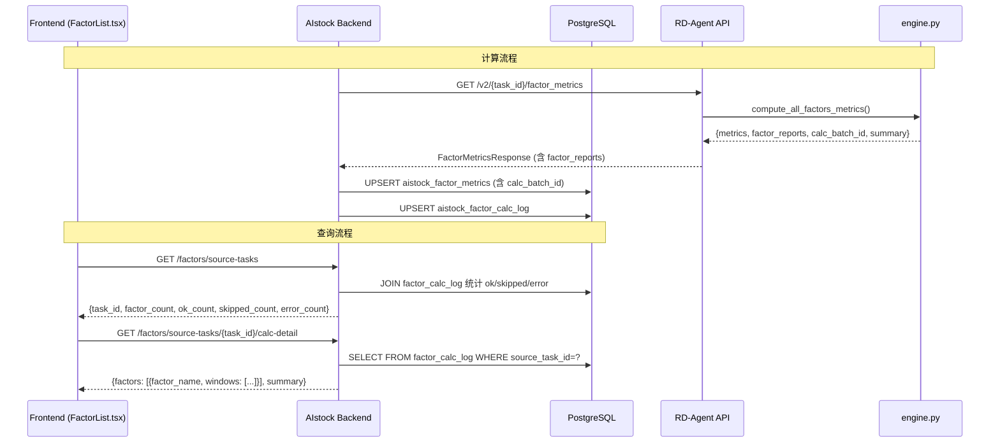

# Design Document: 因子计算日志 (factor-calc-log)

## Overview

本设计实现因子指标计算的全链路状态追溯。当前系统中，`engine.py` 在 `mask.sum() == 0` 时直接 `continue`，`except` 块只打 `logger.warning`，前端只能统计有指标的因子数量，无法区分"没算过"和"算了但失败了"。

本方案通过以下改动解决：
1. 新建 `aistock_factor_calc_log` 表，记录每个因子×窗口的计算状态（ok/skipped/error）
2. 修改 `compute_all_factors_metrics` 返回结构，从 `list[dict]` 改为包含 `metrics`、`factor_reports`、`calc_batch_id`、`summary` 的字典
3. 扩展 API 响应模型，透传 `factor_reports` 和 `calc_batch_id`
4. 同步服务写入计算日志到数据库
5. 新增后端查询接口，返回因子×窗口矩阵数据
6. 修改 source-tasks SQL，统计 ok/skipped/error 数量
7. 前端展示因子×窗口矩阵，使用 ✅/⚠️/❌ 图标

跨工作区数据流：

```
RD-Agent-main (计算侧)                    AIstock (存储/展示侧)
┌─────────────────────┐                   ┌──────────────────────────┐
│ engine.py           │  HTTP API         │ sync_service.py          │
│ compute_all_factors │ ──────────────►   │ ├─ 写入 factor_metrics   │
│ _metrics()          │  factor_reports   │ └─ 写入 factor_calc_log  │
│ + factor_reports    │  + calc_batch_id  │                          │
│ + calc_batch_id     │                   │ catalog_admin.py         │
└─────────────────────┘                   │ ├─ source-tasks 统计     │
                                          │ └─ calc-detail 查询      │
┌─────────────────────┐                   │                          │
│ sota_factors_api.py │                   │ FactorList.tsx           │
│ FactorMetricsResp   │                   │ └─ 因子×窗口矩阵 UI     │
│ + factor_reports    │                   └──────────────────────────┘
│ + calc_batch_id     │
└─────────────────────┘
```

## Architecture

### 系统架构



### 设计决策

1. **calc_batch_id 使用 UUID v4**：在 engine.py 中生成，确保每次计算调用有唯一标识，便于关联 metrics 和 log 记录。不使用时间戳是因为并发场景下可能冲突。

2. **REQUIRED_DAYS 映射放在 engine.py**：`full=0, out_sample=0, recent_6m=126, recent_3m=63`。full 和 out_sample 不设最低天数要求（设为0），recent 窗口有明确的最低交易日要求。

3. **日志写入失败不阻塞指标同步**：sync_service 中 calc_log 写入用 try/except 包裹，失败只记日志，不影响核心 factor_metrics 写入。这是因为日志是辅助信息，指标数据更重要。

4. **UPSERT 语义**：calc_log 使用 `(calc_batch_id, factor_name, eval_window)` 唯一约束，重复写入时更新而非报错，支持重试场景。

5. **前端查询分两步**：source-tasks 列表返回汇总统计（轻量），展开 Task 时再请求 calc-detail（按需加载），避免一次性加载大量数据。


## Components and Interfaces

### 1. engine.py — 计算引擎改造

**文件**: `RD-Agent-main/rdagent/app/factor_metrics/engine.py`

**改动**: `compute_all_factors_metrics` 返回类型从 `list[dict]` 改为 `dict`

```python
REQUIRED_DAYS = {
    "full": 0,
    "out_sample": 0,
    "recent_6m": 126,
    "recent_3m": 63,
}

def compute_all_factors_metrics(
    parquet_path: Path,
    qlib_bin_path: Optional[Path] = None,
    factor_filter: Optional[list[str]] = None,
    max_workers: int = 4,
) -> dict[str, Any]:
    """返回结构:
    {
        "metrics": list[dict],           # 与原 all_results 相同
        "factor_reports": list[dict],     # 每个因子×窗口的状态报告
        "calc_batch_id": str,             # UUID v4
        "summary": {
            "ok_count": int,
            "skipped_count": int,
            "error_count": int,
        }
    }
    """
```

**factor_report 单条结构**:
```python
{
    "factor_name": str,
    "eval_window": str,          # full/out_sample/recent_6m/recent_3m
    "status": str,               # "ok" | "skipped" | "error"
    "error_message": str | None,
    "n_trading_days": int | None,
    "required_days": int | None,
    "data_start": str | None,    # ISO date
    "data_end": str | None,      # ISO date
    "data_source": "parquet",
    "calc_engine": "rdagent",
    "calculated_at": str,        # ISO datetime
}
```

**逻辑变更**:
- 函数开头生成 `calc_batch_id = str(uuid.uuid4())`
- `mask.sum() == 0` 时：不再 `continue`，而是生成 `status="skipped"` 的 report，记录 `n_trading_days=0`、`required_days=REQUIRED_DAYS[window_name]`、`error_message="数据天数不足: 实际0天, 需要{required}天"`
- 新增 required_days 检查：`recent_6m` 窗口 `mask.sum() < 126` 或 `recent_3m` 窗口 `mask.sum() < 63` 时，生成 `status="skipped"` report
- `except` 块：生成 `status="error"` 的 report，`error_message=str(e)`
- 计算成功：生成 `status="ok"` 的 report
- 每条 metrics dict 中新增 `calc_batch_id` 字段
- 返回 `{"metrics": all_results, "factor_reports": all_reports, "calc_batch_id": calc_batch_id, "summary": {...}}`

### 2. sota_factors_api.py — API 模型扩展

**文件**: `RD-Agent-main/rdagent/app/api_endpoints/sota_factors_api.py`

**新增 Pydantic 模型**:
```python
class FactorReportItem(BaseModel):
    """单因子单窗口的计算状态报告"""
    factor_name: str
    eval_window: str
    status: str                          # ok / skipped / error
    error_message: Optional[str] = None
    n_trading_days: Optional[int] = None
    required_days: Optional[int] = None
    data_start: Optional[str] = None
    data_end: Optional[str] = None
    data_source: str = "parquet"
    calc_engine: str = "rdagent"
    calculated_at: Optional[str] = None
```

**修改 FactorMetricsResponse**:
```python
class FactorMetricsResponse(BaseModel):
    task_id: str
    success: bool
    factor_count: int = 0
    metrics_count: int = 0
    parquet_path: Optional[str] = None
    metrics: List[SingleFactorMetricsItem] = []
    factor_reports: List[FactorReportItem] = []    # 新增
    calc_batch_id: Optional[str] = None            # 新增
    error: Optional[str] = None
```

**修改 `_compute_task_factor_metrics`**:
- 调用 `compute_all_factors_metrics` 后，从返回的 dict 中提取 `metrics`、`factor_reports`、`calc_batch_id`
- 构造 `FactorMetricsResponse` 时填入新字段

### 3. init_quant_schema.py — 数据库表创建

**文件**: `AIstock/backend/db/init_quant_schema.py`

**新增 DDL**: 在 DDL 列表中追加 `aistock_factor_calc_log` 建表语句和索引

**新增 ALTER TABLE**: 在 `init_quant_schema()` 函数中通过 `add_column_if_not_exists` 为 `aistock_factor_metrics` 添加 `calc_batch_id TEXT` 字段

### 4. rdagent_factor_metrics_sync.py — 同步服务扩展

**文件**: `AIstock/backend/services/rdagent_factor_metrics_sync.py`

**改动**:
- `_insert_metrics_batch` 的 params 中新增 `calc_batch_id` 字段
- `_UPSERT_SQL` 新增 `calc_batch_id` 列
- 新增 `_insert_calc_log_batch` 函数，将 `factor_reports` 写入 `aistock_factor_calc_log`
- `sync_factor_metrics_for_task` 中：从 API 响应提取 `factor_reports` 和 `calc_batch_id`，先写 metrics（含 calc_batch_id），再写 calc_log（try/except 包裹，失败不阻塞）

```python
_UPSERT_CALC_LOG_SQL = """
INSERT INTO aistock_factor_calc_log (
    calc_batch_id, source_task_id, factor_name, eval_window,
    status, error_message, n_trading_days, required_days,
    data_start, data_end, data_source, calc_engine, calculated_at
) VALUES (
    %(calc_batch_id)s, %(source_task_id)s, %(factor_name)s, %(eval_window)s,
    %(status)s, %(error_message)s, %(n_trading_days)s, %(required_days)s,
    %(data_start)s, %(data_end)s, %(data_source)s, %(calc_engine)s, %(calculated_at)s
)
ON CONFLICT (calc_batch_id, factor_name, eval_window)
DO UPDATE SET
    status = EXCLUDED.status,
    error_message = EXCLUDED.error_message,
    n_trading_days = EXCLUDED.n_trading_days,
    required_days = EXCLUDED.required_days,
    data_start = EXCLUDED.data_start,
    data_end = EXCLUDED.data_end,
    data_source = EXCLUDED.data_source,
    calculated_at = EXCLUDED.calculated_at
"""
```

### 5. rdagent_catalog_admin.py — 后端查询接口

**文件**: `AIstock/backend/routers/rdagent_catalog_admin.py`

**修改 `list_factor_source_tasks`**: SQL 改为 LEFT JOIN `aistock_factor_calc_log`，统计 ok_count、skipped_count、error_count

```sql
SELECT c.source_task_id,
       COUNT(DISTINCT c.factor_name) AS factor_count,
       COUNT(DISTINCT CASE WHEN l.status = 'ok' THEN l.factor_name || '|' || l.eval_window END) AS ok_count,
       COUNT(DISTINCT CASE WHEN l.status = 'skipped' THEN l.factor_name || '|' || l.eval_window END) AS skipped_count,
       COUNT(DISTINCT CASE WHEN l.status = 'error' THEN l.factor_name || '|' || l.eval_window END) AS error_count
FROM aistock_factor_catalog c
LEFT JOIN aistock_factor_calc_log l
  ON l.source_task_id = c.source_task_id
WHERE c.source_task_id IS NOT NULL
GROUP BY c.source_task_id
ORDER BY c.source_task_id DESC
```

**新增端点 `GET /factors/source-tasks/{task_id}/calc-detail`**:

```python
@router.get("/factors/source-tasks/{task_id}/calc-detail")
async def get_task_calc_detail(task_id: str) -> Dict[str, Any]:
    """返回该 Task 下所有因子在所有窗口的计算状态，按 factor_name 分组。"""
```

响应结构:
```json
{
  "factors": [
    {
      "factor_name": "factor_a",
      "windows": [
        {
          "eval_window": "full",
          "status": "ok",
          "error_message": null,
          "n_trading_days": 500,
          "required_days": 0,
          "data_start": "2022-01-04",
          "data_end": "2024-12-31",
          "calculated_at": "2025-01-15T10:30:00Z"
        },
        {
          "eval_window": "recent_3m",
          "status": "skipped",
          "error_message": "数据天数不足: 实际45天, 需要63天",
          "n_trading_days": 45,
          "required_days": 63,
          "data_start": null,
          "data_end": null,
          "calculated_at": "2025-01-15T10:30:00Z"
        }
      ]
    }
  ],
  "summary": {
    "ok_count": 12,
    "skipped_count": 3,
    "error_count": 1
  }
}
```

### 6. FactorList.tsx — 前端因子×窗口矩阵

**文件**: `AIstock/frontend/src/app/quantevolver/components/FactorList.tsx`

**改动**:
- `SourceTask` 类型新增 `ok_count`、`skipped_count`、`error_count` 字段
- Task 行显示 `✅{ok} ⚠️{skipped} ❌{error}` 替代 `metrics_count`
- 展开 Task 时调用 `GET /factors/source-tasks/{task_id}/calc-detail`
- 渲染因子×窗口矩阵表格：行=因子名，列=full/out_sample/recent_6m/recent_3m
- 单元格图标：`✅`(ok) / `⚠️`(skipped) / `❌`(error) / 空白(无记录)
- ⚠️ 和 ❌ 图标上 hover 显示 tooltip（error_message + n_trading_days/required_days）
- 无记录时显示"暂无计算日志"提示

## Data Models

### aistock_factor_calc_log 表结构

```sql
CREATE TABLE IF NOT EXISTS aistock_factor_calc_log (
    id               BIGSERIAL PRIMARY KEY,
    calc_batch_id    TEXT NOT NULL,          -- 计算批次ID(UUID v4)，同一次计算请求共享
    source_task_id   TEXT,                   -- 来源RD-Agent任务ID
    factor_name      TEXT NOT NULL,          -- 因子名称
    eval_window      TEXT NOT NULL,          -- 评估窗口: full/out_sample/recent_6m/recent_3m
    status           TEXT NOT NULL,          -- 计算状态: ok/skipped/error
    error_message    TEXT,                   -- 错误或跳过原因描述
    n_trading_days   INTEGER,               -- 实际交易日数
    required_days    INTEGER,               -- 该窗口所需最少交易日数
    data_start       DATE,                  -- 计算数据起始日期
    data_end         DATE,                  -- 计算数据截止日期
    data_source      TEXT NOT NULL DEFAULT 'parquet',  -- 数据来源: parquet/realtime/merged
    calc_engine      TEXT NOT NULL DEFAULT 'rdagent',  -- 计算引擎标识
    calculated_at    TIMESTAMPTZ NOT NULL,   -- 计算执行时间(UTC)
    created_at       TIMESTAMPTZ NOT NULL DEFAULT NOW(), -- 记录创建时间
    UNIQUE (calc_batch_id, factor_name, eval_window)
);

-- 索引
CREATE INDEX IF NOT EXISTS idx_calc_log_batch ON aistock_factor_calc_log (calc_batch_id);
CREATE INDEX IF NOT EXISTS idx_calc_log_task ON aistock_factor_calc_log (source_task_id);

-- 中文 COMMENT
COMMENT ON TABLE aistock_factor_calc_log IS '因子计算日志表，记录每个因子在每个评估窗口下的计算状态（成功/跳过/失败）';
COMMENT ON COLUMN aistock_factor_calc_log.id IS '自增主键';
COMMENT ON COLUMN aistock_factor_calc_log.calc_batch_id IS '计算批次ID(UUID v4)，同一次计算请求中所有因子×窗口记录共享同一个ID';
COMMENT ON COLUMN aistock_factor_calc_log.source_task_id IS '来源RD-Agent任务ID，与aistock_factor_catalog.source_task_id对应';
COMMENT ON COLUMN aistock_factor_calc_log.factor_name IS '因子名称，与aistock_factor_catalog.factor_name对应';
COMMENT ON COLUMN aistock_factor_calc_log.eval_window IS '评估窗口: full=全量, out_sample=样本外(2024-07-01起), recent_6m=近6月, recent_3m=近3月';
COMMENT ON COLUMN aistock_factor_calc_log.status IS '计算状态: ok=成功, skipped=跳过(数据不足), error=失败(异常)';
COMMENT ON COLUMN aistock_factor_calc_log.error_message IS '错误或跳过原因的详细描述';
COMMENT ON COLUMN aistock_factor_calc_log.n_trading_days IS '该窗口内实际可用的交易日数量';
COMMENT ON COLUMN aistock_factor_calc_log.required_days IS '该评估窗口所需的最少交易日数: full=0, out_sample=0, recent_6m=126, recent_3m=63';
COMMENT ON COLUMN aistock_factor_calc_log.data_start IS '计算所用数据的起始日期';
COMMENT ON COLUMN aistock_factor_calc_log.data_end IS '计算所用数据的截止日期';
COMMENT ON COLUMN aistock_factor_calc_log.data_source IS '数据来源: parquet=离线parquet文件, realtime=实时数据, merged=合并数据';
COMMENT ON COLUMN aistock_factor_calc_log.calc_engine IS '计算引擎标识: rdagent=RD-Agent侧计算';
COMMENT ON COLUMN aistock_factor_calc_log.calculated_at IS '计算执行时间(UTC)';
COMMENT ON COLUMN aistock_factor_calc_log.created_at IS '记录创建时间';
```

### aistock_factor_metrics 表变更

```sql
-- 新增 calc_batch_id 字段（通过 ALTER TABLE，在 init_quant_schema 中执行）
ALTER TABLE aistock_factor_metrics ADD COLUMN calc_batch_id TEXT;
COMMENT ON COLUMN aistock_factor_metrics.calc_batch_id IS '计算批次ID，关联aistock_factor_calc_log表的calc_batch_id';
```

### FactorReportItem (Pydantic 模型)

```python
class FactorReportItem(BaseModel):
    factor_name: str
    eval_window: str                         # full/out_sample/recent_6m/recent_3m
    status: str                              # ok/skipped/error
    error_message: Optional[str] = None
    n_trading_days: Optional[int] = None
    required_days: Optional[int] = None
    data_start: Optional[str] = None
    data_end: Optional[str] = None
    data_source: str = "parquet"
    calc_engine: str = "rdagent"
    calculated_at: Optional[str] = None
```

### engine.py 返回结构 (TypedDict 概念)

```python
{
    "metrics": [                    # list[dict] — 与原返回格式相同的指标数据
        {
            "factor_name": "xxx",
            "eval_window": "full",
            "calc_batch_id": "uuid-v4-string",  # 新增
            # ... 原有17项指标字段 ...
        }
    ],
    "factor_reports": [             # list[dict] — 每个因子×窗口的状态报告
        {
            "factor_name": "xxx",
            "eval_window": "full",
            "status": "ok",
            "error_message": None,
            "n_trading_days": 500,
            "required_days": 0,
            "data_start": "2022-01-04",
            "data_end": "2024-12-31",
            "data_source": "parquet",
            "calc_engine": "rdagent",
            "calculated_at": "2025-01-15T10:30:00+00:00"
        }
    ],
    "calc_batch_id": "uuid-v4-string",
    "summary": {
        "ok_count": 12,
        "skipped_count": 3,
        "error_count": 1
    }
}
```

## Correctness Properties

*A property is a characteristic or behavior that should hold true across all valid executions of a system — essentially, a formal statement about what the system should do. Properties serve as the bridge between human-readable specifications and machine-verifiable correctness guarantees.*

### Property 1: Engine returns complete structure

*For any* valid parquet input with at least one factor, `compute_all_factors_metrics` should return a dict containing keys `metrics` (list), `factor_reports` (list), `calc_batch_id` (non-empty string matching UUID v4 format), and `summary` (dict with `ok_count`, `skipped_count`, `error_count` integers). The total of `ok_count + skipped_count + error_count` should equal `len(factor_reports)`.

**Validates: Requirements 2.1, 2.5**

### Property 2: Insufficient trading days produce skipped status

*For any* factor and any eval_window, if the number of trading days in that window is less than `REQUIRED_DAYS[eval_window]`, the corresponding factor_report entry should have `status="skipped"`, `required_days` equal to the threshold value, and `error_message` containing the actual and required day counts. Specifically: recent_6m requires 126 days, recent_3m requires 63 days, full and out_sample require 0 days (never skipped for insufficient days alone).

**Validates: Requirements 2.2, 2.6, 2.7**

### Property 3: Computation exceptions produce error reports

*For any* factor that causes an exception during metric computation in any eval_window, the engine should produce a factor_report with `status="error"` and `error_message` containing the exception text, rather than propagating the exception to the caller.

**Validates: Requirements 2.3**

### Property 4: Successful computation produces ok report with metadata

*For any* factor×window that computes successfully, the engine should produce both a metrics entry (in the `metrics` list) and a factor_report with `status="ok"`, `n_trading_days > 0`, non-null `data_start` and `data_end`, and the same `calc_batch_id` as the top-level return value.

**Validates: Requirements 2.4**

### Property 5: Factor reports cover all factor×window combinations

*For any* set of N factors and 4 eval_windows, `len(factor_reports)` should equal `N × 4`. Every combination of (factor_name, eval_window) should appear exactly once in factor_reports, regardless of whether the computation succeeded, was skipped, or failed.

**Validates: Requirements 2.1, 2.2, 2.3, 2.4**

### Property 6: Calc log UPSERT idempotency

*For any* valid factor_report record, writing it to `aistock_factor_calc_log` twice with the same `(calc_batch_id, factor_name, eval_window)` should result in exactly one row in the table (not two), and the row should reflect the latest write's values.

**Validates: Requirements 4.4**

### Property 7: Calc-detail summary counts match actual records

*For any* source_task_id with calc_log records, the `summary.ok_count` should equal the number of records with `status='ok'`, `summary.skipped_count` should equal records with `status='skipped'`, and `summary.error_count` should equal records with `status='error'` in the returned `factors` list.

**Validates: Requirements 5.1, 5.2, 5.3**

### Property 8: Source-tasks statistics reflect calc_log data

*For any* source_task_id, the `ok_count`, `skipped_count`, `error_count` returned by the source-tasks endpoint should match the actual count of distinct (factor_name, eval_window) records with each status in `aistock_factor_calc_log` for that task.

**Validates: Requirements 6.1, 6.2**

### Property 9: Status-to-icon mapping is deterministic

*For any* status string, the frontend mapping function should return: `✅` for "ok", `⚠️` for "skipped", `❌` for "error", and empty/null for any other value. This mapping should be a pure function with no side effects.

**Validates: Requirements 7.2**

## Error Handling

### engine.py

| 场景 | 处理方式 |
|------|---------|
| parquet 文件不存在或格式错误 | 抛出异常（由 API 层捕获返回 404/500） |
| 单个因子×窗口计算异常 | 捕获异常，生成 `status="error"` 的 factor_report，继续处理下一个 |
| mask.sum() == 0（无有效交易日） | 生成 `status="skipped"` 的 factor_report，不再 `continue` |
| recent_6m/3m 交易日不足阈值 | 生成 `status="skipped"` 的 factor_report |

### sync_service.py

| 场景 | 处理方式 |
|------|---------|
| API 调用失败 | 返回 `MetricsSyncResult(ok=False)`，记录错误 |
| factor_metrics 写入失败 | 返回 `MetricsSyncResult(ok=False)`，记录错误 |
| factor_calc_log 写入失败 | `logger.error` 记录，**不影响** metrics 写入结果 |
| API 响应中无 factor_reports 字段 | 兼容处理，跳过 calc_log 写入（向后兼容旧版 API） |

### catalog_admin.py

| 场景 | 处理方式 |
|------|---------|
| source_task_id 在 calc_log 中无记录 | 返回空 factors 列表和全零 summary |
| 数据库查询异常 | 返回 500 错误 |

### 前端

| 场景 | 处理方式 |
|------|---------|
| calc-detail API 调用失败 | 显示错误提示，不影响 Task 列表 |
| 某 Task 无 calc_log 记录 | 显示"暂无计算日志"提示 |
| factor_reports 为空数组 | 显示"暂无计算日志"提示 |

## Testing Strategy

### 属性测试 (Property-Based Testing)

使用 **Hypothesis** (Python) 和 **fast-check** (TypeScript) 作为属性测试库。

每个属性测试配置最少 100 次迭代，使用 `@settings(max_examples=100)` (Hypothesis) 或 `fc.assert(..., { numRuns: 100 })` (fast-check)。

每个测试用注释标注对应的设计属性：
```python
# Feature: factor-calc-log, Property 1: Engine returns complete structure
```

**Python 属性测试 (engine + sync + backend)**:

| 属性 | 测试内容 | 生成策略 |
|------|---------|---------|
| Property 1 | engine 返回结构完整性 | 生成随机 MultiIndex DataFrame（日期×股票×因子值） |
| Property 2 | 交易日不足时 skipped 状态 | 生成日期范围短于阈值的 DataFrame |
| Property 3 | 异常时 error 状态 | 生成含 NaN/Inf/全零列的 DataFrame 触发异常 |
| Property 4 | 成功时 ok 状态 + 元数据 | 生成正常范围的因子数据 |
| Property 5 | factor_reports 覆盖所有因子×窗口 | 生成 N 个因子的 DataFrame |
| Property 6 | UPSERT 幂等性 | 生成随机 report 记录，写入两次 |
| Property 7 | calc-detail summary 一致性 | 生成随机 calc_log 记录集，验证 summary |
| Property 8 | source-tasks 统计一致性 | 生成多 task 的 calc_log 记录，验证统计 |

**TypeScript 属性测试 (frontend)**:

| 属性 | 测试内容 | 生成策略 |
|------|---------|---------|
| Property 9 | status→icon 映射 | 生成随机 status 字符串 |

### 单元测试

单元测试聚焦于具体示例和边界情况，不重复属性测试已覆盖的通用逻辑：

- **DDL 验证** (Req 1.1-1.5): 验证表创建、唯一约束、索引、COMMENT、ALTER TABLE
- **API 模型** (Req 3.1-3.3): 验证 FactorMetricsResponse 序列化/反序列化含新字段
- **Sync 容错** (Req 4.3): 模拟 calc_log 写入异常，验证 metrics 写入不受影响
- **空记录边界** (Req 5.4, 6.3): 验证无 calc_log 记录时返回空列表和全零 summary
- **前端空状态** (Req 7.5): 验证无记录时显示"暂无计算日志"
