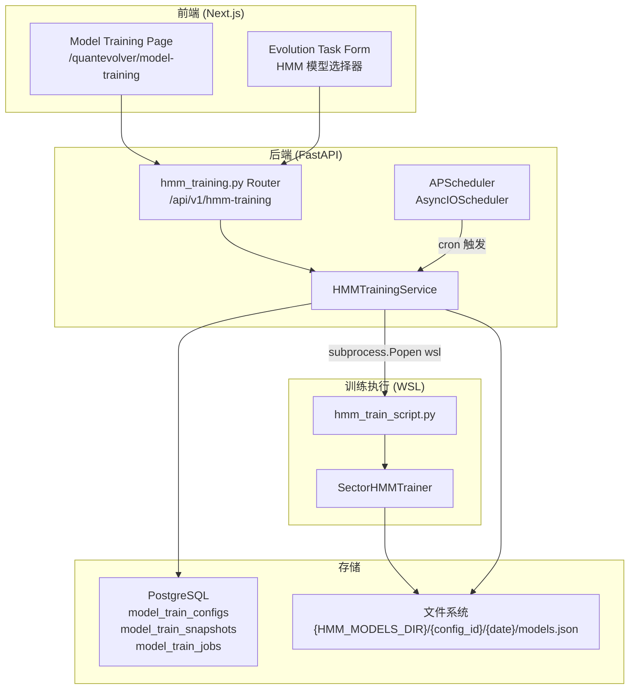
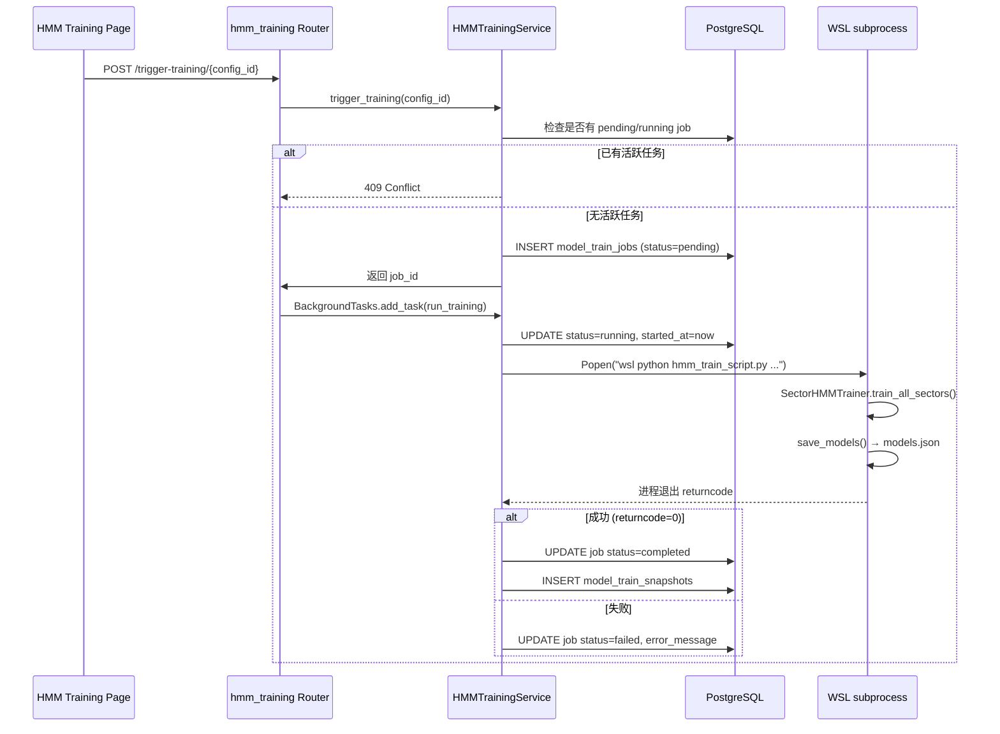
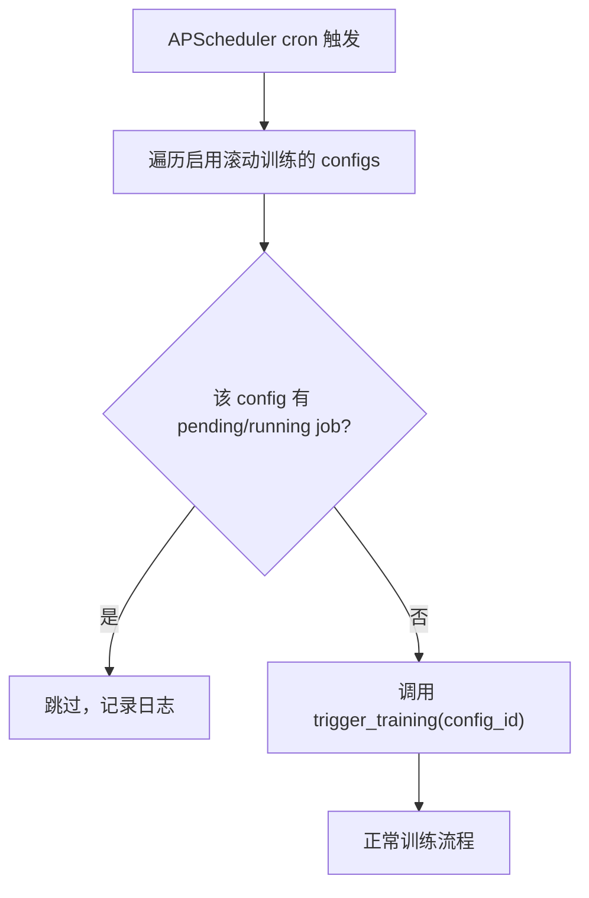

# 设计文档：HMM 模型训练管理

## 概述

本设计文档描述在 QE（QuantEvolver）系统中新增「模型训练」模块的完整技术方案。该模块实现行业 HMM 模型的全生命周期管理，包括：

1. **超参版本管理**：CRUD 操作管理 `SectorHMMConfig` 超参配置
2. **训练任务执行**：通过 WSL subprocess 异步执行 `SectorHMMTrainer.train_all_sectors()`
3. **时间快照管理**：同一超参版本下多次训练产生的模型快照管理
4. **定期滚动训练**：基于 APScheduler 的 cron 定时训练
5. **前端页面**：Next.js 页面展示配置列表、快照列表、训练触发与状态
6. **QE 实验集成**：在 `EvolutionTaskCreateRequest` 中新增 HMM 模型选择字段

### 设计决策

| 决策 | 选择 | 理由 |
|------|------|------|
| 训练执行方式 | `subprocess.Popen` + `wsl` 前缀 | HMM 训练是独立 Python 脚本，不需要 RDAgent 交互，比 QEWorkspaceClient 更简单直接 |
| 异步任务管理 | FastAPI `BackgroundTasks` + DB 状态轮询 | 与现有 `quantevolver_evolution.py` 模式一致，无需引入 Celery 等重量级队列 |
| 定时调度 | APScheduler `AsyncIOScheduler` | 轻量级，原生支持 cron 表达式，可在 FastAPI 生命周期中启停 |
| 模型文件格式 | JSON（复用 `SectorHMMTrainer.save_models()`） | 已有实现，无需改动训练器代码 |
| 数据库主键 | UUID（`gen_random_uuid()`） | 与现有 QE 表（`qe_experiments`、`qe_evolution_tasks`）风格一致 |
| 前端框架 | Next.js App Router + 原生 fetch | 与现有 QE 页面风格一致，无额外依赖 |
| 快照删除策略 | 同时删除 DB 记录和文件系统模型文件 | 保持一致性，避免孤立文件 |

## 架构

### 整体架构图



### 训练任务执行流程



### 定期滚动训练流程



## 组件与接口

### 1. FastAPI Router: `hmm_training.py`

**文件：** `AIstock/backend/routers/hmm_training.py`
**挂载路径：** `/api/v1/hmm-training`

```python
# --- Pydantic 请求/响应模型 ---

class ConfigCreateRequest(BaseModel):
    model_type: str  # 'sector_hmm', 'market_hmm', 'rl_execution', ...
    display_name: str
    config_json: Dict[str, Any]  # 超参（字段因 model_type 而异）

class ConfigResponse(BaseModel):
    config_id: str
    model_type: str
    display_name: str
    config_json: Dict[str, Any]
    snapshot_count: int
    cron_expression: Optional[str]
    cron_enabled: bool
    created_at: str

class SnapshotResponse(BaseModel):
    snapshot_id: str
    config_id: str
    trained_at: str
    model_path: str
    sector_count: int
    status: str  # pending/completed/failed
    metrics_json: Optional[Dict[str, Any]]

class JobResponse(BaseModel):
    job_id: str
    config_id: str
    status: str  # pending/running/completed/failed
    started_at: Optional[str]
    completed_at: Optional[str]
    error_message: Optional[str]

class CronUpdateRequest(BaseModel):
    cron_expression: Optional[str]
    cron_enabled: bool

# --- 端点 ---

# 超参版本 CRUD（支持 model_type 筛选）
POST   /configs                              → ConfigResponse  (body 含 model_type)
GET    /configs?model_type=sector_hmm        → List[ConfigResponse]
DELETE /configs/{config_id}              → {"deleted": True}

# 训练任务
POST   /configs/{config_id}/trigger-training → JobResponse
GET    /configs/{config_id}/jobs             → List[JobResponse]

# 时间快照
GET    /configs/{config_id}/snapshots        → List[SnapshotResponse]
GET    /snapshots/{snapshot_id}              → SnapshotResponse
DELETE /snapshots/{snapshot_id}              → {"deleted": True, "file_missing": bool}

# 滚动训练计划
PUT    /configs/{config_id}/cron             → ConfigResponse

# QE 实验集成辅助
GET    /snapshots/{snapshot_id}/model-path   → {"model_path": str}
```

### 2. 服务层: `HMMTrainingService`

**文件：** `AIstock/backend/services/hmm_training_service.py`

```python
class HMMTrainingService:
    """HMM 模型训练管理的核心业务逻辑。"""

    def __init__(self):
        self.models_dir = os.getenv("HMM_MODELS_DIR", "AIstock/data/hmm_models/")

    # --- 超参版本 ---
    async def create_config(self, model_type: str, display_name: str, config_json: dict) -> dict:
        """创建超参版本，缺失字段用对应 model_type 的默认值填充。"""

    async def list_configs(self, model_type: str = "sector_hmm") -> List[dict]:
        """列出指定 model_type 的超参版本，附带快照数量。"""

    async def delete_config(self, config_id: str) -> None:
        """删除超参版本，有关联快照时拒绝。"""

    # --- 训练任务 ---
    async def trigger_training(self, config_id: str) -> dict:
        """触发训练：检查并发限制，创建 job，返回 job_id。"""

    async def run_training(self, job_id: str, config_id: str) -> None:
        """后台执行训练：WSL subprocess → 更新状态 → 创建快照。"""

    async def list_jobs(self, config_id: str) -> List[dict]:
        """列出某配置的训练任务。"""

    # --- 快照 ---
    async def list_snapshots(self, config_id: str) -> List[dict]:
        """列出某配置的所有快照。"""

    async def get_snapshot(self, snapshot_id: str) -> dict:
        """获取快照详情。"""

    async def delete_snapshot(self, snapshot_id: str) -> dict:
        """删除快照：DB 记录 + 文件系统。"""

    async def resolve_model_path(self, snapshot_id: str) -> str:
        """根据 snapshot_id 解析模型文件路径。"""

    # --- 滚动训练 ---
    async def update_cron(self, config_id: str, cron_expr: str, enabled: bool) -> dict:
        """更新滚动训练计划。"""

    # --- 辅助 ---
    def _build_model_path(self, config_id: str, snapshot_date: str) -> str:
        """生成模型文件路径：{models_dir}/{config_id}/{snapshot_date}/models.json"""

    def _fill_default_config(self, config_json: dict) -> dict:
        """用 SectorHMMConfig 默认值填充缺失字段。"""
```

### 3. 训练脚本: `hmm_train_script.py`

**文件：** `AIstock/scripts/hmm_train_script.py`

独立 Python 脚本，由 WSL subprocess 调用：

```python
"""HMM 训练脚本，由后端通过 WSL subprocess 调用。

用法: python hmm_train_script.py --config-json '{"n_states":2,...}' --output-path /path/to/models.json
"""

def main():
    parser = argparse.ArgumentParser()
    parser.add_argument("--config-json", required=True)
    parser.add_argument("--output-path", required=True)
    args = parser.parse_args()

    config_dict = json.loads(args.config_json)
    config = SectorHMMConfig(**config_dict)
    trainer = SectorHMMTrainer(config=config)
    models = trainer.train_all_sectors()
    trainer.save_models(models, args.output_path)

    # 输出训练结果摘要到 stdout（供后端解析）
    print(json.dumps({"sector_count": len(models), "status": "ok"}))
```

### 4. 定时调度器

在 FastAPI 应用启动时初始化 APScheduler：

```python
from apscheduler.schedulers.asyncio import AsyncIOScheduler
from apscheduler.triggers.cron import CronTrigger

scheduler = AsyncIOScheduler()

async def rolling_training_tick():
    """遍历所有启用 cron 的配置，触发训练。"""
    service = HMMTrainingService()
    configs = await service.list_configs()
    for cfg in configs:
        if cfg.get("cron_enabled") and cfg.get("cron_expression"):
            try:
                await service.trigger_training(cfg["config_id"])
            except Exception as e:
                logger.warning("滚动训练跳过 %s: %s", cfg["config_id"], e)

# 在 app startup 中:
# scheduler.add_job(rolling_training_tick, CronTrigger.from_crontab("0 6 * * 1-5"))
# scheduler.start()
```

### 5. QE 实验集成

**修改文件：** `AIstock/backend/routers/quantevolver_evolution.py`

在 `EvolutionTaskCreateRequest` 中新增字段：

```python
class EvolutionTaskCreateRequest(BaseModel):
    # ... 现有字段 ...
    enable_sector_hmm: bool = Field(False, description="是否启用行业 HMM 热度调整")
    hmm_model_version_id: Optional[str] = Field(None, description="HMM 模型快照 ID (snapshot_id)")
```

在 `create_evolution_task` 端点中新增验证逻辑：
- `enable_sector_hmm=True` 时必须提供 `hmm_model_version_id`
- 验证 snapshot 状态为 "completed"
- 验证模型文件存在
- 解析 `model_path` 注入策略配置

### 6. 前端页面

**文件：** `AIstock/frontend/src/app/quantevolver/model-training/page.tsx`

页面结构：
- 顶部：标题「模型训练」 + 模型类型 Tab 切换（当前仅 sector_hmm，未来可扩展 market_hmm、rl_execution 等）
- 每个 Tab 下：Config 列表（可展开），每项显示 display_name、关键超参、快照数、创建时间
- 展开后：该配置下的快照列表 + 训练触发按钮 + cron 配置
- 创建对话框：display_name + 根据 model_type 动态渲染的超参字段（sector_hmm 显示 SectorHMMConfig 字段）
- 模型类型 Tab 配置通过前端常量定义，新增模型类型只需添加一个 Tab 配置项

## 数据模型

### 数据库表结构

#### `model_train_configs`

通用模型训练配置表，通过 `model_type` 字段区分不同模型类型（sector_hmm、market_hmm、rl_execution 等）。

```sql
CREATE TABLE IF NOT EXISTS model_train_configs (
    config_id TEXT PRIMARY KEY DEFAULT gen_random_uuid()::TEXT,
    model_type TEXT NOT NULL,  -- 'sector_hmm', 'market_hmm', 'rl_execution', ...
    display_name TEXT NOT NULL,
    config_json JSONB NOT NULL,
    cron_expression TEXT,
    cron_enabled BOOLEAN DEFAULT FALSE,
    created_at TIMESTAMPTZ DEFAULT NOW(),
    UNIQUE(model_type, display_name)
);

CREATE INDEX IF NOT EXISTS idx_mtc_model_type
    ON model_train_configs(model_type);
```

#### `model_train_snapshots`

通用模型训练快照表，记录每次训练产出的模型版本。

```sql
CREATE TABLE IF NOT EXISTS model_train_snapshots (
    snapshot_id TEXT PRIMARY KEY DEFAULT gen_random_uuid()::TEXT,
    config_id TEXT NOT NULL REFERENCES model_train_configs(config_id) ON DELETE RESTRICT,
    trained_at TIMESTAMPTZ DEFAULT NOW(),
    model_path TEXT NOT NULL,
    sector_count INTEGER DEFAULT 0,
    status TEXT DEFAULT 'pending',  -- pending/completed/failed
    metrics_json JSONB
);

CREATE INDEX IF NOT EXISTS idx_mts_config_id
    ON model_train_snapshots(config_id);
```

#### `model_train_jobs`

通用模型训练任务表，跟踪训练执行状态。

```sql
CREATE TABLE IF NOT EXISTS model_train_jobs (
    job_id TEXT PRIMARY KEY DEFAULT gen_random_uuid()::TEXT,
    config_id TEXT NOT NULL REFERENCES model_train_configs(config_id) ON DELETE RESTRICT,
    snapshot_id TEXT REFERENCES model_train_snapshots(snapshot_id),
    status TEXT DEFAULT 'pending',  -- pending/running/completed/failed
    started_at TIMESTAMPTZ,
    completed_at TIMESTAMPTZ,
    error_message TEXT
);

CREATE INDEX IF NOT EXISTS idx_mtj_config_id
    ON model_train_jobs(config_id);
```

### `config_json` 结构

```json
{
    "n_states": 2,
    "history_years": 3.0,
    "min_trading_days": 120,
    "cooldown_days": 3,
    "trending_coeff": 1.5,
    "fading_coeff": 0.5,
    "neutral_coeff": 1.0
}
```

### 模型文件路径规则

```
{HMM_MODELS_DIR}/{config_id}/{snapshot_date}/models.json

示例：
AIstock/data/hmm_models/a1b2c3d4/2025-07-15/models.json
```

### `EvolutionTaskCreateRequest` 扩展字段

```python
enable_sector_hmm: bool = False
hmm_model_version_id: Optional[str] = None  # → snapshot_id
```

运行时解析：`snapshot_id` → 查询 `hmm_model_snapshots.model_path` → 注入 `config["sector_hmm_model_path"]`


## 正确性属性（Correctness Properties）

*属性（Property）是指在系统所有合法执行路径中都应成立的特征或行为——本质上是对系统应做什么的形式化陈述。属性是人类可读规格说明与机器可验证正确性保证之间的桥梁。*

### Property 1: 超参配置创建往返

*For any* 有效的 display_name 和 config_json（可缺少部分字段），调用 `create_config` 后再通过 `list_configs` 查询，返回的记录应包含所有必需字段（config_id、display_name、config_json、created_at），且 config_json 中缺失的字段应被 `SectorHMMConfig` 默认值填充（n_states=2, history_years=3.0, min_trading_days=120, cooldown_days=3, trending_coeff=1.5, fading_coeff=0.5, neutral_coeff=1.0）。

**Validates: Requirements 1.1, 1.2, 1.6**

### Property 2: 超参版本列表按创建时间降序

*For any* 一组在不同时间创建的 Config_Version 记录，调用 `list_configs` 返回的列表中，每一项的 `created_at` 应大于等于其后一项的 `created_at`。

**Validates: Requirements 1.3**

### Property 3: 超参版本删除约束

*For any* Config_Version，当且仅当该版本没有关联的 Time_Snapshot 时，删除操作应成功；若存在关联快照，删除应被拒绝并返回错误。

**Validates: Requirements 1.4, 1.5, 8.5**

### Property 4: 训练任务并发约束

*For any* Config_Version，若该版本已有一个状态为 "pending" 或 "running" 的 Training_Job，则再次触发训练应被拒绝（无论是手动触发还是滚动训练触发）。

**Validates: Requirements 2.7, 4.5**

### Property 5: 模型文件路径生成

*For any* config_id 和 snapshot_date，生成的模型文件路径应严格等于 `{HMM_MODELS_DIR}/{config_id}/{snapshot_date}/models.json`，其中 `HMM_MODELS_DIR` 取自环境变量，未设置时默认为 `AIstock/data/hmm_models/`。

**Validates: Requirements 2.5, 7.1, 7.2**

### Property 6: 快照列表按训练时间降序

*For any* Config_Version 下的一组 Time_Snapshot 记录，调用 `list_snapshots` 返回的列表中，每一项的 `trained_at` 应大于等于其后一项的 `trained_at`。

**Validates: Requirements 3.1**

### Property 7: 快照详情往返

*For any* 已创建的 Time_Snapshot，调用 `get_snapshot(snapshot_id)` 返回的记录应包含所有必需字段（snapshot_id、config_id、trained_at、model_path、sector_count、status、metrics_json），且各字段值与创建时一致。

**Validates: Requirements 3.2, 3.3**

### Property 8: 快照删除同步清理

*For any* Time_Snapshot，删除操作应同时移除数据库记录和对应的模型文件；若模型文件已不存在，仍应成功删除数据库记录并在响应中标注 `file_missing=True`。删除后，`get_snapshot(snapshot_id)` 应返回 404。

**Validates: Requirements 3.4, 3.5, 7.4**

### Property 9: 滚动训练计划配置往返

*For any* Config_Version 和有效的 cron 表达式，调用 `update_cron(config_id, cron_expr, enabled=True)` 后查询该配置，`cron_expression` 和 `cron_enabled` 应与设置值一致；将 `cron_enabled` 设为 False 后，该配置不应被滚动训练调度器选中执行。

**Validates: Requirements 4.1, 4.4**

### Property 10: QE 实验 HMM 验证规则

*For any* `EvolutionTaskCreateRequest`，当 `enable_sector_hmm=True` 时：(a) 若 `hmm_model_version_id` 为空，应返回验证错误；(b) 若对应 snapshot 状态不是 "completed"，应返回验证错误；(c) 若对应模型文件不存在于文件系统，应返回验证错误；(d) 若验证通过，解析出的 `model_path` 应与 snapshot 记录中的 `model_path` 一致。

**Validates: Requirements 6.2, 6.3, 6.4, 6.6**

### Property 11: display_name 唯一性约束

*For any* 同一 model_type 下的两个 Config_Version 创建请求，若 `display_name` 相同，第二次创建应失败并返回唯一性冲突错误。不同 model_type 下允许相同的 display_name。

**Validates: Requirements 8.4**

### Property 12: 训练任务初始状态

*For any* 成功触发的训练任务，创建时的 `status` 应为 "pending"，`started_at` 和 `completed_at` 应为空，`error_message` 应为空。

**Validates: Requirements 2.1**

## 错误处理

| 错误场景 | 处理方式 |
|----------|----------|
| 创建配置时 display_name 重复 | 返回 409 Conflict，提示名称已存在 |
| 删除有关联快照的配置 | 返回 409 Conflict，提示存在关联快照 |
| 触发训练时已有活跃任务 | 返回 409 Conflict，提示已有 pending/running 任务 |
| config_json 缺少字段 | 用 SectorHMMConfig 默认值填充，不报错 |
| config_json 包含无效字段名 | 忽略无效字段，仅保留 SectorHMMConfig 已知字段 |
| WSL subprocess 执行失败 | 更新 job status=failed，记录 stderr 到 error_message |
| WSL subprocess 超时 | 设置合理超时（如 30 分钟），超时后 kill 进程并标记 failed |
| 训练脚本输出解析失败 | 标记 job 为 failed，记录原始输出 |
| 删除快照时模型文件不存在 | 仍删除 DB 记录，响应中标注 file_missing=True |
| 删除快照时文件系统权限不足 | 返回 500，记录错误日志，不删除 DB 记录 |
| 实验集成：snapshot 不存在 | 返回 404，提示快照不存在 |
| 实验集成：snapshot 状态非 completed | 返回 400，提示模型尚未完成训练 |
| 实验集成：模型文件缺失 | 返回 400，提示模型文件缺失 |
| APScheduler 启动失败 | 记录错误日志，手动训练仍可用 |
| 数据库连接失败 | 返回 503，记录错误日志 |

## 测试策略

### 双重测试方法

本功能采用单元测试 + 属性测试（Property-Based Testing）双重策略：

- **单元测试**：验证具体示例、边界条件和错误处理
- **属性测试**：验证跨所有输入的通用属性

### 属性测试配置

- **库**：`hypothesis`（Python PBT 库）
- **最小迭代次数**：每个属性测试 100 次
- **标签格式**：`Feature: hmm-model-training-management, Property {N}: {property_text}`
- **每个正确性属性由一个属性测试实现**

### 属性测试计划

| Property | 测试策略 | 生成器 |
|----------|----------|--------|
| P1: 超参配置创建往返 | 生成随机 display_name 和部分 config_json，验证创建后查询结果 | `st.text()` for name, `st.fixed_dictionaries()` with optional keys for config |
| P2: 超参版本列表排序 | 创建多个配置，验证列表排序 | `st.lists(st.text())` for names |
| P3: 超参版本删除约束 | 创建配置，可选创建快照，验证删除行为 | `st.booleans()` for has_snapshot |
| P4: 训练并发约束 | 创建配置和活跃 job，验证重复触发被拒绝 | `st.sampled_from(["pending", "running"])` for job status |
| P5: 模型路径生成 | 生成随机 config_id 和日期，验证路径格式 | `st.uuids()`, `st.dates()` |
| P6: 快照列表排序 | 创建多个快照，验证列表排序 | `st.lists(st.datetimes())` |
| P7: 快照详情往返 | 创建快照，验证详情查询结果 | `st.integers()` for sector_count, `st.dictionaries()` for metrics |
| P8: 快照删除清理 | 创建快照（可选创建文件），验证删除行为 | `st.booleans()` for file_exists |
| P9: 滚动训练配置往返 | 设置 cron 表达式和启用状态，验证查询结果 | `st.from_regex()` for cron, `st.booleans()` for enabled |
| P10: QE 实验 HMM 验证 | 生成各种 snapshot 状态和文件存在组合，验证验证逻辑 | `st.sampled_from(["pending","completed","failed"])`, `st.booleans()` for file_exists |
| P11: display_name 唯一性 | 用相同名称创建两次，验证第二次失败 | `st.text(min_size=1)` |
| P12: 训练任务初始状态 | 触发训练，验证初始字段值 | `st.uuids()` for config_id |

### 单元测试计划

- config_json 为空字典时所有字段使用默认值
- config_json 包含额外未知字段时被忽略
- WSL subprocess 返回非零退出码时 job 标记为 failed
- 删除快照时文件不存在的降级行为
- enable_sector_hmm=False 时不验证 hmm_model_version_id
- APScheduler cron 表达式格式验证
- 数据库表初始化 DDL 幂等性（CREATE IF NOT EXISTS）
