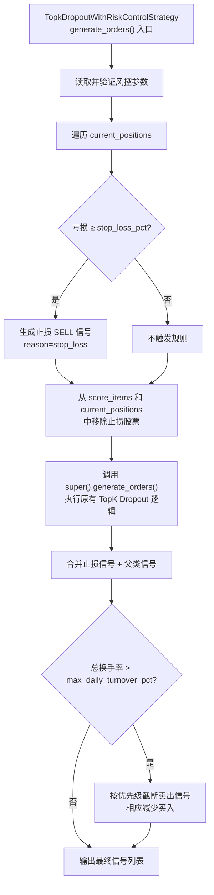
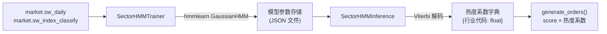

# 设计文档：P4/P1/P5 策略增强

## 概述

本设计文档覆盖 AIstock 量化交易系统三个独立功能模块的技术方案：

1. **P4 — 规则层风控**：新建 `TopkDropoutWithRiskControlStrategy` 策略类，继承 `TopkDropoutStrategy`，在其 `generate_orders()` 中新增止损和换手率上限控制两条确定性规则。不修改原有 `TopkDropoutStrategy`，通过策略注册表切换使用。本阶段不设置止盈和最大持仓天数（实测盈利股票可达 300%+，长期持仓盈利显著，完全依靠 alpha 信号控制轮换）。
2. **P1 — 行业 HMM 热度跟踪**：为每个申万一级行业训练 2 状态 GaussianHMM，每日推断热态/冷态并输出热度系数，集成到 `TopkDropoutStrategy` 中调整个股评分权重。
3. **P5 — Optuna 贝叶斯超参优化**：新增 `OptunaHyperparamOptimizer` 类，在 QE 演进的 `param_tune` 方向中用 Optuna TPE 生成超参数建议，注入 `EvolutionModelAgent` Step 6 的 LLM prompt，并在 Loop 完成后反馈结果。

三个模块无循环依赖：P4 和 P5 可并行实施，P1 依赖 P0（TopK=20）已完成。

### 设计决策

| 决策 | 选择 | 理由 |
|------|------|------|
| P4 实现方式 | 新建子类 `TopkDropoutWithRiskControlStrategy` 继承 `TopkDropoutStrategy` | 不修改原有策略，通过 `@register` 注册新策略代码 `TOPK_DROPOUT_RC`，可随时切换回原策略 |
| P4 规则执行位置 | 子类 `generate_orders()` 中，先执行风控规则，再调用 `super().generate_orders()` | 规则优先于模型，止损信号不应被 dropout 覆盖 |
| P4 规则优先级 | 止损 > force_sell > dropout | 风险控制优先于收益优化 |
| P1 HMM 粒度 | 申万一级行业（~31 个），每行业独立 2 状态 | 一级行业数据充足，2 状态（热/冷）简洁且可解释 |
| P1 冷却期 | 状态切换后 3 个交易日锁定 | 防止 HMM 状态抖动导致频繁调仓 |
| P5 Optuna 模式 | LLM 辅助模式（Optuna 建议 + LLM 微调） | 保留 LLM 的领域知识，Optuna 提供数据驱动的搜索方向 |
| P5 Study 持久化 | JournalFileStorage 文件存储 | 轻量、无需额外数据库，路径与现有 SOTA_ASSETS_DIR 一致 |

## 架构

### 整体架构图

```mermaid
graph TB
    subgraph P4["P4: 规则层风控（新策略子类）"]
        RC["TopkDropoutWithRiskControlStrategy"] --> SL["止损检查"]
        SL --> PARENT["super().generate_orders()<br/>(原 TopK Dropout 逻辑)"]
        PARENT --> MERGE["合并止损信号 + 父类信号"]
        MERGE --> TC["换手率上限截断"]
    end

    subgraph P1["P1: 行业 HMM"]
        TR["SectorHMMTrainer"] --> |"训练"| HM["HMM 模型存储"]
        HM --> INF["SectorHMMInference"]
        INF --> |"热度系数"| GO
    end

    subgraph P5["P5: Optuna 超参优化"]
        OPT["OptunaHyperparamOptimizer"] --> |"ask()"| MA["EvolutionModelAgent Step 6"]
        MA --> |"LLM + Optuna 建议"| CFG["新超参数配置"]
        PCL["process_completed_loop"] --> |"tell()"| OPT
    end
```



### P4 执行流程



### P1 数据流



### P5 集成流程

```mermaid
sequenceDiagram
    participant PCL as process_completed_loop
    participant MA as EvolutionModelAgent
    participant OPT as OptunaHyperparamOptimizer
    participant LLM as LLM

    PCL->>OPT: tell(trial, IC) [上轮结果反馈]
    PCL->>MA: run() [param_tune 方向]
    MA->>OPT: ask() [获取 Optuna 建议]
    OPT-->>MA: suggested_params
    MA->>LLM: Step 6 prompt + optuna_suggestion
    LLM-->>MA: final_params (LLM 微调后)
    MA-->>PCL: next_config
```

## 组件与接口

### P4: TopkDropoutWithRiskControlStrategy（新策略类）

**新文件：** `AIstock/backend/rebalance_strategies/topk_dropout_rc.py`

新建 `TopkDropoutWithRiskControlStrategy` 继承 `TopkDropoutStrategy`，通过 `@register` 装饰器注册为 `TOPK_DROPOUT_RC`。原有 `TopkDropoutStrategy`（`TOPK_DROPOUT`）保持不变。

```python
@register
class TopkDropoutWithRiskControlStrategy(TopkDropoutStrategy):
    """带风控规则的 TopkDropout 策略。
    
    在原有 TopK Dropout 逻辑基础上新增：
    1. 止损规则：亏损 ≥ stop_loss_pct 时强制卖出
    2. 换手率上限：每日卖出市值不超过 max_daily_turnover_pct
    """
    STRATEGY_CODE = "TOPK_DROPOUT_RC"

    def generate_orders(self, score_items, current_positions, portfolio_value,
                        config, signal_date, next_trade_date, portfolio_id,
                        close_price_fn) -> List[Dict[str, Any]]:
        """重写 generate_orders：先执行风控规则，再调用父类逻辑。"""
    
    def _check_stop_loss(self, current_positions, close_price_fn, signal_date,
                         config) -> List[Dict]:
        """检查止损规则，返回止损 SELL 信号列表。"""
    
    def _apply_turnover_cap(self, signals, portfolio_value, config) -> List[Dict]:
        """对合并后的信号列表应用换手率上限截断。"""
    
    @staticmethod
    def _validate_risk_params(config) -> Dict[str, Any]:
        """验证并返回风控参数，非法值回退到默认值。"""
```

**执行流程：**
1. 读取并验证风控参数（stop_loss_pct, max_daily_turnover_pct）
2. 执行止损检查，生成止损 SELL 信号
3. 从 score_items 中移除止损股票，从 current_positions 中移除止损股票
4. 调用 `super().generate_orders()` 执行原有 TopK Dropout 逻辑
5. 合并止损信号 + 父类信号
6. 应用换手率上限截断

**参数读取接口（从 config 字典）：**

| 参数 | 类型 | 默认值 | 合法范围 |
|------|------|--------|----------|
| `stop_loss_pct` | float | 0.10 | (0, 1) |
| `max_daily_turnover_pct` | float | 0.30 | (0, 1] |

### P1: SectorHMMTrainer

**新文件：** `AIstock/backend/quant_models/hmm/sector_hmm.py`

```python
@dataclass
class SectorHMMConfig:
    n_states: int = 2
    history_years: float = 3.0
    min_trading_days: int = 120
    cooldown_days: int = 3
    trending_coeff: float = 1.5
    fading_coeff: float = 0.5
    neutral_coeff: float = 1.0

class SectorHMMTrainer:
    def __init__(self, config: SectorHMMConfig = None): ...
    
    def train_all_sectors(self) -> Dict[str, Any]:
        """为所有申万一级行业训练 HMM 模型。
        Returns: {sector_code: {transmat, means, covars, state_labels}}
        """
    
    def _build_observation_matrix(self, sector_code: str) -> np.ndarray:
        """构建 4 列观测矩阵：
        [日收益率, 相对沪深300超额收益20日均值, 成交量占比, 涨停家数占比]
        """
    
    def _label_states(self, model: GaussianHMM) -> Dict[int, str]:
        """比较两个状态的均值向量中日收益率分量，高者为 trending，低者为 fading。"""
    
    def save_models(self, models: Dict, path: str): ...
    def load_models(self, path: str) -> Dict: ...
```

### P1: SectorHMMInference

```python
class SectorHMMInference:
    def __init__(self, model_path: str, config: SectorHMMConfig = None): ...
    
    def get_sector_coefficients(self, trade_date: date) -> Dict[str, float]:
        """返回 {sector_code: heat_coefficient}。
        热态→1.5, 冷态→0.5, 无模型→1.0, 冷却期内→上次值。
        """
    
    def _decode_state(self, sector_code: str, trade_date: date) -> str:
        """Viterbi 解码当日隐状态。"""
    
    def _check_cooldown(self, sector_code: str, new_state: str, trade_date: date) -> bool:
        """检查是否在冷却期内。"""
```

### P1: TopkDropoutWithRiskControlStrategy 集成

在 `TopkDropoutWithRiskControlStrategy.generate_orders()` 中，当 `config.get("enable_sector_hmm")` 为 True 时：
1. 调用 `SectorHMMInference.get_sector_coefficients(signal_date)`
2. 将 `score_items` 中每只股票的 score 乘以其所属行业的热度系数
3. 使用调整后的评分传递给后续 TopK 排序

需要一个辅助函数查询股票所属申万一级行业：

```python
def _get_stock_sector_map(self, symbols: List[str], trade_date: date) -> Dict[str, str]:
    """查询股票→申万一级行业代码映射。"""
```

### P5: OptunaHyperparamOptimizer

**新文件：** `AIstock/backend/services/quantevolver/optuna_optimizer.py`

```python
class OptunaHyperparamOptimizer:
    def __init__(self, task_id: str, model_type: str): ...
    
    def get_or_create_study(self) -> optuna.Study:
        """创建或加载持久化 Study，注入历史 trial。"""
    
    def ask(self) -> Tuple[optuna.Trial, Dict[str, Any]]:
        """生成一组候选超参数。
        Returns: (trial, suggested_params)
        """
    
    def tell(self, trial: optuna.Trial, ic_value: float): 
        """反馈结果给 Optuna。"""
    
    def _inject_historical_trials(self, study: optuna.Study):
        """从 qe_evolution_loops 注入历史 param_tune trial。"""
    
    def _inject_cross_task_trials(self, study: optuna.Study):
        """注入同 model_type 跨 task 的最优 trial（前 10/20 条）。"""
    
    def _define_search_space(self, trial: optuna.Trial) -> Dict[str, Any]:
        """根据 HYPERPARAM_RANGES 定义搜索空间。"""
```

**Study 存储路径：** `{QE_SOTA_ASSETS_DIR}/optuna_studies/{task_id}_{model_type}.db`

### P5: EvolutionModelAgent 修改

在 `EvolutionModelAgent.run()` 的 Step 6 中：
- 当 `model_decision == "tune_hyperparams"` 时，调用 `OptunaHyperparamOptimizer.ask()` 获取建议
- 将建议注入 Step 6 LLM prompt 的 `optuna_suggestion` 字段
- 在 `process_completed_loop()` 中，当 `action_type == "param_tune"` 时调用 `tell()` 反馈

### P5: AutoEvolutionScheduler 修改

在 `process_completed_loop()` 中新增：
- 检测 `action_type == "param_tune"` 时，调用 `OptunaHyperparamOptimizer.tell()` 反馈 IC 值
- 异常处理：Optuna 不可用时回退到纯 LLM 模式

## 数据模型

### P4: 信号扩展

现有 signal 字典新增 `reason` 字段：

```python
{
    "portfolio_id": int,
    "signal_date": date,
    "trade_date": date,
    "symbol": str,
    "side": "SELL" | "BUY",
    "target_quantity": int,
    "target_weight": float,
    "score": float,
    "reason": str | None,  # 新增: "stop_loss", None
}
```

### P1: HMM 模型存储格式

每个行业的 HMM 模型参数以 JSON 文件持久化：

```json
{
    "sector_code": "801010.SI",
    "sector_name": "农林牧渔",
    "n_states": 2,
    "transmat": [[0.95, 0.05], [0.08, 0.92]],
    "means": [[0.001, 0.002, 0.03, 0.02], [-0.001, -0.001, 0.02, 0.01]],
    "covars": "...",
    "state_labels": {"0": "trending", "1": "fading"},
    "trained_at": "2025-01-15T10:00:00",
    "training_days": 730
}
```

冷却期状态缓存（内存 + 可选 JSON 持久化）：

```python
{
    "sector_code": {
        "last_state": "trending",
        "last_switch_date": date(2025, 1, 10),
        "current_coeff": 1.5
    }
}
```

### P1: 数据库查询

训练数据来源：
- `market.sw_index_classify`：获取申万一级行业列表（`level = 'L1'`）
- `market.sw_daily`：行业指数日线行情（open, high, low, close, vol, amount, pct_change）
- `market.sw_index_member`：股票→行业映射（PIT）
- 沪深 300 指数日线：用于计算超额收益

### P5: Optuna Study 存储

- 存储方式：`optuna.storages.JournalFileStorage`
- 路径：`{QE_SOTA_ASSETS_DIR}/optuna_studies/{task_id}_{model_type}.db`
- 每个 (task_id, model_type) 组合一个独立 Study

### P5: 历史 Trial 注入数据源

```sql
-- 同 task 历史 trial
SELECT config_json, metrics_json 
FROM qe_evolution_loops 
WHERE task_id = ? AND action_type = 'param_tune' AND status = 'completed';

-- 跨 task 最优 trial（同 model_type）
SELECT config_json, metrics_json 
FROM qe_evolution_loops l
JOIN qe_evolution_tasks t ON l.task_id = t.task_id
WHERE l.action_type = 'param_tune' AND l.status = 'completed'
  AND config_json->>'model_type' = ?
ORDER BY (metrics_json->>'IC')::float DESC
LIMIT 20;
```


## 正确性属性（Correctness Properties）

*属性（Property）是指在系统所有合法执行路径中都应成立的特征或行为——本质上是对系统应做什么的形式化陈述。属性是人类可读规格说明与机器可验证正确性保证之间的桥梁。*

### Property 1: 止损信号生成

*For any* 持仓股票，若 close_price_fn 返回的当前价格 ≤ avg_cost × (1 - stop_loss_pct)，则 generate_orders 返回的信号列表中应包含该股票的 SELL 信号，且 target_quantity 等于当前持仓数量，reason 字段为 "stop_loss"。

**Validates: Requirements 1.1, 1.2, 1.3**

### Property 2: 规则优先级与 Dropout 排除

*For any* 持仓集合，被止损规则触发的股票不应出现在 TopK dropout 卖出信号中，不产生重复信号。

**Validates: Requirements 1.4**

### Property 3: 换手率上限截断

*For any* generate_orders 的输出信号列表，所有卖出信号的市值总和占 portfolio_value 的比例不应超过 max_daily_turnover_pct。当截断发生时，低优先级信号先被移除（优先级：止损 > force_sell > dropout_sell），且买入信号数量应相应减少以保持买卖平衡。

**Validates: Requirements 2.2, 2.3, 2.4**

### Property 4: 非法参数回退到默认值

*For any* config 字典中超出合法范围的风控参数值（如 stop_loss_pct ≤ 0 或 ≥ 1），generate_orders 的行为应等价于使用对应默认值时的行为。

**Validates: Requirements 3.3, 3.4**

### Property 5: HMM 观测矩阵结构

*For any* 申万一级行业，SectorHMMTrainer._build_observation_matrix() 返回的矩阵应有恰好 4 列，行数等于训练窗口内的交易日数量，且不包含 NaN 值。

**Validates: Requirements 4.2**

### Property 6: HMM 模型持久化往返

*For any* 已训练的 HMM 模型参数集合，save_models() 后再 load_models() 应得到与原始参数数值等价的结果（转移矩阵、均值向量、协方差矩阵的元素差异 < 1e-10）。

**Validates: Requirements 4.4**

### Property 7: HMM 状态标记一致性

*For any* 已训练的 2 状态 HMM 模型，被标记为 "trending" 的状态的均值向量中日收益率分量应严格大于被标记为 "fading" 的状态的对应分量。

**Validates: Requirements 4.6**

### Property 8: HMM 推断输出有效性

*For any* 交易日期和已训练的行业 HMM 模型集合，SectorHMMInference.get_sector_coefficients() 返回的字典中每个值应为 0.5、1.0 或 1.5 之一，且所有已训练行业的代码都应作为键出现。

**Validates: Requirements 5.1, 5.2, 5.3**

### Property 9: HMM 冷却期行为

*For any* 行业，若其 HMM 状态在某交易日发生切换，则在随后的 cooldown_days 个交易日内，该行业的热度系数应保持为切换前的值，不随新的 Viterbi 解码结果变化。

**Validates: Requirements 5.4**

### Property 10: 行业热度系数调整评分

*For any* score_items 列表和行业热度系数字典，当 enable_sector_hmm 为 True 时，调整后的评分应等于原始 score × 对应行业热度系数，且 TopK 排序应基于调整后的评分。

**Validates: Requirements 6.2, 6.3**

### Property 11: 行业热度开关关闭时评分不变

*For any* score_items 列表，当 enable_sector_hmm 为 False 或未设置时，generate_orders 使用的评分应与原始 score_items 中的评分完全一致。

**Validates: Requirements 6.4**

### Property 12: Optuna Study 幂等创建

*For any* (task_id, model_type) 组合，连续两次调用 get_or_create_study() 应返回包含相同 trial 数量的 Study，不会重复注入历史 trial。

**Validates: Requirements 7.1**

### Property 13: 历史 Trial 注入

*For any* task_id，若 qe_evolution_loops 中存在 N 条 action_type="param_tune" 且 status="completed" 的记录，则新创建的 Optuna Study 中应包含至少 N 条已完成的 trial，每条 trial 的目标值等于对应 Loop 的 IC 值。

**Validates: Requirements 7.2, 7.3**

### Property 14: 跨 Task Trial 注入与上限

*For any* model_type，跨 task 注入的 trial 数量不应超过 20 条（当可用 trial > 50 时），且每条注入的 trial 的 user_attrs 中应包含 source_task_id 标记。

**Validates: Requirements 7.4, 10.1, 10.2, 10.3**

### Property 15: Optuna ask() 参数范围有效性

*For any* model_type 在 HYPERPARAM_RANGES 中有定义时，ask() 返回的每个超参数值应在对应的 (min, max) 范围内，且整数类型参数（max_depth, num_leaves, n_epochs, batch_size, early_stop）应为整数，浮点类型参数应为浮点数。

**Validates: Requirements 8.1, 8.2, 8.5**

### Property 16: Optuna tell() 反馈更新

*For any* ask() 返回的 trial，调用 tell(trial, ic_value) 后，Study 中已完成的 trial 数量应增加 1，且最新 trial 的目标值应等于传入的 ic_value。

**Validates: Requirements 8.4**

## 错误处理

### P4: TopkDropoutWithRiskControlStrategy 风控规则

| 错误场景 | 处理方式 |
|----------|----------|
| close_price_fn 返回 None | 跳过该股票的止损检查，不生成规则信号 |
| 风控参数超出合法范围 | 记录警告日志，使用默认值 |
| portfolio_value ≤ 0 | 跳过换手率计算，不截断信号 |

### P1: 行业 HMM

| 错误场景 | 处理方式 |
|----------|----------|
| 行业训练数据不足 120 天 | 跳过该行业，记录警告日志 |
| hmmlearn 拟合失败（不收敛） | 跳过该行业，记录错误日志 |
| 模型文件不存在或损坏 | 该行业返回中性系数 1.0 |
| 数据库查询失败 | 所有行业返回中性系数 1.0，记录错误日志 |
| 股票无法映射到申万一级行业 | 该股票使用中性系数 1.0 |

### P5: Optuna 超参优化

| 错误场景 | 处理方式 |
|----------|----------|
| optuna 库未安装 | 回退到纯 LLM 模式，记录警告日志 |
| Study 文件损坏或加载失败 | 创建新 Study，记录警告日志 |
| ask() 异常 | 回退到纯 LLM 模式，本轮不使用 Optuna 建议 |
| tell() 异常 | 记录错误日志，不影响演进流程继续 |
| 历史 trial 的 model_params 格式不兼容 | 跳过该 trial 的注入，记录警告日志 |
| HYPERPARAM_RANGES 中无对应 model_type | 回退到纯 LLM 模式 |

## 测试策略

### 双重测试方法

本功能采用单元测试 + 属性测试（Property-Based Testing）双重策略：

- **单元测试**：验证具体示例、边界条件和错误处理
- **属性测试**：验证跨所有输入的通用属性

### 属性测试配置

- **库**：`hypothesis`（Python PBT 库）
- **最小迭代次数**：每个属性测试 100 次
- **标签格式**：`Feature: p4-p1-p5-strategy-enhancement, Property {N}: {property_text}`
- **每个正确性属性由一个属性测试实现**

### P4 测试计划

**属性测试（hypothesis）：**
- Property 1: 止损信号生成 — 生成随机持仓和价格，验证止损触发条件和信号正确性
- Property 2: 规则优先级 — 生成止损触发的持仓，验证不出现在 dropout 信号中
- Property 3: 换手率上限 — 生成超过换手率上限的信号集，验证截断逻辑和买卖平衡
- Property 4: 参数验证 — 生成随机非法参数值，验证回退到默认值

**单元测试：**
- 冷启动场景（无持仓）下风控规则不触发
- close_price_fn 返回 None 时的降级行为
- 默认参数值验证（需求 3.1, 3.2）

### P1 测试计划

**属性测试（hypothesis）：**
- Property 5: 观测矩阵结构 — 生成随机行业数据，验证矩阵维度和无 NaN
- Property 6: 模型持久化往返 — 生成随机 HMM 参数，验证 save/load 等价性
- Property 7: 状态标记一致性 — 生成随机 2 状态 HMM 均值，验证标记逻辑
- Property 8: 推断输出有效性 — 生成随机模型和日期，验证系数值域
- Property 9: 冷却期行为 — 模拟状态切换序列，验证冷却期内系数不变
- Property 10: 评分调整 — 生成随机评分和系数，验证乘法正确性
- Property 11: 开关关闭 — 验证 enable_sector_hmm=False 时评分不变

**单元测试：**
- 训练数据不足 120 天时跳过行业（需求 4.5）
- 无模型行业返回中性系数 1.0（需求 5.6）
- enable_sector_hmm 未设置时的默认行为

### P5 测试计划

**属性测试（hypothesis）：**
- Property 12: Study 幂等创建 — 多次创建同一 Study，验证 trial 不重复
- Property 13: 历史 trial 注入 — 模拟历史数据，验证注入数量和目标值
- Property 14: 跨 task trial 注入上限 — 生成大量跨 task trial，验证上限截断
- Property 15: ask() 参数范围 — 对所有 model_type 调用 ask()，验证参数在范围内
- Property 16: tell() 反馈 — 调用 ask() + tell()，验证 trial 数量递增

**单元测试：**
- optuna 未安装时的回退行为（需求 9.4）
- HYPERPARAM_RANGES 中所有 model_type 的覆盖验证（需求 10.4）
- Study 文件路径格式验证（需求 9.3）
- 空历史时的冷启动行为（需求 7.5）
