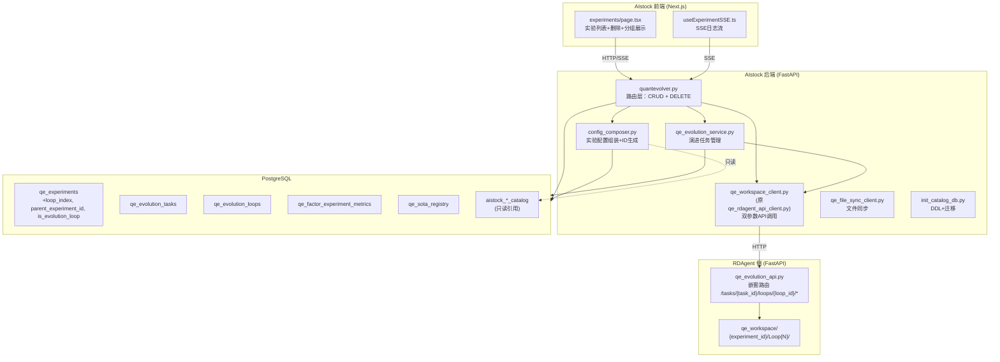
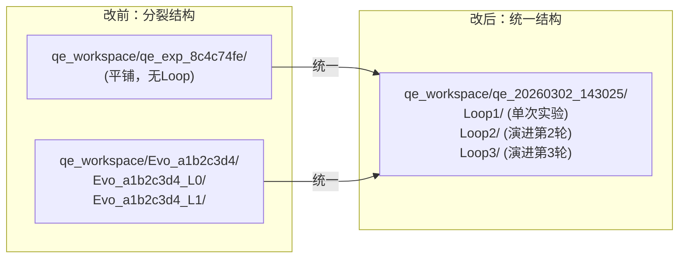
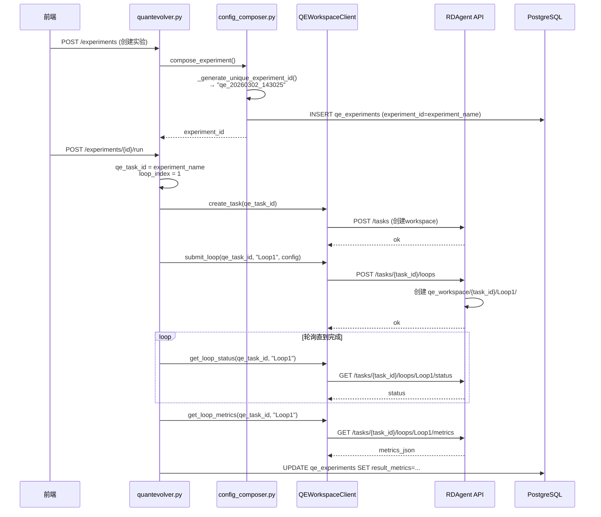
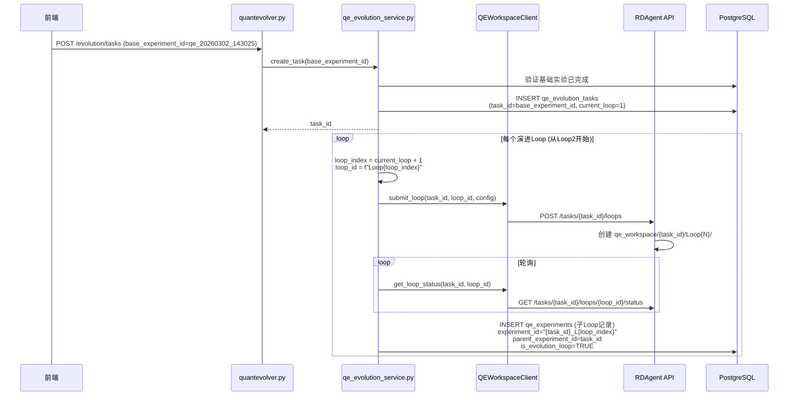
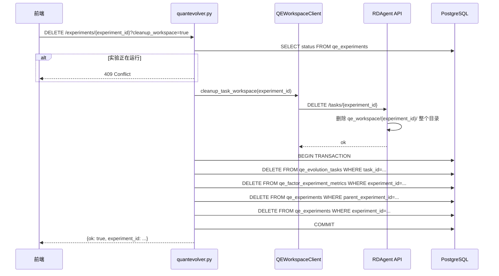

# 设计文档：QE 实验模块整改 (qe-experiment-overhaul)

## 概述

QE（QuantEvolver）实验模块当前存在多个架构缺陷：实验ID使用无语义UUID、单次实验与演进实验workspace结构不统一、metrics 404关键Bug（task_id重复拼接）、缺少实验删除功能、以及QE内部代码中不当的`rdagent_*`命名。本次整改将从ID格式改造、workspace统一、结果统计统一、删除功能、命名清理、API路由重构六个维度进行全面改造。

整改涉及三个代码仓库：AIstock后端（Python/FastAPI）、AIstock前端（TypeScript/Next.js）、RDAgent侧API（Python/FastAPI）。改动按依赖关系分三个Phase执行：Phase 1 DB迁移+RDAgent路由重构（可并行）→ Phase 2 AIstock后端核心改动 → Phase 3 前端适配。

核心设计原则：QE实验子系统与RDAgent Task同步模块完全隔离——QE只读引用catalog表，绝不写入catalog表，绝不触碰RDAgent的workspace。

## 架构

### 系统架构总览



### 统一Workspace结构



## 主要工作流时序图

### 单次实验执行流程



### 从单次实验无缝开始演进



### 实验删除流程



## 组件与接口

### 组件1：ConfigComposer（config_composer.py）

**职责**：实验配置组装、ID生成、配置缓存管理

**接口**：
```python
class ConfigComposer:
    _workspace_config_cache: dict  # 原 _rdagent_config_cache

    def compose_experiment(self, ...) -> dict:
        """组装实验配置，生成唯一experiment_id"""
        ...

    def compose_experiment_in_memory(self, experiment_name: str, ...) -> dict:
        """内存中组装实验配置（用于workspace文件生成）"""
        ...

    def _generate_unique_experiment_id(self) -> str:
        """生成基于日期时间的唯一实验ID: qe_YYYYMMDD_HHMMSS"""
        ...

    def _fetch_workspace_config(self) -> dict:  # 原 _fetch_rdagent_config
        """获取workspace配置"""
        ...
```

### 组件2：QEWorkspaceClient（qe_workspace_client.py）

**职责**：与RDAgent侧API通信，管理workspace生命周期

**接口**：
```python
class QEWorkspaceClient:  # 原 RdagentApiClient
    async def get_loop_status(self, task_id: str, loop_id: str) -> dict:
        """双参数：获取Loop状态"""
        url = f"{self.base_url}/tasks/{task_id}/loops/{loop_id}/status"
        ...

    async def get_loop_metrics(self, task_id: str, loop_id: str) -> dict:
        """双参数：获取Loop指标"""
        url = f"{self.base_url}/tasks/{task_id}/loops/{loop_id}/metrics"
        ...

    async def download_loop_assets(self, task_id: str, loop_id: str) -> bytes:
        """双参数：下载Loop资产"""
        url = f"{self.base_url}/tasks/{task_id}/loops/{loop_id}/assets/download"
        ...

    async def cleanup_task_workspace(self, task_id: str) -> dict:
        """清理整个task的workspace目录"""
        url = f"{self.base_url}/tasks/{task_id}"
        ...
```

### 组件3：QEEvolutionService（qe_evolution_service.py）

**职责**：演进任务生命周期管理

**接口**：
```python
class QEEvolutionService:
    workspace_client: QEWorkspaceClient  # 原 rdagent_client

    async def create_task(
        self, task_name: str, target_desc: str,
        max_loops: int, base_experiment_id: str
    ) -> str:
        """创建演进任务，task_id复用base_experiment_id"""
        ...

    async def start_task_loop(self, task_id: str) -> dict:
        """启动下一个演进Loop，loop_id格式: Loop{N}"""
        ...
```

### 组件4：RDAgent QE API（qe_evolution_api.py）

**职责**：提供嵌套路由的workspace管理API

**接口**：
```python
# 改后的路由结构（双参数嵌套）
@router.get("/tasks/{task_id}/loops/{loop_id}/status")
async def get_loop_status(task_id: str, loop_id: str) -> dict: ...

@router.get("/tasks/{task_id}/loops/{loop_id}/metrics")
async def get_loop_metrics(task_id: str, loop_id: str) -> dict: ...

@router.get("/tasks/{task_id}/loops/{loop_id}/assets/download")
async def download_loop_assets(task_id: str, loop_id: str) -> Response: ...

@router.delete("/tasks/{task_id}")
async def delete_task_workspace(task_id: str) -> dict: ...
```

## 数据模型

### qe_experiments 表（改后）

```python
# DDL定义
qe_experiments = {
    "experiment_id": "TEXT PRIMARY KEY",       # qe_20260302_143025 或 qe_20260302_143025_L2
    "experiment_name": "TEXT NOT NULL",         # 与experiment_id统一
    "qe_task_id": "TEXT",                      # 原 rdagent_task_id
    "qe_loop_id": "TEXT",                      # 原 rdagent_loop_id
    "loop_index": "INTEGER DEFAULT 1",         # 新增：Loop序号
    "parent_experiment_id": "TEXT",            # 新增：父实验ID（演进Loop用）
    "is_evolution_loop": "BOOLEAN DEFAULT FALSE",  # 新增：是否为演进Loop
    "factor_names": "JSONB",
    "model_id": "TEXT",
    "strategy_id": "TEXT",
    "result_metrics": "JSONB",
    "status": "TEXT DEFAULT 'pending'",
    "is_sota": "BOOLEAN DEFAULT FALSE",
    "created_at": "TIMESTAMPTZ DEFAULT NOW()",
}
```

**验证规则**：
- `experiment_id` 必须唯一（UNIQUE约束）
- `loop_index` 必须 >= 1
- `parent_experiment_id` 为NULL时表示主实验，非NULL时表示演进子Loop
- `is_evolution_loop` 为TRUE时 `parent_experiment_id` 不能为NULL

### 前端TypeScript类型（改后）

```typescript
interface QEExperiment {
    experiment_id: string;
    experiment_name: string;
    qe_task_id: string;      // 原 rdagent_task_id
    qe_loop_id: string;      // 原 rdagent_loop_id
    loop_index: number;
    parent_experiment_id: string | null;
    is_evolution_loop: boolean;
    factor_names: string[];
    model_id: string;
    strategy_id: string;
    result_metrics: Record<string, any> | null;
    status: string;
    is_sota: boolean;
    created_at: string;
}
```


## 关键函数与形式化规约

### 函数1：_generate_unique_experiment_id()

```python
def _generate_unique_experiment_id(self) -> str:
    """生成基于日期时间的唯一实验ID"""
    base_id = f"qe_{datetime.now().strftime('%Y%m%d_%H%M%S')}"
    # 检查唯一性，冲突时追加后缀
    ...
    return unique_id
```

**前置条件**：
- 数据库连接可用
- `qe_experiments` 表存在

**后置条件**：
- 返回的ID格式匹配 `qe_YYYYMMDD_HHMMSS` 或 `qe_YYYYMMDD_HHMMSS_N`
- 返回的ID在 `qe_experiments` 表中不存在
- 不修改数据库状态（只读查询）

**循环不变量**：
- 冲突检测循环中，所有已检查的候选ID均已存在于数据库中

### 函数2：run_experiment()（quantevolver.py）

```python
async def run_experiment(experiment_id: str, experiment_name: str, ...):
    qe_task_id = experiment_name  # experiment_name = experiment_id（已统一）
    loop_index = 1
    qe_loop_id = f"Loop{loop_index}"
    # 创建workspace、提交Loop、轮询状态、同步结果
    ...
```

**前置条件**：
- `experiment_id` 在 `qe_experiments` 表中存在且状态为 `pending`
- `experiment_name == experiment_id`（已统一）
- RDAgent API服务可达

**后置条件**：
- workspace路径 `qe_workspace/{qe_task_id}/Loop1/` 已创建
- `qe_experiments` 表中该记录的 `qe_task_id = experiment_name`
- `qe_experiments` 表中该记录的 `qe_loop_id = "Loop1"`
- API查询路径与workspace物理路径一致（不再404）

**循环不变量**：
- 轮询循环中，每次查询使用的 `(qe_task_id, qe_loop_id)` 参数与workspace创建时一致

### 函数3：delete_experiment()

```python
@router.delete("/experiments/{experiment_id}")
async def delete_experiment(experiment_id: str, cleanup_workspace: bool = True):
    ...
```

**前置条件**：
- `experiment_id` 在 `qe_experiments` 表中存在
- 实验状态不为 `running`

**后置条件**：
- 若 `cleanup_workspace=True`：`qe_workspace/{experiment_id}/` 目录已删除
- `qe_experiments` 中 `experiment_id` 及所有 `parent_experiment_id = experiment_id` 的记录已删除
- `qe_evolution_tasks` 中 `task_id = experiment_id` 的记录已删除
- `qe_factor_experiment_metrics` 中 `experiment_id` 匹配的记录已删除
- 所有DB删除在同一事务中完成（原子性）

**循环不变量**：N/A（无循环）

### 函数4：create_task()（演进任务创建）

```python
async def create_task(self, task_name, target_desc, max_loops, base_experiment_id) -> str:
    ...
```

**前置条件**：
- `base_experiment_id` 在 `qe_experiments` 表中存在
- 基础实验状态为 `completed`
- `max_loops >= 1`

**后置条件**：
- 返回的 `task_id == base_experiment_id`（复用基础实验ID）
- `qe_evolution_tasks` 中新增一条记录，`current_loop = 1`
- workspace `qe_workspace/{base_experiment_id}/Loop1/` 已存在（基础实验产物）
- 后续演进将从 `Loop2` 开始

**循环不变量**：N/A

## 算法伪代码

### 实验ID生成算法

```python
def _generate_unique_experiment_id(self) -> str:
    """
    算法：生成唯一实验ID
    输入：无（使用当前时间）
    输出：唯一的实验ID字符串
    
    前置条件：数据库连接可用
    后置条件：返回的ID在qe_experiments表中不存在
    """
    base_id = f"qe_{datetime.now().strftime('%Y%m%d_%H%M%S')}"
    
    with get_conn() as conn:
        with conn.cursor() as cur:
            # 检查基础ID是否可用
            cur.execute(
                "SELECT 1 FROM qe_experiments WHERE experiment_id = %s",
                (base_id,),
            )
            if not cur.fetchone():
                return base_id
            
            # 极端冲突：追加序号后缀
            # 循环不变量：所有 base_id, base_id_2, ..., base_id_{i-1} 均已存在
            for i in range(2, 100):
                candidate = f"{base_id}_{i}"
                cur.execute(
                    "SELECT 1 FROM qe_experiments WHERE experiment_id = %s",
                    (candidate,),
                )
                if not cur.fetchone():
                    return candidate
    
    raise RuntimeError(f"无法生成唯一实验ID: {base_id}")
```

### 统一结果写入算法

```python
def write_loop_result_to_experiments(
    task_id: str, loop_index: int, config: dict, metrics: dict, is_sota: bool
):
    """
    算法：将演进Loop结果统一写入qe_experiments表
    输入：task_id, loop_index, config, metrics, is_sota
    输出：无（副作用：DB写入）
    
    前置条件：
    - task_id 对应的基础实验存在于 qe_experiments
    - loop_index >= 2（Loop1是基础实验）
    - metrics 是有效的JSON对象
    
    后置条件：
    - qe_experiments 中存在 experiment_id = f"{task_id}_L{loop_index}" 的记录
    - 该记录的 parent_experiment_id = task_id
    - 该记录的 is_evolution_loop = TRUE
    """
    experiment_id = f"{task_id}_L{loop_index}"
    
    with get_conn() as conn:
        with conn.cursor() as cur:
            cur.execute("""
                INSERT INTO qe_experiments 
                (experiment_id, experiment_name, loop_index, parent_experiment_id,
                 is_evolution_loop, factor_names, model_id, strategy_id,
                 result_metrics, status, is_sota)
                VALUES (%s, %s, %s, %s, TRUE, %s, %s, %s, %s, 'completed', %s)
                ON CONFLICT (experiment_id) DO UPDATE SET
                    result_metrics = EXCLUDED.result_metrics,
                    status = EXCLUDED.status,
                    is_sota = EXCLUDED.is_sota
            """, (
                experiment_id,
                f"{task_id} Loop{loop_index}",
                loop_index,
                task_id,
                json.dumps(config.get("factor_list", [])),
                config.get("model_id"),
                config.get("strategy_id"),
                json.dumps(metrics),
                is_sota,
            ))
        conn.commit()
```

### DB迁移算法

```python
def run_migration():
    """
    算法：执行DB迁移（列名重命名 + 新增字段 + 历史数据回填）
    
    前置条件：
    - qe_experiments 表存在
    - rdagent_task_id, rdagent_loop_id 列存在（旧列名）
    
    后置条件：
    - 列名已重命名：rdagent_task_id → qe_task_id, rdagent_loop_id → qe_loop_id
    - 新增列：loop_index, parent_experiment_id, is_evolution_loop
    - 历史数据已回填：qe_task_id = experiment_name, qe_loop_id = 'Loop1', loop_index = 1
    """
    migration_steps = [
        # Step 1: 列名重命名
        "ALTER TABLE qe_experiments RENAME COLUMN rdagent_task_id TO qe_task_id",
        "ALTER TABLE qe_experiments RENAME COLUMN rdagent_loop_id TO qe_loop_id",
        # Step 2: 新增字段
        "ALTER TABLE qe_experiments ADD COLUMN IF NOT EXISTS loop_index INTEGER DEFAULT 1",
        "ALTER TABLE qe_experiments ADD COLUMN IF NOT EXISTS parent_experiment_id TEXT",
        "ALTER TABLE qe_experiments ADD COLUMN IF NOT EXISTS is_evolution_loop BOOLEAN DEFAULT FALSE",
        # Step 3: 历史数据回填
        """UPDATE qe_experiments 
           SET qe_task_id = experiment_name,
               qe_loop_id = 'Loop1',
               loop_index = 1
           WHERE qe_task_id IS NULL OR qe_task_id LIKE '%\\_%\\_%'""",
    ]
    
    with get_conn() as conn:
        with conn.cursor() as cur:
            for sql in migration_steps:
                cur.execute(sql)
        conn.commit()
```

## 示例用法

### 创建并执行单次实验

```python
# 1. 创建实验 → experiment_id = "qe_20260302_143025"
response = await client.post("/api/v1/quantevolver/experiments", json={
    "factor_names": ["alpha001", "alpha002"],
    "model_id": "lgb_v1",
    "strategy_id": "topk_30",
})
experiment_id = response.json()["experiment_id"]
# experiment_id == "qe_20260302_143025"

# 2. 执行实验 → workspace: qe_workspace/qe_20260302_143025/Loop1/
await client.post(f"/api/v1/quantevolver/experiments/{experiment_id}/run")

# 3. 查询状态 → 使用双参数API
status = await workspace_client.get_loop_status("qe_20260302_143025", "Loop1")
# → GET /tasks/qe_20260302_143025/loops/Loop1/status
```

### 从单次实验开始演进

```python
# 4. 基于已完成实验开始演进
response = await client.post("/api/v1/quantevolver/evolution/tasks", json={
    "base_experiment_id": "qe_20260302_143025",
    "target_desc": "优化因子组合",
    "max_loops": 3,
})
# task_id == "qe_20260302_143025"（复用基础实验ID）

# 5. 演进Loop2 → workspace: qe_workspace/qe_20260302_143025/Loop2/
# 6. 演进Loop3 → workspace: qe_workspace/qe_20260302_143025/Loop3/
```

### 删除实验

```python
# 7. 删除实验（含所有演进Loop和workspace）
response = await client.delete(
    f"/api/v1/quantevolver/experiments/{experiment_id}?cleanup_workspace=true"
)
# → 删除 qe_workspace/qe_20260302_143025/ 整个目录
# → 删除 DB 中所有相关记录
```

### 统一查询实验结果

```sql
-- 获取某个实验（含所有演进Loop）的完整结果
SELECT experiment_id, loop_index, result_metrics, status, is_sota
FROM qe_experiments
WHERE experiment_id = 'qe_20260302_143025'
   OR parent_experiment_id = 'qe_20260302_143025'
ORDER BY loop_index ASC;
```

## Correctness Properties

*A property is a characteristic or behavior that should hold true across all valid executions of a system-essentially, a formal statement about what the system should do. Properties serve as the bridge between human-readable specifications and machine-verifiable correctness guarantees.*

### Property 1: 实验ID格式与唯一性

*For any* generated experiment ID, the ID SHALL match the regex pattern `qe_\d{8}_\d{6}(_\d+)?`, the ID SHALL NOT already exist in the qe_experiments table, and the experiment_name SHALL equal the experiment_id.

**Validates: Requirements 1.1, 1.2, 1.3**

### Property 2: Workspace路径一致性

*For any* experiment record in qe_experiments, the workspace physical path `qe_workspace/{qe_task_id}/Loop{loop_index}/` SHALL equal the API query path `/tasks/{qe_task_id}/loops/Loop{loop_index}/*` in terms of the (task_id, loop_id) parameter pair, and this pair SHALL remain consistent throughout the experiment lifecycle (creation, polling, metrics retrieval).

**Validates: Requirements 2.1, 2.3, 2.4, 3.1, 8.3**

### Property 3: Loop序号单调递增

*For any* set of experiment records sharing the same parent_experiment_id, the loop_index values SHALL be strictly monotonically increasing starting from 2, with no gaps, and the main experiment (parent_experiment_id = NULL) SHALL have loop_index = 1.

**Validates: Requirements 3.3, 4.2**

### Property 4: 演进任务ID复用

*For any* evolution task created from a base experiment, the evolution task's task_id SHALL equal the base_experiment_id, and the evolution task record in qe_evolution_tasks SHALL have current_loop = 1.

**Validates: Requirements 3.2, 6.2**

### Property 5: 实验结果记录完整性

*For any* experiment with N completed evolution loops, querying qe_experiments with `WHERE experiment_id = :id OR parent_experiment_id = :id ORDER BY loop_index ASC` SHALL return exactly N+1 records (1 main + N evolution loops), each with correct loop_index, parent_experiment_id, and is_evolution_loop values.

**Validates: Requirements 4.3, 4.2**

### Property 6: 数据完整性约束

*For any* record in qe_experiments, if is_evolution_loop is TRUE then parent_experiment_id SHALL NOT be NULL, and if parent_experiment_id is NULL then the record SHALL represent a main experiment (is_evolution_loop = FALSE).

**Validates: Requirements 4.4, 4.5**

### Property 7: 删除完整性

*For any* successfully deleted experiment_id, there SHALL be zero records in qe_experiments (including child loops), qe_evolution_tasks, and qe_factor_experiment_metrics that reference that experiment_id, and all deletions SHALL occur within a single database transaction.

**Validates: Requirements 5.5, 5.6**

### Property 8: 演进前置条件

*For any* experiment with status not equal to 'completed', attempting to create an evolution task based on that experiment SHALL raise a ValueError.

**Validates: Requirement 6.1**

### Property 9: QE Catalog隔离性

*For any* SQL statement executed by QE module code, the statement SHALL NOT contain INSERT, UPDATE, or DELETE operations targeting `aistock_factor_catalog`, `aistock_model_catalog`, or `aistock_strategy_catalog` tables.

**Validates: Requirement 10.1**

### Property 10: QE命名一致性

*For any* Python variable or attribute in QE module source files, if it uses the `rdagent_` prefix, it SHALL only be in contexts that semantically refer to RDAgent data (e.g., `rdagent_task_sync`, `rdagent_sota`), not QE experiment concepts.

**Validates: Requirement 7.7**

### Property 11: 迁移幂等性

*For any* database state, executing the migration script twice SHALL produce the same final state as executing it once, with no errors on the second execution.

**Validates: Requirement 9.4**

## 错误处理

### 场景1：实验ID冲突

**条件**：同一秒内创建两个实验（极端情况）
**响应**：`_generate_unique_experiment_id()` 自动追加 `_2`、`_3` 等后缀
**恢复**：自动恢复，无需人工干预

### 场景2：删除运行中的实验

**条件**：用户尝试删除状态为 `running` 的实验
**响应**：返回 HTTP 409 Conflict，提示"实验正在运行中，请先停止"
**恢复**：用户需先停止实验，再执行删除

### 场景3：Workspace清理失败

**条件**：RDAgent API不可达或workspace目录不存在
**响应**：记录warning日志，继续执行DB清理，返回结果中包含 `warnings` 字段
**恢复**：DB记录已清理，workspace残留可后续手动清理

### 场景4：演进基础实验未完成

**条件**：用户尝试对未完成的实验发起演进
**响应**：抛出 ValueError，返回 HTTP 400
**恢复**：用户需等待基础实验完成后再发起演进

### 场景5：DB迁移列名已存在

**条件**：重复执行迁移脚本
**响应**：`ALTER TABLE RENAME COLUMN` 会报错（列名已改）
**恢复**：迁移脚本应使用 `IF EXISTS` 检查，或捕获异常跳过已完成的步骤

## 测试策略

### 单元测试方法

- 测试 `_generate_unique_experiment_id()` 在无冲突和有冲突场景下的行为
- 测试 `delete_experiment()` 的级联删除逻辑（mock DB）
- 测试 `QEWorkspaceClient` 的双参数URL构造
- 测试 `create_task()` 对基础实验状态的校验

### 属性测试方法

**属性测试库**：hypothesis（Python）

- 属性：生成的experiment_id始终匹配 `qe_YYYYMMDD_HHMMSS(_N)?` 正则
- 属性：删除操作后，相关表中无残留记录
- 属性：Loop序号在同一实验下严格递增

### 集成测试方法

- 端到端测试：创建实验 → 执行 → 查询metrics → 验证不再404
- 端到端测试：创建实验 → 完成 → 发起演进 → 验证Loop2在同一workspace
- 端到端测试：创建实验 → 删除 → 验证workspace和DB均已清理
- 回归测试：验证RDAgent Task同步、因子库CRUD、策略库CRUD不受影响

## 性能考虑

- 实验ID冲突检测使用DB查询而非内存锁，适合单实例部署场景
- 删除操作在单个事务中完成所有DB清理，避免部分删除的不一致状态
- workspace清理通过RDAgent API异步执行，不阻塞DB清理

## 安全考虑

- 删除API需验证实验归属（当前为单用户系统，后续多用户时需加权限校验）
- DB迁移脚本应在维护窗口执行，避免影响在线服务
- QE模块严格隔离，不写入catalog表，防止数据污染

## 依赖

- **AIstock后端**：FastAPI, psycopg2, httpx（用于QEWorkspaceClient）
- **AIstock前端**：Next.js, React, TypeScript
- **RDAgent侧**：FastAPI, pathlib（workspace文件操作）
- **数据库**：PostgreSQL（支持 `ALTER TABLE RENAME COLUMN`、`JSONB` 类型）
- **跨系统通信**：HTTP REST API（AIstock ↔ RDAgent）
