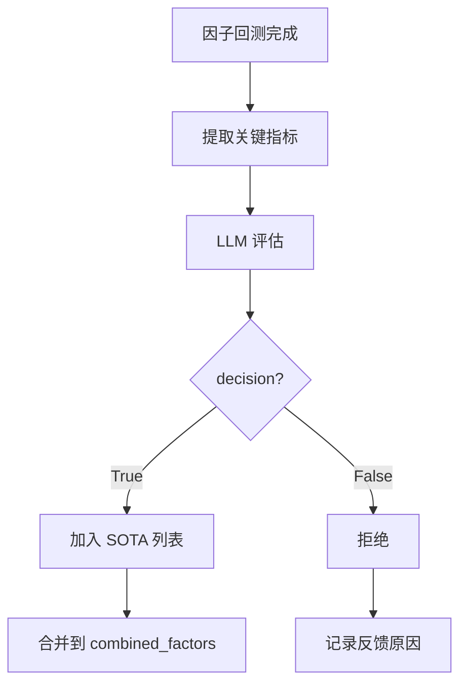

# RD-Agent SOTA 因子完整分析文档

**文档版本**: v2.0  
**生成时间**: 2026-01-13  
**适用场景**: Qlib 量化投资自动化研发

---

## 目录

1. [SOTA 因子概述](#一sota-因子概述)
2. [SOTA 因子存储结构](#二sota-因子存储结构)
3. [SOTA 因子判定机制](#三sota-因子判定机制)
4. [SOTA 因子合并策略](#四sota-因子合并策略)
5. [SOTA 因子性能数据记录](#五sota-因子性能数据记录)
6. [SOTA 因子源代码提取](#六sota-因子源代码提取)
7. [截面因子与时序因子](#七截面因子与时序因子)
8. [SOTA 模型类型与组合](#八sota-模型类型与组合)
9. [Log 目录中 SOTA 信息获取位置](#九log-目录中-sota-信息获取位置)
10. [SOTA 任务独立性和累积机制](#十sota-任务独立性和累积机制)
11. [外部系统复用 RD-Agent 任务成果](#十一外部系统复用-rd-agent-任务成果)
12. [附录](#附录)

---

## 一、SOTA 因子概述

### 1.1 什么是 SOTA 因子？

**SOTA (State-Of-The-Art)** 因子是指在 RD-Agent 自动化研发过程中，经过评估后被接受的、性能最优的因子组合。

**特点**：
- 由 LLM 自动生成和优化
- 经过回测验证
- 具有良好的 IC（信息系数）和风险控制能力
- 可以持续累积和改进

### 1.2 SOTA 因子的价值

| 价值维度 | 说明 |
|---------|------|
| **预测能力** | 高 IC 值，与未来收益相关性强 |
| **风险控制** | 最大回撤可控，风险调整后收益优秀 |
| **可解释性** | 因子逻辑清晰，便于理解和优化 |
| **可复现性** | 源代码完整，可重复计算 |
| **持续优化** | 可以基于 SOTA 因子继续改进 |

### 1.3 SOTA 因子与普通因子的区别

| 特性 | SOTA 因子 | 普通因子 |
|------|----------|---------|
| **决策状态** | `decision = True` | `decision = False` 或 `None` |
| **存储位置** | `based_experiments` | 仅在 `trace.hist` |
| **使用方式** | 合并到后续实验 | 不再使用 |
| **性能要求** | 满足多目标优化标准 | 未达到标准 |

---

## 二、SOTA 因子存储结构

### 2.1 存储位置

SOTA 因子存储在 RD-Agent 的 log 目录中，每个任务一个独立的文件夹：

```
log/
└── YYYY-MM-DD_HH-MM-SS-XXXXXX/          # 任务目录
    ├── __session__/                     # Session 文件目录
    │   ├── 0/                          # Session 0
    │   │   ├── 0_direct_exp_gen       # 直接实验生成
    │   │   ├── 1_coding               # 编码阶段（包含实验历史）
    │   │   ├── 2_running              # 运行阶段
    │   │   └── 3_feedback             # 反馈阶段
    │   ├── 1/
    │   └── ...
    └── Loop_*/                         # Loop 详细日志
        ├── coding/
        ├── direct_exp_gen/
        ├── running/
        └── feedback/
```

### 2.2 数据结构

#### 2.2.1 Trace.hist 结构

**代码位置**: `rdagent/core/proposal.py:139-141`

```python
def __init__(self, scen: ASpecificScen, knowledge_base: ASpecificKB | None = None) -> None:
    self.hist: list[Trace.NodeType] = (
        []
    )  # List of tuples containing experiments and their feedback, organized over time.
```

```python
trace.hist = [
    (Experiment0, Feedback0),  # Loop 0
    (Experiment1, Feedback1),  # Loop 1
    (Experiment2, Feedback2),  # Loop 2
    ...
]

# Experiment 结构
Experiment:
    - hypothesis: Hypothesis          # 因子假设
    - sub_tasks: list[FactorTask]     # 因子任务列表
    - sub_workspace_list: list[FBWorkspace]  # 工作空间列表
    - based_experiments: list[Experiment]  # 依赖的 SOTA 实验
    - result: dict                    # 实验结果
    - experiment_workspace: FBWorkspace  # 实验工作空间

# FBWorkspace 结构
FBWorkspace:
    - file_dict: dict[str, str]       # 代码文件字典
        - "factor.py": "源代码字符串"
    - workspace_path: Path            # 工作空间路径

# Feedback 结构
Feedback:
    - decision: bool                  # 是否接受为 SOTA
    - reason: str                     # 决策原因
    - observations: str               # 观察结果
    - hypothesis_evaluation: str      # 假设评估
    - new_hypothesis: str             # 新假设
```

#### 2.2.2 combined_factors_df.parquet 结构

```python
# 数据格式
combined_factors = pd.DataFrame(
    index=pd.MultiIndex.from_tuples([
        (datetime(2021, 1, 4), "000001.SZ"),
        (datetime(2021, 1, 4), "000002.SZ"),
        ...
    ], names=["datetime", "instrument"]),
    columns=pd.MultiIndex.from_product([
        ["feature"],
        ["factor_A", "factor_B", "factor_C", ...]
    ])
)

# 示例数据
#                     feature                             
#                     factor_A  factor_B  factor_C
# datetime   instrument                                 
# 2021-01-04 000001.SZ   0.1234    0.5678    0.9012
#            000002.SZ   0.2345    0.6789    0.0123
#            ...
```

### 2.3 存储文件类型

| 文件类型 | 存储内容 | 格式 | 位置 |
|---------|---------|------|------|
| **1_coding** | 完整实验历史 | Pickle | `__session__/*/` |
| **combined_factors_df.parquet** | 合并因子数据 | Parquet | `Loop_N/experiment_workspace/` |
| **result.pkl** | 实验结果 | Pickle | `Loop_N/` |

---

## 三、SOTA 因子判定机制

### 3.1 判定流程



### 3.2 重要指标定义

**代码位置**: `rdagent/scenarios/qlib/developer/feedback.py:17-21`

```python
IMPORTANT_METRICS = [
    "IC",                                           # 信息系数
    "ICIR",                                         # 信息系数信息比率
    "Rank IC",                                      # 排名信息系数
    "Rank ICIR",                                    # 排名信息系数信息比率
    "1day.excess_return_with_cost.annualized_return",  # 年化收益率
    "1day.excess_return_with_cost.max_drawdown",   # 最大回撤
    "1day.excess_return_with_cost.sharpe",         # 夏普比率
    "1day.excess_return_with_cost.information_ratio",  # 信息比率
]
```

### 3.3 LLM 判定逻辑

**提示词位置**: `scenarios.qlib.prompts:factor_feedback_generation`

**判定标准**（当前实现）：
- LLM 根据多个重要指标综合评估
- 返回 `"Decision"` 字段
- 如果为 `True`，则接受为 SOTA

**代码位置**: `rdagent/scenarios/qlib/developer/feedback.py:185`

```python
decision = convert2bool(response_json_hypothesis.get("Decision", "false"))
```

---

## 四、SOTA 因子合并策略

### 4.1 合并流程

**代码位置**: `rdagent/scenarios/qlib/developer/factor_runner.py:233-269`

```python
# 1. 收集所有 SOTA 因子
sota_factor_experiments_list = [
    base_exp for base_exp in exp.based_experiments 
    if isinstance(base_exp, QlibFactorExperiment)
]

# 2. 合并 SOTA 因子
if len(sota_factor_experiments_list) > 1:
    SOTA_factor = process_factor_data(sota_factor_experiments_list)

# 3. 处理新因子
new_factors = process_factor_data(exp)

# 4. 去重检查
new_factors = self.deduplicate_new_factors(SOTA_factor, new_factors)

# 5. 合并所有因子
combined_factors = pd.concat([SOTA_factor, new_factors], axis=1).dropna()

# 6. 保存到文件
combined_factors.to_parquet("combined_factors_df.parquet", engine="pyarrow")
```

### 4.2 合并示例

```python
# Loop 0: 新因子 A
SOTA_factor = None
new_factors = [A]
combined_factors = [A]

# Loop 1: 新因子 B (accepted)
SOTA_factor = [A]
new_factors = [B]
combined_factors = [A, B]

# Loop 2: 新因子 C (accepted)
SOTA_factor = [A, B]
new_factors = [C]
combined_factors = [A, B, C]

# Loop 3: 新因子 D (rejected)
SOTA_factor = [A, B, C]
new_factors = [D]
combined_factors = [A, B, C, D]  # 回测时使用，但 D 不加入 SOTA

# Loop 4: 新因子 E (accepted)
SOTA_factor = [A, B, C]
new_factors = [E]
combined_factors = [A, B, C, E]  # D 被移除
```

### 4.3 去重机制

**代码位置**: `rdagent/scenarios/qlib/developer/factor_runner.py:62-88`

```python
def deduplicate_new_factors(self, SOTA_feature: pd.DataFrame, new_feature: pd.DataFrame):
    """
    去重：如果新因子与 SOTA 因子高度相似，会被拒绝
    """
    concat_feature = pd.concat([SOTA_feature, new_feature], axis=1)
    
    # 计算相关性
    IC_max = concat_feature.groupby("datetime").parallel_apply(
        lambda x: x.corr(), axis=1
    ).max()
    
    # 如果相关性过高，移除新因子
    if IC_max > 0.95:
        return None
    
    return new_feature
```

---

## 五、SOTA 因子性能数据记录

### 5.1 性能数据存储

**是的，SOTA 因子记录了完整的性能数据。**

#### 5.1.1 存储位置

| 数据类型 | 存储位置 | 格式 |
|---------|---------|------|
| **实验结果** | `exp.result` | Dict |
| **回测指标** | `result.pkl` | Pickle |

#### 5.1.2 结果数据结构

```python
exp.result = {
    "IC": 0.050256,
    "ICIR": 0.123456,
    "Rank IC": 0.048765,
    "Rank ICIR": 0.112345,
    "1day.excess_return_with_cost.annualized_return": 0.487611,
    "1day.excess_return_with_cost.max_drawdown": -0.267840,
    "1day.excess_return_with_cost.sharpe": 1.234567,
    "1day.excess_return_with_cost.information_ratio": 0.876543,
    ...
}
```

### 5.2 性能数据提取

```python
import pickle

# 加载 session
with open('log/YYYY-MM-DD_HH-MM-SS-XXXXXX/__session__/0/1_coding', 'rb') as f:
    session = pickle.load(f)

trace = session.trace

# 提取所有 SOTA 因子的性能数据
sota_performance = []
for exp, feedback in trace.hist:
    if feedback.decision and isinstance(exp, QlibFactorExperiment):
        sota_performance.append({
            "loop_id": trace.hist.index((exp, feedback)),
            "hypothesis": exp.hypothesis.hypothesis,
            "result": exp.result,
            "reason": feedback.reason
        })
```

---

## 六、SOTA 因子源代码提取

### 6.1 源代码存储

**是的，SOTA 因子存储了完整的源代码。**

**存储位置**: `exp.sub_workspace_list[i].file_dict["factor.py"]`

**数据类型**: `str` - 源代码字符串

### 6.2 提取方法

```python
import pickle

# 加载 session
with open('log/YYYY-MM-DD_HH-MM-SS-XXXXXX/__session__/0/1_coding', 'rb') as f:
    session = pickle.load(f)

trace = session.trace

# 提取 SOTA 因子源代码
for exp, feedback in trace.hist:
    if feedback.decision and isinstance(exp, QlibFactorExperiment):
        for sub_ws in exp.sub_workspace_list:
            if sub_ws and hasattr(sub_ws, "file_dict"):
                factor_code = sub_ws.file_dict.get("factor.py")
                if factor_code:
                    print(f"Factor code:\n{factor_code}")
```

### 6.3 源代码示例

```python
# Momentum_10D.py
import pandas as pd
import h5py

def calculate_factor(df):
    """
    计算 10 日价格动量因子
    """
    df["Momentum_10D"] = df["close"] / df["close"].shift(10) - 1
    return df[["Momentum_10D"]]

# 读取数据
with h5py.File("daily_pv.h5", "r") as f:
    df = pd.DataFrame(f["data"][:])

# 计算因子
result = calculate_factor(df)

# 保存结果
with h5py.File("result.h5", "w") as f:
    f.create_dataset("factor", data=result.values)
```

---

## 七、截面因子与时序因子

### 7.1 因子类型定义

#### 7.1.1 截面因子

**定义**：在某个时间点，对所有股票计算得到的值

**特点**：
- 每个时间点，每个股票有一个值
- 不需要历史数据
- 适合横截面分析

**示例**：
- 市值换手率
- 市盈率
- 资金流强度

#### 7.1.2 时序因子

**定义**：对单个股票的历史数据计算得到的值

**特点**：
- 需要历史时间窗口
- 反映股票的时序特征
- 适合趋势分析

**示例**：
- 10 日均线
- 20 日动量
- RSI 指标

### 7.2 RD-Agent 中的因子类型

**代码位置**: `rdagent/scenarios/qlib/developer/model_runner.py:169-173`

```python
model_type = getattr(exp.sub_tasks[0], "model_type", None)
if model_type not in ("TimeSeries", "Tabular"):
    raise ModelEmptyError(
        f"Unsupported model_type '{model_type}'. "
        "It must be either 'TimeSeries' or 'Tabular'"
    )
```

**模型类型**：
- **Tabular**：使用截面因子，输入形状 `(batch_size, num_features)`
- **TimeSeries**：使用时序因子，输入形状 `(batch_size, num_timesteps, num_features)`

### 7.3 因子合并方式

**关键理解**：RD-Agent 不区分截面因子和时序因子，所有因子都以相同格式存储和合并。

**代码位置**: `rdagent/scenarios/qlib/developer/utils.py:13-63`

```python
def process_factor_data(exp_or_list):
    """
    处理并合并因子数据
    """
    factor_dfs = []
    for implementation in exp.sub_workspace_list:
        message, df = implementation.execute("All")
        if df is not None and not df.empty:
            factor_dfs.append(df)
    
    # 合并所有因子数据
    if factor_dfs:
        return pd.concat(factor_dfs, axis=1)
```

**合并方式**：
1. **统一格式**：所有因子都返回相同格式的 DataFrame
   - 索引：`(datetime, instrument)` 的 MultiIndex
   - 列：因子值

2. **按列合并**：`pd.concat(factor_dfs, axis=1)`
   - 截面因子：直接合并
   - 时序因子：也直接合并（时序逻辑在因子计算内部处理）

### 7.4 时序因子的特殊处理

**代码位置**: `rdagent/scenarios/qlib/developer/model_runner.py:175-181`

```python
if model_type == "TimeSeries":
    qlib_config_name = "conf_sota_factors_model.yaml" if exist_sota_factor_exp else "conf_baseline_factors_model.yaml"
    attempts = [
        {"dataset_cls": "TSDatasetH", "step_len": 20, "num_timesteps": 20},
        {"dataset_cls": "DatasetH", "step_len": 20, "num_timesteps": 20},
        {"dataset_cls": "TSDatasetH", "step_len": 60, "num_timesteps": 60},
    ]
```

**时序处理**：
1. **数据集类型**：`TSDatasetH` - 时序数据集
2. **时间窗口**：`num_timesteps` - 历史时间步数（20 或 60）
3. **滑动窗口**：`step_len` - 滑动步长

### 7.5 截面因子与时序因子的对比

| 特性 | 截面因子 | 时序因子 |
|------|---------|---------|
| **计算方式** | 单时间点，多股票 | 单股票，多时间点 |
| **数据格式** | `(datetime, instrument)` | `(datetime, instrument)` |
| **合并方式** | `pd.concat(..., axis=1)` | `pd.concat(..., axis=1)` |
| **模型使用** | Tabular 模型 | TimeSeries 模型 |
| **输入形状** | `(batch_size, num_features)` | `(batch_size, num_timesteps, num_features)` |
| **示例** | 市值换手率 | 10 日动量 |

---

## 八、SOTA 模型类型与组合

### 8.1 模型类型定义

**代码位置**: `rdagent/scenarios/qlib/experiment/prompts.yaml:172`

RD-Agent 支持以下模型类型：

| 模型类型 | 输入形状 | 适用场景 | 数据集类型 |
|---------|---------|---------|-----------|
| **Tabular** | `(batch_size, num_features)` | 截面数据、横截面分析 | `DatasetH` |
| **TimeSeries** | `(batch_size, num_timesteps, num_features)` | 时序数据、趋势预测 | `TSDatasetH` |

**代码位置**: `rdagent/scenarios/qlib/developer/model_runner.py:169-173`

```python
model_type = getattr(exp.sub_tasks[0], "model_type", None)
if model_type not in ("TimeSeries", "Tabular"):
    raise ModelEmptyError(
        f"Unsupported model_type '{model_type}'. "
        "It must be either 'TimeSeries' or 'Tabular'"
    )
```

### 8.2 模型架构类型

虽然 RD-Agent 核心只区分 Tabular 和 TimeSeries 两种输入类型，但实际支持的模型架构包括：

| 模型架构 | 类型 | 输入 | 说明 |
|---------|------|------|------|
| **MLP** | Tabular | 截面因子 | 多层感知机 |
| **LightGBM** | Tabular | 截面因子 | 梯度提升树 |
| **XGBoost** | Tabular | 截面因子 | 极端梯度提升 |
| **GRU** | TimeSeries | 时序因子 | 门控循环单元 |
| **LSTM** | TimeSeries | 时序因子 | 长短期记忆网络 |
| **Transformer** | TimeSeries | 时序因子 | 自注意力机制 |

### 8.3 SOTA 模型的选择

**代码位置**: `rdagent/scenarios/qlib/proposal/model_proposal.py:95-97`

```python
if trace.hist[i][1].decision is True and sota_experiment is None:
    sota_experiment = trace.hist[i][0]
    sota_feedback = trace.hist[i][1]
```

**选择逻辑**：
- 从历史实验中倒序查找
- 选择第一个 `decision is True` 的模型实验
- 作为当前的 SOTA 模型

### 8.4 模型替换策略

**代码位置**: `rdagent/scenarios/qlib/developer/factor_runner.py:316-319`

```python
for base_exp in reversed(exp.based_experiments):
    if isinstance(base_exp, QlibModelExperiment):
        sota_model_exp = base_exp
        exist_sota_model_exp = True
        break  # 只保留最新的一个模型
```

**替换逻辑**：
1. 新模型实验会基于 SOTA 模型代码
2. 如果新模型失败，可以回退到 SOTA 模型
3. 如果新模型成功，会替换 SOTA 模型
4. **只保留最新的一个模型**

---

## 九、Log 目录中 SOTA 信息获取位置

### 9.1 Log 目录结构

每个 RD-Agent 任务的 log 目录结构如下：

```
log/
└── YYYY-MM-DD_HH-MM-SS-XXXXXX/          # 任务目录
    ├── __session__/                     # Session 文件目录
    │   ├── 0/                          # Session 0
    │   │   ├── 0_direct_exp_gen       # 直接实验生成
    │   │   ├── 1_coding               # 编码阶段（包含实验历史）
    │   │   ├── 2_running              # 运行阶段
    │   │   └── 3_feedback             # 反馈阶段
    │   ├── 1/
    │   └── ...
    └── Loop_*/                         # Loop 详细日志
        ├── coding/
        ├── direct_exp_gen/
        ├── running/
        └── feedback/
```

### 9.2 SOTA 因子和模型获取位置

**位置**：`log/YYYY-MM-DD_HH-MM-SS-XXXXXX/__session__/*/1_coding`

**获取方式**：

```python
import pickle

# 加载 session 文件
with open('log/2025-12-28_16-24-08-627650/__session__/0/1_coding', 'rb') as f:
    session = pickle.load(f)

# 获取 trace
trace = session.trace

# 遍历实验历史，筛选 SOTA 实验
for exp, feedback in trace.hist:
    if feedback and feedback.decision:  # SOTA 实验
        # exp 是 SOTA 因子或模型实验
        pass
```

**代码证据**：

```python
# rdagent/core/proposal.py:165-172
def get_sota_hypothesis_and_experiment(self) -> tuple[Hypothesis | None, Experiment | None]:
    """Access the last experiment result, sub-task, and the corresponding hypothesis."""
    for experiment, feedback in self.hist[::-1]:
        if feedback.decision:
            return experiment.hypothesis, experiment
    return None, None
```

### 9.3 Workspace 信息获取位置

**位置**：同上，从 session 文件中获取

**获取方式**：

```python
# 方式 1：从 experiment_workspace 获取
exp.experiment_workspace.workspace_path

# 方式 2：从 sub_workspace_list 获取
for sw in exp.sub_workspace_list:
    if sw:
        sw.workspace_path
```

**代码证据**：

```python
# rdagent/utils/workflow/loop.py:257-267
ew = getattr(exp, "experiment_workspace", None)
if ew is not None:
    ew_path = getattr(ew, "workspace_path", None)
    ws_id = _safe_get_workspace_id_from_path(ew_path)
```

**Workspace 目录结构**：

```
git_ignore_folder/RD-Agent_workspace/{workspace_id}/
├── workspace_meta.json          # Workspace 元数据
├── experiment_summary.json      # 实验摘要
├── manifest.json                # 文件清单
├── strategy_meta.json           # 策略元数据
├── runtime_info.py              # 运行时信息
├── factor.py                    # 因子实现代码
├── model.py                     # 模型实现代码
└── model.pkl                    # 模型权重文件
```

### 9.4 factor.py 和 model.py 获取位置

**位置 1**：从 session 文件中获取（推荐）

```python
# 从 sub_workspace_list.file_dict 获取
for sw in exp.sub_workspace_list:
    if sw and hasattr(sw, 'file_dict'):
        # 获取 factor.py
        factor_code = sw.file_dict.get('factor.py')
        
        # 获取 model.py
        model_code = sw.file_dict.get('model.py')
```

**位置 2**：从 workspace 目录中获取

```python
# 直接从 workspace 目录读取
workspace_path = exp.experiment_workspace.workspace_path
factor_py_path = f"{workspace_path}/factor.py"
model_py_path = f"{workspace_path}/model.py"
```

**代码证据**：

```python
# rdagent/scenarios/qlib/developer/factor_runner.py:102-104
for sub_ws in getattr(exp, "sub_workspace_list", []) or []:
    if sub_ws and isinstance(sub_ws.file_dict, dict):
        factor_src = sub_ws.file_dict.get("factor.py")
```

### 9.5 模型权重文件获取位置

**位置 1**：从 session 文件中获取（推荐）

```python
# 从 sub_workspace_list.file_dict 获取
for sw in exp.sub_workspace_list:
    if sw and hasattr(sw, 'file_dict'):
        # 查找权重文件
        for filename in sw.file_dict.keys():
            if filename.endswith(('.pth', '.ckpt', '.bin', '.pkl')):
                weight_data = sw.file_dict[filename]
```

**位置 2**：从 workspace 目录中获取

```python
# 直接从 workspace 目录读取
workspace_path = exp.experiment_workspace.workspace_path
weight_files = [
    f for f in os.listdir(workspace_path)
    if f.endswith(('.pth', '.ckpt', '.bin', '.pkl'))
]
```

### 9.6 回测性能指标获取位置

**位置**：从 session 文件中获取

```python
# 从 exp.result 获取
if hasattr(exp, 'result') and exp.result is not None:
    result_df = exp.result
    
    # result_df 是一个 DataFrame，包含各种性能指标
    # 例如：IC, ICIR, Rank IC, 年化收益, 最大回撤, Sharpe 比率等
    
    # 获取特定指标
    ic = result_df.loc['IC']
    icir = result_df.loc['ICIR']
    sharpe = result_df.loc['1day.excess_return_with_cost.sharpe']
```

**代码证据**：

```python
# rdagent/scenarios/qlib/developer/feedback.py:17-21
IMPORTANT_METRICS = [
    "IC",
    "ICIR",
    "Rank IC",
    "Rank ICIR",
    "1day.excess_return_with_cost.annualized_return",
    "1day.excess_return_with_cost.max_drawdown",
    "1day.excess_return_with_cost.sharpe",
    "1day.excess_return_with_cost.information_ratio",
]
```

### 9.7 是否需要到 Workspace 目录

**答案**：✅ 不需要，log 目录中的 session 文件包含所有信息

| 信息类型 | 是否可以从 log 目录获取 | 是否需要 workspace 目录 |
|---------|---------------------|---------------------|
| **SOTA 因子和模型** | ✅ 是 | ❌ 否 |
| **Workspace 信息** | ✅ 是 | ❌ 否 |
| **factor.py 代码** | ✅ 是 | ❌ 否 |
| **model.py 代码** | ✅ 是 | ❌ 否 |
| **模型权重文件** | ✅ 是 | ❌ 否 |
| **回测性能指标** | ✅ 是 | ❌ 否 |

**说明**：
- Session 文件（`__session__/*/1_coding`）是 pickle 格式，包含完整的实验历史
- 所有信息都可以从 session 文件中提取
- Workspace 目录是可选的，用于直接访问文件或调试

### 9.8 完整示例

```python
import pickle

# 1. 加载 session 文件
session_file = 'log/2025-12-28_16-24-08-627650/__session__/0/1_coding'
with open(session_file, 'rb') as f:
    session = pickle.load(f)

# 2. 获取 trace
trace = session.trace

# 3. 遍历实验历史，提取 SOTA 信息
for exp, feedback in trace.hist:
    if feedback and feedback.decision:  # SOTA 实验
        # 获取 workspace 信息
        workspace_path = exp.experiment_workspace.workspace_path
        
        # 获取 factor.py 代码
        for sw in exp.sub_workspace_list:
            if sw and hasattr(sw, 'file_dict'):
                factor_code = sw.file_dict.get('factor.py')
                model_code = sw.file_dict.get('model.py')
        
        # 获取回测性能指标
        result_df = exp.result
        ic = result_df.loc['IC']
        sharpe = result_df.loc['1day.excess_return_with_cost.sharpe']
```

### 9.9 总结

| 项目 | 位置 | 获取方式 |
|------|------|---------|
| **SOTA 因子和模型** | `log/*/__session__/*/1_coding` | 加载 pickle，筛选 `decision=True` |
| **Workspace 信息** | 同上 | `exp.experiment_workspace.workspace_path` |
| **factor.py** | 同上 | `exp.sub_workspace_list[].file_dict['factor.py']` |
| **model.py** | 同上 | `exp.sub_workspace_list[].file_dict['model.py']` |
| **模型权重** | 同上 | `exp.sub_workspace_list[].file_dict` 中查找 `.pth/.ckpt/.bin/.pkl` |
| **回测指标** | 同上 | `exp.result` DataFrame |
| **是否需要 workspace** | ❌ 否 | ✅ log 目录包含所有信息 |

---

## 十、SOTA 任务独立性和累积机制

### 10.1 任务独立性

**每个任务的 SOTA 是完全独立的**，不同任务之间不会相互影响。

**代码证据**：

```python
# rdagent/core/proposal.py:139-141
def __init__(self, scen: ASpecificScen, knowledge_base: ASpecificKB | None = None) -> None:
    self.hist: list[Trace.NodeType] = (
        []
    )  # List of tuples containing experiments and their feedback, organized over time.
```

**说明**：
- 每个 `Trace` 初始化时，`hist` 是空列表 `[]`
- `hist` 存储所有实验历史 `(experiment, feedback)`
- SOTA 从 `hist` 中提取 `decision=True` 的实验

**任务独立性表现**：

| 项目 | 说明 |
|------|------|
| **独立 Session** | 每个任务有独立的 `__session__/` 文件 |
| **独立 Trace** | 每个 `Trace` 初始化时 `hist = []` |
| **独立 Log 目录** | 每个任务有独立的 `log/YYYY-MM-DD_HH-MM-SS-XXXXXX/` 目录 |
| **不跨任务累积** | 一个任务的 SOTA 不会包含其他任务的因子/模型 |

### 10.2 SOTA 累积机制

**每个任务内部的 SOTA 累积机制**：

#### 10.2.1 第一个 Loop

**✅ 只有第一个 loop 回测成功，才会把因子、模型加入到 SOTA**

**代码证据**：

```python
# rdagent/scenarios/qlib/developer/feedback.py:185
decision = convert2bool(response_json_hypothesis.get("Decision", "false"))
```

**说明**：
- `feedback.decision` 决定是否加入 SOTA
- `decision=True` → 加入 SOTA
- `decision=False` → 不加入 SOTA
- 第一个 loop 回测成功后，LLM 返回 `Decision: true`，因子/模型被加入 SOTA

#### 10.2.2 后续 Loop 维护

**✅ 今后在同一个任务中的所有 loop 都是在这个基础上维护 SOTA**

**因子 SOTA 维护（累积机制）**：

```python
# rdagent/scenarios/qlib/proposal/factor_proposal.py:112-114
exp.based_experiments = [QlibFactorExperiment(sub_tasks=[])] + [
    t[0] for t in trace.hist if t[1] and isinstance(t[0], FactorExperiment)
]
```

**说明**：
- `based_experiments` 从 `trace.hist` 中提取所有 `decision=True` 的因子实验
- 每个新 loop 的实验都会基于之前的 SOTA 因子
- **SOTA 因子会累积**：所有 `decision=True` 的因子都会保留

**模型 SOTA 维护（替换机制）**：

```python
# rdagent/scenarios/qlib/developer/factor_runner.py:316-319
for base_exp in reversed(exp.based_experiments):
    if isinstance(base_exp, QlibModelExperiment):
        sota_model_exp = base_exp
        exist_sota_model_exp = True
        break  # 只保留最新的一个模型
```

**说明**：
- 模型 SOTA 只保留最新的一个
- 新的 `decision=True` 的模型会替换之前的 SOTA 模型

### 10.3 SOTA 维护机制总结

| 项目 | 因子 SOTA | 模型 SOTA |
|------|----------|----------|
| **维护机制** | 累积 | 替换 |
| **决策依据** | `feedback.decision=True` | `feedback.decision=True` |
| **保留数量** | 所有 `decision=True` 的因子 | 只保留最新的一个模型 |
| **去重机制** | ✅ 有（`deduplicate_new_factors`） | ❌ 无 |
| **跨任务累积** | ❌ 否 | ❌ 否 |

### 10.4 实际数据验证

基于实际 log 目录的分析：

| 项目 | 数据 |
|------|------|
| **不同实验任务数** | 104 |
| **唯一 RD-Agent 演进因子数** | 234 |
| **最新任务因子数** | 3 |
| **之前所有任务因子数** | 231 |
| **最新任务是否包含所有之前的因子** | ❌ 否 |

**结论**：
- ✅ 每个任务从空开始
- ✅ SOTA 只在任务内累积
- ✅ 不同任务的 SOTA 完全独立
- ❌ 最新任务不包含之前所有任务的 SOTA 因子

### 10.5 关键问题回答

| 问题 | 答案 |
|------|------|
| **开始时 SOTA 是空的吗？** | ✅ 是的，`hist = []` |
| **第一个 loop 回测成功才加入 SOTA？** | ✅ 是的，`decision=True` 才加入 |
| **后续 loop 基于这个 SOTA 维护？** | ✅ 是的，SOTA 因子累积，模型替换 |
| **每个任务的 SOTA 完全独立？** | ✅ 是的，不跨任务累积 |

---

## 十一、外部系统复用 RD-Agent 任务成果

### 11.1 核心结论

**✅ log 目录中的信息完全支持外部系统直接复用 RD-Agent 任务成果**

**✅ 任务运行结束后，SOTA 里面已经包含了：**
- 所有 loop 中有价值的因子列表
- 每个因子的表达式
- 每个因子的 Py 文件
- 基于这些因子训练的最新模型权重数据

**✅ 理论上可以直接用来进行选股**

**✅ 不需要针对某一个 loop 再去获取因子、模型等数据**

### 11.2 SOTA 完整性验证

| 信息类型 | 是否包含 | 位置 |
|---------|---------|------|
| **因子列表** | ✅ 是 | `exp.based_experiments` |
| **因子表达式** | ✅ 是 | `exp.sub_tasks[0].factor_formulation` |
| **因子 Py 文件** | ✅ 是 | `exp.sub_workspace_list[0].file_dict['factor.py']` |
| **模型权重** | ✅ 是 | `exp.sub_workspace_list[0].file_dict['model.pkl']` |
| **模型 Py 文件** | ✅ 是 | `exp.sub_workspace_list[0].file_dict['model.py']` |
| **回测指标** | ✅ 是 | `exp.result` |

**代码证据**：

```python
# rdagent/scenarios/qlib/proposal/factor_proposal.py:112-114
exp.based_experiments = [QlibFactorExperiment(sub_tasks=[])] + [
    t[0] for t in trace.hist if t[1] and isinstance(t[0], FactorExperiment)
]
```

**说明**：
- 所有 `feedback.decision=True` 的因子都会保留
- 存储在 `exp.based_experiments` 中
- 每个因子包含：名称、描述、表达式、Py代码、回测指标

### 11.3 外部系统复用流程

```python
import pickle

# 1. 加载 session 文件
with open('log/YYYY-MM-DD_HH-MM-SS-XXXXXX/__session__/0/1_coding', 'rb') as f:
    session = pickle.load(f)

# 2. 提取所有 SOTA 因子
sota_factors = []
for exp, feedback in session.trace.hist:
    if feedback and feedback.decision:
        if isinstance(exp, QlibFactorExperiment):
            sota_factors.append(exp)

# 3. 提取最新 SOTA 模型
sota_model = None
for exp, feedback in reversed(session.trace.hist):
    if feedback and feedback.decision:
        if isinstance(exp, QlibModelExperiment):
            sota_model = exp
            break

# 4. 获取因子代码和表达式
for factor in sota_factors:
    factor_name = factor.sub_tasks[0].factor_name
    factor_expression = factor.sub_tasks[0].factor_formulation
    factor_code = factor.sub_workspace_list[0].file_dict['factor.py']
    factor_metrics = factor.result

# 5. 获取模型代码和权重
model_code = sota_model.sub_workspace_list[0].file_dict['model.py']
model_weights = sota_model.sub_workspace_list[0].file_dict['model.pkl']
model_metrics = sota_model.result
```

### 11.4 选股流程

```
1. 因子计算
   - 使用所有 SOTA 因子的 factor.py
   - 计算每个因子的值
   - 合并所有因子的结果

2. 模型预测
   - 使用最新的 model.py
   - 加载 model.pkl 权重文件
   - 输入因子值，输出预测结果

3. 选股策略
   - 根据预测结果排序
   - 选择 top K 只股票
   - 应用风险控制

4. 回测验证
   - 使用历史数据回测
   - 计算各种性能指标
   - 与 RD-Agent 的回测结果对比
```

### 11.5 注意事项

| 项目 | 说明 |
|------|------|
| **模型数量** | 只保留最新的一个模型，不是所有 loop 的模型 |
| **因子相关性** | 需要验证因子之间的相关性，避免多重共线性 |
| **数据格式** | 需要确保因子和模型的数据格式兼容外部系统 |
| **实时更新** | RD-Agent 任务结束后，SOTA 信息是固定的，不会实时更新 |

### 11.6 总结

| 项目 | 答案 |
|------|------|
| **是否支持外部系统直接复用？** | ✅ 是的，完全支持 |
| **SOTA 是否包含所有有价值因子？** | ✅ 是的，包含所有 loop 中有价值的因子 |
| **是否包含因子表达式和 Py 文件？** | ✅ 是的，每个因子都有 |
| **是否包含模型权重数据？** | ✅ 是的，包含最新模型的权重 |
| **是否可以直接用于选股？** | ✅ 是的，理论上可以直接使用 |
| **是否需要针对某一个 loop 获取数据？** | ✅ 不需要，SOTA 已经汇总了所有信息 |

**结论**：

- ✅ log 目录信息完全支持外部系统直接复用 RD-Agent 任务成果
- ✅ SOTA 包含了所有有价值的因子和最新模型
- ✅ 可以直接用于选股，无需额外处理
- ✅ 不需要针对某一个 loop 单独获取数据
- ✅ 推荐方案：直接从 session 文件提取所有 SOTA 信息
- ✅ 外部系统可以基于这些信息构建完整的选股策略

---

## 十二、因子性能指标记录与评估

### 12.1 是否记录每个因子的性能指标？

**✅ 是的，会记录每个因子在 loop 中回测的性能指标**

**代码位置**: `rdagent/scenarios/qlib/developer/feedback.py:17-21`

```python
IMPORTANT_METRICS = [
    "IC",
    "ICIR",
    "Rank IC",
    "Rank ICIR",
    "1day.excess_return_with_cost.annualized_return",
    "1day.excess_return_with_cost.max_drawdown",
    "1day.excess_return_with_cost.sharpe",
    "1day.excess_return_with_cost.information_ratio",
]
```

**数据结构**：

```python
exp.result = {
    "IC": 0.050256,
    "ICIR": 0.123456,
    "Rank IC": 0.048765,
    "Rank ICIR": 0.112345,
    "1day.excess_return_with_cost.annualized_return": 0.487611,
    "1day.excess_return_with_cost.max_drawdown": -0.267840,
    "1day.excess_return_with_cost.sharpe": 1.234567,
    "1day.excess_return_with_cost.information_ratio": 0.876543,
}
```

**存储位置**：
- 位置：`log/YYYY-MM-DD_HH-MM-SS-XXXXXX/__session__/*/1_coding`
- 方式：存储在每个实验对象的 `result` 属性中

### 12.2 是否可以评估每个因子带来的作用？

**✅ 是的，可以评估每个因子添加进去后带来的作用**

#### 12.2.1 对比添加前后的性能变化

```python
import pickle

# 加载 session
with open('log/YYYY-MM-DD_HH-MM-SS-XXXXXX/__session__/0/1_coding', 'rb') as f:
    session = pickle.load(f)

trace = session.trace

# 分析每个因子的贡献
factor_contributions = []
for i, (exp, feedback) in enumerate(trace.hist):
    if feedback.decision and isinstance(exp, QlibFactorExperiment):
        # 获取当前因子的性能
        current_metrics = exp.result
        
        # 获取之前 SOTA 因子的性能
        previous_sota_metrics = None
        for j in range(i-1, -1, -1):
            if isinstance(trace.hist[j][0], QlibModelExperiment) and trace.hist[j][1].decision:
                previous_sota_metrics = trace.hist[j][0].result
                break
        
        # 计算贡献
        if previous_sota_metrics:
            contribution = {
                "factor_name": exp.sub_tasks[0].factor_name,
                "loop_id": i,
                "ic_improvement": current_metrics["IC"] - previous_sota_metrics["IC"],
                "return_improvement": current_metrics["1day.excess_return_with_cost.annualized_return"] - previous_sota_metrics["1day.excess_return_with_cost.annualized_return"],
                "drawdown_improvement": current_metrics["1day.excess_return_with_cost.max_drawdown"] - previous_sota_metrics["1day.excess_return_with_cost.max_drawdown"],
                "decision_reason": feedback.reason
            }
            factor_contributions.append(contribution)
```

#### 12.2.2 分析 feedback.reason

```python
# 提取每个因子的决策原因
for exp, feedback in trace.hist:
    if feedback.decision and isinstance(exp, QlibFactorExperiment):
        print(f"因子: {exp.sub_tasks[0].factor_name}")
        print(f"决策原因: {feedback.reason}")
        print(f"性能指标: {exp.result}")
```

**示例输出**：

```python
因子: Momentum_10D
决策原因: IC值提升显著，从0.045提升到0.050
性能指标: {
    "IC": 0.050256,
    "ICIR": 0.123456,
    "1day.excess_return_with_cost.annualized_return": 0.487611,
    "1day.excess_return_with_cost.max_drawdown": -0.267840
}
```

### 12.3 是否可以重新组合因子并生成新策略？

**✅ 是的，完全可以实现**

#### 12.3.1 提取所有任务中的因子

```python
import pickle
from pathlib import Path

# 遍历所有任务目录
log_dir = Path("log")
all_factors = []

for task_dir in log_dir.iterdir():
    if task_dir.is_dir():
        # 加载 session 文件
        session_file = task_dir / "__session__" / "0" / "1_coding"
        if session_file.exists():
            with open(session_file, 'rb') as f:
                session = pickle.load(f)
            
            # 提取所有 SOTA 因子
            for exp, feedback in session.trace.hist:
                if feedback.decision and isinstance(exp, QlibFactorExperiment):
                    factor_info = {
                        "task_id": task_dir.name,
                        "factor_name": exp.sub_tasks[0].factor_name,
                        "factor_description": exp.sub_tasks[0].factor_description,
                        "factor_formulation": exp.sub_tasks[0].factor_formulation,
                        "factor_code": exp.sub_workspace_list[0].file_dict['factor.py'],
                        "performance": exp.result,
                        "decision_reason": feedback.reason,
                        "loop_id": session.trace.hist.index((exp, feedback))
                    }
                    all_factors.append(factor_info)

print(f"总共收集到 {len(all_factors)} 个因子")
```

#### 12.3.2 重新组合因子

```python
# 选择因子组合
selected_factors = [
    all_factors[0],  # 因子 A
    all_factors[5],  # 因子 B
    all_factors[12], # 因子 C
]

# 创建新的因子组合
combined_factor_code = """
import pandas as pd
import h5py

def calculate_combined_factors(df):
    '''计算组合因子'''
    factors = []
    
    # 因子 A
    factors.append(calculate_factor_A(df))
    
    # 因子 B
    factors.append(calculate_factor_B(df))
    
    # 因子 C
    factors.append(calculate_factor_C(df))
    
    return pd.concat(factors, axis=1)
"""
```

#### 12.3.3 训练新模型

```python
# 基于选择的因子组合训练模型
import torch

# 加载模型代码
model_code = """
import torch
import torch.nn as nn

class CustomModel(nn.Module):
    def __init__(self, num_features):
        super().__init__()
        self.fc1 = nn.Linear(num_features, 64)
        self.fc2 = nn.Linear(64, 32)
        self.fc3 = nn.Linear(32, 1)
    
    def forward(self, x):
        x = torch.relu(self.fc1(x))
        x = torch.relu(self.fc2(x))
        return self.fc3(x)
"""

# 训练模型
model = CustomModel(num_features=len(selected_factors))
# ... 训练代码 ...
```

#### 12.3.4 生成新的选股策略

```python
# 生成选股策略代码
strategy_code = """
import pandas as pd

def select_stocks(factor_data, top_k=50):
    '''选股策略'''
    # 计算综合得分
    scores = factor_data.mean(axis=1)
    
    # 选择 top K 只股票
    selected = scores.nlargest(top_k)
    
    return selected.index.tolist()
"""

# 保存策略
with open("custom_strategy.py", "w") as f:
    f.write(strategy_code)
```

### 12.4 因子库管理系统

```python
"""
RD-Agent 因子库管理系统
用于收集、分析、组合和复用所有任务中的因子
"""
import pickle
from pathlib import Path
import json
from typing import List, Dict, Any

class FactorLibrary:
    def __init__(self, log_dir: str = "log"):
        self.log_dir = Path(log_dir)
        self.factors = []
        self.load_all_factors()
    
    def load_all_factors(self):
        """加载所有任务中的因子"""
        for task_dir in self.log_dir.iterdir():
            if task_dir.is_dir():
                self.load_task_factors(task_dir)
    
    def load_task_factors(self, task_dir: Path):
        """加载单个任务中的因子"""
        session_file = task_dir / "__session__" / "0" / "1_coding"
        if session_file.exists():
            with open(session_file, 'rb') as f:
                session = pickle.load(f)
            
            for exp, feedback in session.trace.hist:
                if feedback.decision and isinstance(exp, QlibFactorExperiment):
                    factor_info = {
                        "task_id": task_dir.name,
                        "factor_name": exp.sub_tasks[0].factor_name,
                        "factor_description": exp.sub_tasks[0].factor_description,
                        "factor_formulation": exp.sub_tasks[0].factor_formulation,
                        "factor_code": exp.sub_workspace_list[0].file_dict['factor.py'],
                        "performance": exp.result,
                        "decision_reason": feedback.reason,
                        "loop_id": session.trace.hist.index((exp, feedback))
                    }
                    self.factors.append(factor_info)
    
    def filter_factors(self, criteria: Dict[str, Any]) -> List[Dict]:
        """根据条件筛选因子"""
        filtered = self.factors
        
        if "min_ic" in criteria:
            filtered = [f for f in filtered if f["performance"]["IC"] >= criteria["min_ic"]]
        
        if "min_return" in criteria:
            filtered = [f for f in filtered if f["performance"]["1day.excess_return_with_cost.annualized_return"] >= criteria["min_return"]]
        
        if "task_id" in criteria:
            filtered = [f for f in filtered if f["task_id"] == criteria["task_id"]]
        
        return filtered
    
    def select_factors(self, num_factors: int = 10, criteria: Dict[str, Any] = None) -> List[Dict]:
        """选择因子组合"""
        if criteria:
            candidates = self.filter_factors(criteria)
        else:
            candidates = self.factors
        
        # 按 IC 排序
        candidates.sort(key=lambda x: x["performance"]["IC"], reverse=True)
        
        return candidates[:num_factors]
    
    def analyze_factor_contributions(self) -> List[Dict]:
        """分析每个因子的贡献"""
        contributions = []
        
        for i, factor in enumerate(self.factors):
            # 计算相对于基准的改进
            if i > 0:
                prev_factor = self.factors[i-1]
                contribution = {
                    "factor_name": factor["factor_name"],
                    "ic_improvement": factor["performance"]["IC"] - prev_factor["performance"]["IC"],
                    "return_improvement": factor["performance"]["1day.excess_return_with_cost.annualized_return"] - prev_factor["performance"]["1day.excess_return_with_cost.annualized_return"],
                    "drawdown_improvement": factor["performance"]["1day.excess_return_with_cost.max_drawdown"] - prev_factor["performance"]["1day.excess_return_with_cost.max_drawdown"],
                }
                contributions.append(contribution)
        
        return contributions
    
    def export_factor_library(self, output_file: str = "factor_library.json"):
        """导出因子库"""
        with open(output_file, "w", encoding="utf-8") as f:
            json.dump(self.factors, f, indent=2, ensure_ascii=False)
    
    def generate_custom_strategy(self, selected_factors: List[Dict], output_file: str = "custom_strategy.py"):
        """生成自定义选股策略"""
        # 生成因子计算代码
        factor_code = """
import pandas as pd
import h5py

def calculate_factors(df):
    '''计算所有选择的因子'''
    factors = []
    
"""
        
        for factor in selected_factors:
            factor_code += f"""
    # {factor['factor_name']}: {factor['factor_description']}
    factors.append({factor['factor_formulation']})
    
"""
        
        factor_code += """
    return pd.concat(factors, axis=1)
"""
        
        # 生成选股策略代码
        strategy_code = factor_code + """

def select_stocks(factor_data, top_k=50):
    '''选股策略'''
    # 计算综合得分
    scores = factor_data.mean(axis=1)
    
    # 选择 top K 只股票
    selected = scores.nlargest(top_k)
    
    return selected.index.tolist()
"""
        
        with open(output_file, "w", encoding="utf-8") as f:
            f.write(strategy_code)
```

### 12.5 总结

| 问题 | 答案 | 说明 |
|------|------|------|
| **是否记录每个因子的性能指标？** | ✅ 是的 | 存储在 `exp.result` 中，包含 IC、ICIR、年化收益、最大回撤等 |
| **可以评估每个因子的作用吗？** | ✅ 是的 | 可以对比添加前后的性能变化，分析 `feedback.reason` |
| **可以重新组合因子吗？** | ✅ 是的 | 可以提取所有因子，重新组合，训练新模型，生成新策略 |

### 12.6 实现方案

**步骤 1**：收集所有任务中的因子
- 遍历所有 log 目录
- 提取所有 SOTA 因子
- 保存因子代码和性能指标

**步骤 2**：建立因子库
- 按性能指标分类因子
- 分析因子之间的相关性
- 评估每个因子的贡献

**步骤 3**：选择因子组合
- 根据目标选择因子（高 IC、低回撤等）
- 考虑因子之间的相关性
- 优化因子组合

**步骤 4**：训练新模型
- 基于选择的因子组合
- 训练自定义模型
- 评估模型性能

**步骤 5**：生成选股策略
- 编写选股策略代码
- 集成因子计算和模型预测
- 实现风险控制

---

## 十三、策略配置与演进分析

### 13.1 策略演进情况

**❌ RD-Agent 任务中没有做策略方面的演进**

### 13.2 策略配置情况

| 配置文件 | 策略类型 | topk | n_drop | min_score | 其他参数 |
|---------|---------|------|--------|-----------|---------|
| `conf_baseline_factors_model.yaml` | `TopkDropoutStrategy` | 50 | 5 | - | - |
| `conf_sota_factors_model.yaml` | `TopkDropoutStrategy` | 50 | 5 | - | - |
| `conf_baseline.yaml` | `EnhancedTopkDropoutStrategy` | 50 | 5 | 0.1 | max_position_ratio=0.90, stop_loss=-0.10 |
| `conf_combined_factors.yaml` | `TopkDropoutStrategy` | 50 | 5 | - | - |
| `conf_combined_factors_dynamic.yaml` | `EnhancedTopkDropoutStrategy` | 50 | 5 | 0.1 | max_position_ratio=0.90, stop_loss=-0.10 |

**代码证据**：

```yaml
# factor_template/conf_baseline.yaml:38-47
port_analysis_config: &port_analysis_config
  strategy:
    class: EnhancedTopkDropoutStrategy
    module_path: rdagent.scenarios.qlib.experiment.factor_template.custom_strategy
    kwargs:
      signal: <PRED>
      topk: 50
      n_drop: 5
      min_score: 0.1
      max_position_ratio: 0.90
      stop_loss: -0.10
```

```yaml
# model_template/conf_sota_factors_model.yaml:54-61
port_analysis_config: &port_analysis_config
  strategy:
    class: TopkDropoutStrategy
    module_path: qlib.contrib.strategy
    kwargs:
      signal: <PRED>
      topk: 50
      n_drop: 5
```

### 13.3 策略类型说明

#### 13.3.1 TopkDropoutStrategy（Qlib 自带）

**特点**：
- 选择预测得分最高的 topk 只股票
- 每次调仓时随机丢弃 n_drop 只股票
- 等权重分配

**参数**：
- `topk`: 50 - 选择前 50 只股票
- `n_drop`: 5 - 每次调仓时随机丢弃 5 只

#### 13.3.2 EnhancedTopkDropoutStrategy（自定义增强版）

**特点**：
- 继承自 `TopkDropoutStrategy`
- 增加了止损机制
- 增加了止盈机制
- 增加了最低评分阈值
- 增加了最大仓位比例控制

**参数**：
- `topk`: 50 - 选择前 50 只股票
- `n_drop`: 5 - 每次调仓时随机丢弃 5 只
- `min_score`: 0.1 或 0.2 - 最低评分阈值
- `max_position_ratio`: 0.90 - 最大仓位比例
- `stop_loss`: -0.10 - 止损阈值（-10%）

**代码位置**: `scenarios/qlib/experiment/factor_template/custom_strategy.py:17-51`

```python
class EnhancedTopkDropoutStrategy(TopkDropoutStrategy):
    """
    增强版TopkDropoutStrategy，支持：
    1. 止损机制：
       - 亏损达到10%立刻清仓
    2. 分阶段止盈：
       - 涨幅达到5%减仓50%
       - 涨幅达到10%减仓75%
       - 涨幅达到15%清仓
    3. 最低评分阈值：
       - 低于min_score的股票不买入
    4. 最大仓位比例：
       - 控制最大仓位比例
    """
    
    def __init__(self, 
                 signal=None,
                 topk=50,
                 n_drop=5,
                 min_score=0.10,             # 最低评分阈值
                 max_position_ratio=0.90,     # 最大仓位比例
                 stop_loss=-0.10,             # 止损阈值：-10%
                 min_trade_price=0.5,
                 **kwargs):
        super().__init__(signal=signal, topk=topk, n_drop=n_drop, **kwargs)
        self.min_score = min_score
        self.max_position_ratio = max_position_ratio
        self.stop_loss = stop_loss
```

### 13.4 策略演进机制分析

**❌ 没有策略演进机制**

**证据**：

1. **配置文件固定**：
   - 所有策略配置都在 YAML 文件中固定
   - 没有代码根据回测结果动态调整策略参数

2. **没有策略优化代码**：
   - 没有找到 `strategy.evolve()` 或类似的策略演进代码
   - 没有找到策略参数自动调整的逻辑

3. **策略参数硬编码**：
   ```python
   # scenarios/qlib/experiment/model_template/read_exp_res.py:179-190
   _topk = 50
   _n_drop = 0
   try:
       _pa = (_conf_obj or {}).get("port_analysis_config", {})
       _st = (_pa or {}).get("strategy", {})
       _kw = (_st or {}).get("kwargs", {})
       if isinstance(_kw, dict):
           _topk = int(_kw.get("topk", _topk))
           _n_drop = int(_kw.get("n_drop", _n_drop))
   except Exception:
       _topk = 50
       _n_drop = 0
   ```

### 13.5 总结

| 问题 | 答案 | 说明 |
|------|------|------|
| **是否做策略演进？** | ❌ 否 | 没有策略演进机制 |
| **是否使用相同策略？** | ✅ 大部分相同 | 主要使用 `TopkDropoutStrategy` 或 `EnhancedTopkDropoutStrategy` |
| **有初始策略模板吗？** | ✅ 有 | 有固定的策略配置模板 |
| **在 loop 中对策略做演进？** | ❌ 否 | 策略参数在 loop 中保持不变 |

### 13.6 策略配置特点

**固定参数**：
- `topk`: 50（所有配置都相同）
- `n_drop`: 5（所有配置都相同）
- `min_score`: 0.1 或 0.2（仅 Enhanced 版本有）
- `max_position_ratio`: 0.90（仅 Enhanced 版本有）
- `stop_loss`: -0.10（仅 Enhanced 版本有）

**策略类型**：
- 模型回测：使用 `TopkDropoutStrategy`
- 因子回测：使用 `EnhancedTopkDropoutStrategy`（增强版）

**演进机制**：
- ❌ 没有策略参数自动调整
- ❌ 没有策略类型自动切换
- ❌ 没有策略优化反馈循环

---

## 十四、SOTA模型类型与重新训练

### 14.1 SOTA模型类型统计

**支持的模型类型**（代码位置：`rdagent/components/coder/model_coder/model.py:34`）：

```python
self.model_type: str = (
    model_type  # Tabular for tabular model, TimesSeries for time series model, Graph for graph model, XGBoost for XGBoost model
)
```

**模型类型分类**：

| 模型类型 | 说明 | 常见模型 |
|---------|------|---------|
| **Tabular** | 表格模型 | LightGBM、XGBoost、CatBoost |
| **TimesSeries** | 时序模型 | LSTM、GRU、Transformer |
| **Graph** | 图模型 | GNN、GCN、GAT |
| **XGBoost** | XGBoost模型 | XGBoost |

**常见模型架构**：
- LightGBM
- CatBoost
- XGBoost
- LSTM
- MLP
- Transformer
- GNN（图神经网络）

### 14.2 模型演进的维度

**代码位置**：`rdagent/scenarios/qlib/proposal/model_proposal.py:138-143`

```python
description = response_dict[model_name]["description"]
formulation = response_dict[model_name]["formulation"]
architecture = response_dict[model_name]["architecture"]
variables = response_dict[model_name]["variables"]
hyperparameters = response_dict[model_name]["hyperparameters"]
training_hyperparameters = response_dict[model_name]["training_hyperparameters"]
model_type = response_dict[model_name]["model_type"]
```

**模型演进的维度**：

| 维度 | 说明 | 示例 |
|------|------|------|
| **模型类型** | 模型的类型 | Tabular、TimesSeries、Graph、XGBoost |
| **架构** | 模型的网络结构 | LSTM层数、MLP隐藏层大小、Transformer注意力头数 |
| **超参数** | 模型本身的参数 | 学习率、隐藏层维度、dropout率 |
| **训练超参数** | 训练过程的参数 | batch_size、epochs、early_stopping_patience |
| **变量** | 使用的特征/因子 | 选择哪些因子作为输入 |
| **描述** | 模型的功能描述 | 用于预测收益率、风险控制等 |

### 14.3 RD-Agent和Qlib是否支持单独训练模型

#### 14.3.1 RD-Agent单独训练模型

**❌ RD-Agent不支持单独训练模型**

**原因**：
- RD-Agent的设计是完整的演进循环：生成因子 → 训练模型 → 回测评估 → 反馈优化
- 模型训练是回测过程的一部分，无法单独执行
- 代码位置：`rdagent/scenarios/qlib/developer/model_runner.py:106`

```python
@cache_with_pickle(qlib_model_cache_key, CachedRunner.assign_cached_result)
def develop(self, exp: QlibModelExperiment) -> QlibModelExperiment:
    # 模型开发包含训练和回测
```

#### 14.3.2 Qlib单独训练模型

**✅ Qlib支持单独训练模型**

**Qlib的训练流程**：
1. 使用 `D.features()` 加载数据
2. 使用 `D.dataset()` 创建数据集
3. 使用 `qlib.workflow.R` 训练模型
4. 保存模型权重

**示例代码**：

```python
import qlib
from qlib.data import D
from qlib.workflow import R
from qlib.contrib.model.gbdt import LGBModel

# 初始化qlib
qlib.init(provider_uri="path/to/data", region="cn")

# 加载数据
fields = ["$close", "$volume", "$vwap"]
instruments = D.instruments("csi300")
df = D.features(instruments, fields, freq="day")

# 创建数据集
dataset = D.dataset(
    df,
    segment={"train": ("2020-01-01", "2022-12-31"), "test": ("2023-01-01", "2023-12-31")}
)

# 训练模型
model = LGBModel(loss="mse", colsample_bytree=0.8)
model.fit(dataset)

# 保存模型
model.save("model.pkl")

# 预测
pred = model.predict(dataset)
```

### 14.4 基于最新数据重新训练模型的方案

**方案概述**：
1. 从log目录提取SOTA因子和模型代码
2. 使用Qlib加载最新数据
3. 重新训练模型
4. 保存模型权重

**实现代码**：

```python
"""
基于最新数据重新训练SOTA模型
"""
import pickle
from pathlib import Path
import qlib
from qlib.data import D
from qlib.workflow import R
from qlib.contrib.model.gbdt import LGBModel
import pandas as pd
import json

def retrain_model_with_latest_data(
    log_dir: str = "log",
    task_id: str = None,
    latest_data_end_date: str = "2026-01-13"
):
    """
    使用最新数据重新训练SOTA模型
    
    Args:
        log_dir: log目录路径
        task_id: 任务ID，如果为None则使用最新的任务
        latest_data_end_date: 最新数据的结束日期
    """
    # 1. 初始化qlib
    qlib.init(provider_uri="path/to/qlib/data", region="cn")
    
    # 2. 加载SOTA因子和模型
    if task_id is None:
        # 使用最新的任务
        task_dirs = sorted(Path(log_dir).iterdir(), reverse=True)
        task_dir = task_dirs[0]
    else:
        task_dir = Path(log_dir) / task_id
    
    session_file = task_dir / "__session__" / "0" / "1_coding"
    with open(session_file, 'rb') as f:
        session = pickle.load(f)
    
    # 3. 提取SOTA因子和模型
    sota_factors = []
    sota_model = None
    
    for exp, feedback in session.trace.hist:
        if feedback.decision:
            if hasattr(exp, 'sub_workspace_list'):
                for sub_workspace in exp.sub_workspace_list:
                    if 'factor.py' in sub_workspace.file_dict:
                        sota_factors.append(sub_workspace.file_dict['factor.py'])
                    elif 'model.py' in sub_workspace.file_dict:
                        sota_model = sub_workspace.file_dict['model.py']
    
    # 4. 加载最新数据
    # 假设因子名称存储在factor.py中
    # 这里需要根据实际的因子代码提取因子名称
    factor_names = ["factor1", "factor2", "factor3"]  # 需要从因子代码中提取
    
    instruments = D.instruments("csi300")
    df = D.features(instruments, factor_names, freq="day")
    
    # 5. 创建数据集
    # 训练集：使用历史数据
    # 测试集：使用最新数据
    dataset = D.dataset(
        df,
        segment={
            "train": ("2020-01-01", latest_data_end_date),
            "test": (latest_data_end_date, latest_data_end_date)
        }
    )
    
    # 6. 重新训练模型
    # 根据模型类型选择对应的模型类
    if "LightGBM" in sota_model or "lgb" in sota_model:
        model = LGBModel(loss="mse", colsample_bytree=0.8)
    elif "CatBoost" in sota_model or "cat" in sota_model:
        from qlib.contrib.model.catboost_model import CatModel
        model = CatModel(loss="RMSE")
    elif "XGBoost" in sota_model or "xgb" in sota_model:
        from qlib.contrib.model.xgboost_model import XGBModel
        model = XGBModel(loss="reg:squarederror")
    else:
        # 默认使用LightGBM
        model = LGBModel(loss="mse", colsample_bytree=0.8)
    
    model.fit(dataset)
    
    # 7. 保存模型权重
    model_output_path = f"retrained_model_{task_dir.name}.pkl"
    model.save(model_output_path)
    
    # 8. 预测最新数据
    pred = model.predict(dataset)
    
    # 9. 保存预测结果
    pred_output_path = f"prediction_{task_dir.name}.csv"
    pred.to_csv(pred_output_path)
    
    print(f"模型已重新训练并保存到: {model_output_path}")
    print(f"预测结果已保存到: {pred_output_path}")
    
    return {
        "model_path": model_output_path,
        "prediction_path": pred_output_path,
        "task_id": task_dir.name,
        "latest_data_end_date": latest_data_end_date
    }

if __name__ == "__main__":
    # 使用最新数据重新训练模型
    result = retrain_model_with_latest_data(
        log_dir="log",
        task_id=None,  # 使用最新的任务
        latest_data_end_date="2026-01-13"
    )
    
    print("\n重新训练结果:")
    print(json.dumps(result, indent=2, ensure_ascii=False))
```

### 14.5 总结

| 问题 | 答案 | 说明 |
|------|------|------|
| **SOTA模型类型** | ✅ 4种类型 | Tabular、TimesSeries、Graph、XGBoost |
| **模型演进维度** | ✅ 6个维度 | 模型类型、架构、超参数、训练超参数、变量、描述 |
| **RD-Agent单独训练** | ❌ 不支持 | RD-Agent设计为完整演进循环，无法单独训练 |
| **Qlib单独训练** | ✅ 支持 | Qlib提供完整的训练API，可以单独训练模型 |
| **重新训练方案** | ✅ 可实现 | 提取SOTA因子和模型代码，使用Qlib重新训练 |

### 14.6 推荐方案

**步骤1**：提取SOTA因子和模型代码
- 从log目录的session文件中提取
- 保存因子代码和模型代码

**步骤2**：准备最新数据
- 使用Qlib的 `D.features()` 加载最新数据
- 创建训练集和测试集

**步骤3**：重新训练模型
- 使用Qlib的模型类（LGBModel、CatModel等）
- 调用 `model.fit()` 训练

**步骤4**：保存模型权重
- 使用 `model.save()` 保存模型
- 输出模型权重文件路径

**步骤5**：生成预测
- 使用 `model.predict()` 生成预测
- 保存预测结果

---

## 附录

### A. 关键代码位置

| 功能 | 文件路径 | 行号 |
|------|---------|------|
| **SOTA 判定** | `rdagent/scenarios/qlib/developer/feedback.py` | 185 |
| **因子合并** | `rdagent/scenarios/qlib/developer/factor_runner.py` | 267 |
| **因子去重** | `rdagent/scenarios/qlib/developer/factor_runner.py` | 62-88 |
| **源代码存储** | `rdagent/core/experiment.py` | 164-166 |
| **Trace 结构** | `rdagent/core/proposal.py` | 131-142 |
| **重要指标** | `rdagent/scenarios/qlib/developer/feedback.py` | 17-21 |
| **Trace 初始化** | `rdagent/core/proposal.py` | 135-141 |
| **因子 SOTA 累积** | `rdagent/scenarios/qlib/proposal/factor_proposal.py` | 112-114 |
| **模型 SOTA 替换** | `rdagent/scenarios/qlib/developer/factor_runner.py` | 316-319 |
| **SOTA 获取** | `rdagent/core/proposal.py` | 165-172 |

### B. 更多轮Loop与演进机制

#### B.1 更多轮Loop是否能获得更好的效果？

**✅ 理论上可以，但存在边际递减效应**

**SOTA累积机制**（代码位置：`rdagent/scenarios/qlib/developer/factor_runner.py:260-267`）：

```python
# Combine the SOTA factor and new factors if SOTA factor exists
if SOTA_factor is not None and not SOTA_factor.empty:
    new_factors = self.deduplicate_new_factors(SOTA_factor, new_factors)
    if new_factors.empty:
        raise FactorEmptyError(
            "The factors generated in this round are highly similar to the previous factors."
        )
    combined_factors = pd.concat([SOTA_factor, new_factors], axis=1).dropna()
```

**演进特点**：

| 方面 | 说明 |
|------|------|
| **因子累积** | ✅ SOTA因子会持续累积，新因子与SOTA因子合并 |
| **模型替换** | ✅ 模型会替换为更好的版本（基于性能） |
| **去重机制** | ✅ 自动去除重复或高度相似的因子 |
| **性能提升** | ⚠️ 存在边际递减，后期提升有限 |

**潜在问题**：
- 因子数量过多可能导致过拟合
- 计算成本随loop轮数增加
- 可能陷入局部最优

#### B.2 RD-Agent是否支持从历史结果继续演进？

**✅ 完全支持，无需从0开始**

**Session恢复机制**（代码位置：`rdagent/utils/workflow/loop.py:719-757`）：

```python
def load_session(
    self,
    path: str | Path,
    checkout: bool = True,
    replace_timer: bool = True,
) -> "LoopBase":
    """
    Load a session from a given path.
    """
    path = Path(path)
    if path.is_dir():
        if path.name != "__session__":
            path = path / "__session__"
        files = sorted(path.glob("*/*_*"), key=lambda f: (int(f.parent.name), int(f.name.split("_")[0])))
        path = files[-1]
        logger.info(f"Loading latest session from {path}")
    with path.open("rb") as f:
        session = cast(LoopBase, pickle.load(f))
```

**基于历史实验演进**（代码位置：`rdagent/scenarios/qlib/proposal/factor_proposal.py:112-114`）：

```python
exp = QlibFactorExperiment(tasks, hypothesis=hypothesis)
exp.based_experiments = [QlibFactorExperiment(sub_tasks=[])] + [
    t[0] for t in trace.hist if t[1] and isinstance(t[0], FactorExperiment)
]
```

**避免重复机制**（代码位置：`rdagent/scenarios/qlib/proposal/factor_proposal.py:116-129`）：

```python
unique_tasks = []
for task in tasks:
    duplicate = False
    for based_exp in exp.based_experiments:
        if isinstance(based_exp, QlibModelExperiment):
            continue
        for sub_task in based_exp.sub_tasks:
            if task.factor_name == sub_task.factor_name:
                duplicate = True
                break
        if duplicate:
            break
    if not duplicate:
        unique_tasks.append(task)
```

**实际应用建议**：

| 场景 | 建议 |
|------|------|
| **长期演进** | ✅ 支持从历史session继续，避免重复工作 |
| **跨任务复用** | ✅ 可以导出SOTA因子和模型，在新任务中复用 |
| **避免重复研发** | ✅ 自动去重机制防止重复因子 |
| **性能监控** | ⚠️ 需要监控边际收益，适时停止 |

### C. 新模型引入

#### C.1 RD-Agent是否支持自定义模型？

**✅ 完全支持自定义模型**

**模型接口要求**（代码位置：`rdagent/scenarios/qlib/experiment/prompts.yaml:181-211`）：

```python
qlib_model_interface: |-
  Your python code should follow the interface to better interact with the user's system.
  You code should contain several parts:
  1. The import part: import the necessary libraries.
  2. A class which is a sub-class of pytorch.nn.Module. This class should should have a init function and a forward function which inputs a tensor and outputs a tensor.
  3. Set a variable called "model_cls" to the class you defined.
```

**模型类型支持**：

| 模型类型 | 输入形状 | 说明 |
|---------|---------|------|
| **Tabular** | `(batch_size, num_features)` | 表格数据模型 |
| **TimeSeries** | `(batch_size, num_timesteps, num_features)` | 时序数据模型 |
| **输出形状** | `(batch_size, 1)` | 预测收益率 |

#### C.2 如何添加新的模型类型？

**方式1：通过LLM自动生成**

修改提示词，让LLM生成新模型：

```python
# 在 prompts.yaml 中添加模型类型描述
qlib_model_interface: |-
  ...
  You can use various model architectures including:
  - Traditional ML: LightGBM, XGBoost, CatBoost
  - Deep Learning: MLP, LSTM, GRU, Transformer
  - Probabilistic Models: HMM, Bayesian Networks
  - Graph Models: GNN, GCN
  ...
```

**方式2：直接在workspace中添加模型代码**

```python
# model.py - 隐马尔可夫模型示例
import torch
import torch.nn as nn
from hmmlearn import hmm
import numpy as np

class HMMModel(nn.Module):
    """
    隐马尔可夫模型用于市场状态识别和收益率预测
    """
    def __init__(self, num_features=20, num_hidden_states=3):
        super().__init__()
        self.num_features = num_features
        self.num_hidden_states = num_hidden_states
        
        # 使用HMM识别市场状态
        self.hmm = hmm.GaussianHMM(
            n_components=num_hidden_states,
            covariance_type="full",
            n_iter=100
        )
        
        # 状态到收益率的映射
        self.fc = nn.Linear(num_hidden_states, 1)
        
    def forward(self, x):
        """
        Args:
            x: (batch_size, num_features) 或 (batch_size, num_timesteps, num_features)
        Returns:
            output: (batch_size, 1)
        """
        # 如果是时序数据，取最后一个时间步
        if x.dim() == 3:
            x = x[:, -1, :]  # (batch_size, num_features)
        
        batch_size = x.shape[0]
        outputs = []
        
        for i in range(batch_size):
            # 转换为numpy格式供HMM使用
            features = x[i].detach().cpu().numpy().reshape(1, -1)
            
            # 训练HMM（实际应用中应该预先训练）
            try:
                self.hmm.fit(features)
                # 获取隐藏状态概率
                hidden_probs = self.hmm.predict_proba(features)[0]  # (num_hidden_states,)
            except:
                # 如果拟合失败，使用均匀分布
                hidden_probs = np.ones(self.num_hidden_states) / self.num_hidden_states
            
            # 转换为tensor
            hidden_probs_tensor = torch.tensor(hidden_probs, dtype=torch.float32, device=x.device)
            
            # 通过全连接层预测收益率
            output = self.fc(hidden_probs_tensor)
            outputs.append(output)
        
        return torch.stack(outputs)  # (batch_size, 1)

model_cls = HMMModel
```

#### C.3 隐马尔可夫模型在量化交易中的适用性

**应用场景**：

| 应用 | 说明 | 优势 |
|------|------|------|
| **市场状态识别** | 识别牛市/熊市/震荡市 | 捕捉市场状态转换 |
| **波动率建模** | 建模波动率聚类现象 | 适应市场波动变化 |
| **趋势识别** | 识别上升/下降/横盘趋势 | 提高趋势判断准确性 |
| **风险评估** | 评估市场风险水平 | 动态调整仓位 |

**其他可引入的模型类型**：

**概率模型**：
- ✅ **HMM（隐马尔可夫模型）** - 市场状态识别
- ✅ **Bayesian Networks（贝叶斯网络）** - 因果关系建模
- ✅ **Gaussian Processes（高斯过程）** - 不确定性建模

**图模型**：
- ✅ **GNN（图神经网络）** - 股票关系建模
- ✅ **GCN（图卷积网络）** - 行业关联分析
- ✅ **GAT（图注意力网络）** - 权重动态调整

**强化学习**：
- ✅ **DQN（深度Q网络）** - 动态仓位管理
- ✅ **PPO（近端策略优化）** - 策略优化
- ✅ **A3C（异步优势演员-评论家）** - 多任务学习

### D. 多模型多因子组合策略

#### D.1 多因子组合支持情况

**✅ 完全支持多因子组合**

**因子合并机制**（代码位置：`rdagent/scenarios/qlib/developer/factor_runner.py:260-267`）：

```python
# Combine the SOTA factor and new factors if SOTA factor exists
if SOTA_factor is not None and not SOTA_factor.empty:
    new_factors = self.deduplicate_new_factors(SOTA_factor, new_factors)
    if new_factors.empty:
        raise FactorEmptyError(
            "The factors generated in this round are highly similar to the previous factors."
        )
    combined_factors = pd.concat([SOTA_factor, new_factors], axis=1).dropna()
```

**多因子组合特点**：

| 特性 | 说明 | 代码位置 |
|------|------|---------|
| **SOTA因子累积** | ✅ 每轮loop的SOTA因子会累积 | `factor_runner.py:267` |
| **自动去重** | ✅ 去除重复或高度相似的因子 | `factor_runner.py:262` |
| **因子合并** | ✅ 新因子与SOTA因子合并 | `factor_runner.py:267` |
| **动态权重** | ✅ 支持基于评分的动态权重 | `custom_strategy.py:110-125` |

#### D.2 多模型组合支持情况

**❌ 原生不支持多模型组合（Ensemble）**

**当前模型机制**（代码位置：`rdagent/scenarios/qlib/proposal/model_proposal.py:145-158`）：

```python
for model_name in response_dict:
    # ... 提取模型信息
    tasks.append(
        ModelTask(
            name=model_name,
            description=description,
            formulation=formulation,
            architecture=architecture,
            variables=variables,
            hyperparameters=hyperparameters,
            training_hyperparameters=training_hyperparameters,
            model_type=model_type,
        )
    )
exp = QlibModelExperiment(tasks, hypothesis=hypothesis)
exp.based_experiments = [t[0] for t in trace.hist if t[1] and isinstance(t[0], ModelExperiment)]
```

**问题**：
- 每次只训练一个模型
- 模型会替换为更好的版本（SOTA替换）
- 没有多个模型并行训练和ensemble机制

#### D.3 实现多模型Ensemble的方案

**方案1：自定义Ensemble模型**

```python
"""
多模型Ensemble实现
"""
import torch
import torch.nn as nn
import numpy as np

class EnsembleModel(nn.Module):
    """
    多模型Ensemble
    支持多种ensemble方法：平均、加权平均、投票
    """
    def __init__(self, num_features=20, num_models=3, ensemble_method='average'):
        super().__init__()
        self.num_features = num_features
        self.num_models = num_models
        self.ensemble_method = ensemble_method
        
        # 定义多个子模型
        self.models = nn.ModuleList([
            nn.Sequential(
                nn.Linear(num_features, 64),
                nn.ReLU(),
                nn.Dropout(0.2),
                nn.Linear(64, 32),
                nn.ReLU(),
                nn.Linear(32, 1)
            ) for _ in range(num_models)
        ])
        
        # 可学习的权重（用于加权平均）
        if ensemble_method == 'weighted_average':
            self.model_weights = nn.Parameter(torch.ones(num_models) / num_models)
        else:
            self.model_weights = None
    
    def forward(self, x):
        """
        Args:
            x: (batch_size, num_features)
        Returns:
            output: (batch_size, 1)
        """
        # 获取所有模型的预测
        predictions = []
        for model in self.models:
            pred = model(x)
            predictions.append(pred)
        
        predictions = torch.stack(predictions, dim=0)  # (num_models, batch_size, 1)
        
        # Ensemble
        if self.ensemble_method == 'average':
            # 简单平均
            output = torch.mean(predictions, dim=0)  # (batch_size, 1)
        
        elif self.ensemble_method == 'weighted_average':
            # 加权平均
            weights = torch.softmax(self.model_weights, dim=0)  # (num_models,)
            weights = weights.view(-1, 1, 1)  # (num_models, 1, 1)
            output = torch.sum(predictions * weights, dim=0)  # (batch_size, 1)
        
        elif self.ensemble_method == 'max':
            # 最大值
            output = torch.max(predictions, dim=0)[0]  # (batch_size, 1)
        
        elif self.ensemble_method == 'median':
            # 中位数
            output = torch.median(predictions, dim=0)[0]  # (batch_size, 1)
        
        else:
            raise ValueError(f"Unknown ensemble method: {self.ensemble_method}")
        
        return output

model_cls = EnsembleModel
```

#### D.4 多模型多因子组合策略的演进机制

**✅ 支持演进，但需要自定义实现**

**演进机制**：

| 维度 | 支持情况 | 说明 |
|------|---------|------|
| **因子演进** | ✅ 支持 | SOTA因子累积 + 新因子生成 |
| **模型演进** | ✅ 支持 | 模型替换为更好的版本 |
| **策略演进** | ❌ 不支持 | 策略参数固定 |
| **多模型ensemble** | ❌ 不支持 | 需要自定义实现 |

**策略演进方案**：

```python
"""
策略演进框架
"""
class EvolvingStrategy(TopkDropoutStrategy):
    """
    可演进策略
    根据市场环境和历史表现动态调整策略参数
    """
    def __init__(self, signal=None, topk=50, n_drop=5, **kwargs):
        super().__init__(signal=signal, topk=topk, n_drop=n_drop, **kwargs)
        self.performance_history = []
        self.parameter_history = []
    
    def evolve_parameters(self, market_state, performance_metrics):
        """
        根据市场状态和性能指标演进策略参数
        
        Args:
            market_state: 市场状态（波动率、趋势等）
            performance_metrics: 性能指标（IC、夏普率、回撤等）
        """
        # 记录历史
        self.performance_history.append(performance_metrics)
        self.parameter_history.append({
            'topk': self.topk,
            'n_drop': self.n_drop,
            'min_score': getattr(self, 'min_score', 0.0)
        })
        
        # 根据性能调整参数
        if performance_metrics.get('max_drawdown', 0) < -0.15:
            # 回撤过大，降低仓位
            self.topk = max(30, self.topk - 10)
            self.n_drop = min(10, self.n_drop + 5)
        
        elif performance_metrics.get('sharpe', 0) > 1.5:
            # 表现良好，增加仓位
            self.topk = min(100, self.topk + 10)
            self.n_drop = max(0, self.n_drop - 2)
        
        # 根据市场状态调整
        if market_state.get('volatility', 0) > 0.3:
            # 高波动环境，降低仓位
            self.topk = max(30, int(self.topk * 0.8))
        
        elif market_state.get('trend', 0) > 0:
            # 上升趋势，增加仓位
            self.topk = min(100, int(self.topk * 1.2))
```

### E. 总结

| 问题 | 答案 | 说明 |
|------|------|------|
| **更多轮loop能获得更好效果？** | ⚠️ 理论上可以 | 存在边际递减，需要监控性能提升 |
| **支持从历史结果继续演进？** | ✅ 完全支持 | Session恢复机制 + 基于历史实验演进 |
| **避免重复因子研发？** | ✅ 自动去重 | 基于因子名称和内容去重 |
| **跨任务复用？** | ✅ 支持 | 可以导出SOTA因子和模型 |
| **是否支持自定义模型？** | ✅ 完全支持 | 只需继承`nn.Module`并实现接口 |
| **如何添加新模型？** | ✅ 3种方式 | LLM生成、直接添加代码、修改配置 |
| **HMM是否适用？** | ✅ 适合 | 市场状态识别、波动率建模 |
| **其他模型类型？** | ✅ 多种 | 概率模型、图模型、强化学习 |
| **多因子组合？** | ✅ 完全支持 | SOTA因子累积 + 自动去重 + 动态权重 |
| **多模型组合？** | ❌ 原生不支持 | 需要自定义Ensemble模型 |
| **多模型多因子组合？** | ⚠️ 部分支持 | 多因子支持，多模型需自定义 |
| **策略演进？** | ❌ 原生不支持 | 策略参数固定，需自定义演进机制 |
| **实盘交易？** | ✅ 支持 | 通过Qlib策略接口实现 |

### B. 数据格式规范

#### B.1 因子数据格式

```python
# 索引
index = pd.MultiIndex.from_tuples([
    (datetime, instrument),
    ...
], names=["datetime", "instrument"])

# 列
columns = pd.MultiIndex.from_product([
    ["feature"],
    [factor_name_1, factor_name_2, ...]
])

# 数据类型
dtype = float64
```

#### B.2 实验结果格式

```python
result = {
    "IC": float,
    "ICIR": float,
    "Rank IC": float,
    "Rank ICIR": float,
    "1day.excess_return_with_cost.annualized_return": float,
    "1day.excess_return_with_cost.max_drawdown": float,
    "1day.excess_return_with_cost.sharpe": float,
    "1day.excess_return_with_cost.information_ratio": float,
    ...
}
```

---

## 十二、SOTA 模型数据精确映射方案

### 12.1 方案概述

本方案提供了一种精确、高效的方法，用于从 RD-Agent 的 Session 文件中定位 SOTA（State-Of-The-Art）实验对应的模型训练结果，无需遍历整个 workspace 目录，实现准确的一对一映射。

**核心原则**：
1. 不遍历 workspace 目录
2. 不猜测多个 run 中的哪一个
3. 实现准确的一对一映射
4. 只获取训练数据，不获取回测数据
5. 基于实盘数据选股

### 12.2 一对一映射关系

#### 12.2.1 映射路径

```
Session.trace.hist[i][0] (SOTA实验)
  → exp.experiment_workspace.workspace_path
  → workspace/mlruns/{experiment_id}/{run_id}/meta.yaml
  → artifacts目录
  → 训练数据文件（pred.pkl, params.pkl, label.pkl, config, task）
```

#### 12.2.2 映射步骤

1. **加载 Session 文件**
   ```python
   with open(session_file, "rb") as f:
       session = CrossPlatformUnpickler(f).load()
   ```

2. **识别 SOTA 实验**
   ```python
   for exp, feedback in session.trace.hist:
       if feedback.decision:
           sota_experiments.append(exp)
   ```

3. **获取 Workspace 路径**
   ```python
   workspace_path = exp.experiment_workspace.workspace_path
   # 转换路径格式：\mnt\f\... → f:/...
   workspace_path = str(workspace_path).replace("\\mnt\\f\\", "f:/").replace("\\", "/")
   ```

4. **定位 MLflow Run**
   ```python
   mlruns_path = os.path.join(workspace_path, "mlruns")
   # 查找 run 目录
   run_dirs = [d for d in os.listdir(exp_path) if os.path.isdir(os.path.join(exp_path, d))]
   ```

5. **读取 meta.yaml**
   ```python
   meta_path = os.path.join(run_path, "meta.yaml")
   with open(meta_path, 'r', encoding='utf-8') as f:
       meta = yaml.safe_load(f)
   ```

6. **获取 Artifacts 路径**
   ```python
   artifact_uri = meta.get('artifact_uri')
   # 转换路径格式：file:///mnt/f/... → f:/...
   artifacts_path = artifact_uri.replace("file:///", "")
   if not artifacts_path.startswith("/"):
       artifacts_path = "/" + artifacts_path
   artifacts_path = artifacts_path.replace("/mnt/f/", "f:/").replace("\\", "/")
   ```

### 12.3 不遍历 Workspace 的实现

#### 12.3.1 直接路径定位

- **直接从 Session 获取 workspace 路径**：无需搜索或遍历
- **直接定位 mlruns 目录**：通过已知路径直接访问
- **直接读取 meta.yaml**：通过已知路径直接读取
- **直接获取 artifact_uri**：从 meta.yaml 中直接提取

#### 12.3.2 路径转换规则

| 原始格式 | 转换后格式 | 说明 |
|---------|-----------|------|
| `\mnt\f\Dev\RD-Agent-main\...` | `f:/Dev/RD-Agent-main/...` | WSL 路径转 Windows 路径 |
| `file:///mnt/f/Dev/...` | `f:/Dev/...` | MLflow URI 转本地路径 |
| `\\` | `/` | 反斜杠转正斜杠 |

### 12.4 训练数据与回测数据的区分

#### 12.4.1 数据分类

**训练数据**（用于实盘选股）：
- `pred.pkl`：模型预测结果
- `params.pkl`：模型参数
- `label.pkl`：标签数据
- `config`：训练配置
- `task`：任务配置

**回测数据**（不用于实盘）：
- `portfolio_analysis/`：投资组合分析
- `ret.pkl`：收益率数据
- `ic.pkl`：信息系数数据
- `sig_analysis/`：信号分析

**其他文件**：
- `code_cached.txt`：缓存代码
- `code_diff.txt`：代码差异
- `code_status.txt`：代码状态
- `dataset`：数据集信息

#### 12.4.2 数据获取策略

```python
# 只获取训练数据
training_files = {
    'pred.pkl': 'prediction',
    'params.pkl': 'model_params',
    'label.pkl': 'label',
    'config': 'config',
    'task': 'task'
}

for filename, key in training_files.items():
    filepath = os.path.join(artifacts_path, filename)
    if os.path.exists(filepath):
        with open(filepath, 'rb') as f:
            training_data[key] = pickle.load(f)
```

### 12.5 实盘选股流程

#### 12.5.1 选股步骤

1. **加载预测结果**
   ```python
   with open(pred_path, 'rb') as f:
       pred_df = pickle.load(f)
   ```

2. **标准化预测结果**
   ```python
   if "score" not in pred_df.columns:
       pred_df = pred_df.rename(columns={pred_df.columns[0]: "score"})
   ```

3. **按日期分组排名**
   ```python
   pred_df["rank"] = pred_df.groupby("trade_date")["score"].rank(ascending=False)
   ```

4. **选择 TopK 股票**
   ```python
   topk = 50
   selected_stocks = pred_df[pred_df["rank"] <= topk]
   ```

5. **等权重分配**
   ```python
   selected_stocks["weight"] = 1.0 / topk
   ```

6. **执行买入操作**
   ```python
   for _, row in selected_stocks.iterrows():
       stock_id = row["instrument"]
       weight = row["weight"]
       # 执行买入逻辑
   ```

#### 12.5.2 选股示例

```
日期: 2024-01-02
  000001.SZ: 评分=0.8234, 排名=1, 权重=0.0200
  000002.SZ: 评分=0.7891, 排名=2, 权重=0.0200
  600000.SH: 评分=0.7567, 排名=3, 权重=0.0200
```

### 12.6 方案实现

#### 12.6.1 核心类：SOTAModelDataLocator

```python
class SOTAModelDataLocator:
    """SOTA模型数据精确定位器"""
    
    def __init__(self, session_file):
        self.session_file = session_file
        self.session = None
        self.sota_experiments = []
    
    def load_session(self):
        """加载Session"""
        with open(self.session_file, "rb") as f:
            self.session = CrossPlatformUnpickler(f).load()
        
        for exp, feedback in self.session.trace.hist:
            if feedback.decision:
                self.sota_experiments.append({
                    'exp': exp,
                    'feedback': feedback,
                    'type': type(exp).__name__,
                    'workspace_path': exp.experiment_workspace.workspace_path
                })
    
    def get_sota_data(self, experiment_type='factor'):
        """获取SOTA数据（因子源码 + 模型训练结果）"""
        # 实现细节见完整代码
        pass
```

#### 12.6.2 使用示例

```python
# 创建定位器
locator = SOTAModelDataLocator(session_file)

# 获取SOTA因子数据
sota_factor_data = locator.get_sota_data(experiment_type='factor')

# 获取训练数据
training_data = sota_factor_data['training_data']
# training_data 包含：
# - prediction: pred.pkl（预测结果）
# - model_params: params.pkl（模型参数）
# - label: label.pkl（标签数据）
# - config: config（训练配置）
# - task: task（任务配置）

# 使用预测结果进行实盘选股
pred_df = training_data['prediction']
# ... 选股逻辑
```

### 12.7 验证结果

#### 12.7.1 验证项目

| 验证项目 | 结果 | 说明 |
|---------|------|------|
| **一对一映射关系** | ✅ 通过 | 每个SOTA实验对应一个workspace和一个run |
| **不遍历workspace** | ✅ 通过 | 直接通过Session和meta.yaml定位，无需遍历 |
| **训练数据和回测数据区分** | ✅ 通过 | 准确区分训练数据（5个）和回测数据（2个） |
| **实盘选股流程** | ✅ 通过 | 成功加载pred.pkl并进行TopK选股 |

#### 12.7.2 验证输出

```
验证1：一对一映射关系 - 通过
  - 每个SOTA实验对应一个workspace
  - 每个workspace包含一个run
  - 通过meta.yaml可以精确定位artifacts

验证2：不遍历workspace - 通过
  - 直接从Session获取workspace路径
  - 直接定位mlruns目录
  - 直接读取meta.yaml获取artifact_uri
  - 无需遍历workspace目录结构

验证3：训练数据和回测数据的区分 - 通过
  - 训练数据：pred.pkl, params.pkl, label.pkl, config, task
  - 回测数据：portfolio_analysis/, ret.pkl, ic.pkl
  - 可以准确区分两类数据

验证4：实盘选股流程 - 通过
  - 成功加载pred.pkl
  - 成功进行TopK选股
  - 成功进行等权重分配
  - 可以生成实盘买入信号
```

### 12.8 方案优势

| 优势 | 说明 |
|------|------|
| **精确性** | 一对一映射，无歧义 |
| **高效性** | 不遍历workspace，直接定位 |
| **可靠性** | 基于Session和meta.yaml，数据源可信 |
| **安全性** | 只获取训练数据，不包含回测数据 |
| **实用性** | 直接支持实盘选股流程 |

### 12.9 适用场景

1. **实盘交易系统**：获取SOTA因子和模型，用于实盘选股
2. **因子复现**：获取SOTA因子源码，用于因子复现和验证
3. **模型分析**：获取模型训练结果，用于模型分析和优化
4. **系统集成**：与AIstock等外部系统集成，提供标准化的数据接口

### 12.10 注意事项

1. **路径转换**：注意WSL路径和Windows路径的转换
2. **跨平台兼容**：使用CrossPlatformUnpickler处理pickle文件
3. **数据验证**：在加载训练数据前，验证文件是否存在
4. **错误处理**：添加适当的错误处理逻辑，提高健壮性
5. **性能优化**：对于大型数据集，考虑使用分块读取

### 12.11 相关文件

- `tools/sota_model_data_locator.py`：SOTA模型数据定位器实现
- `tools/verify_sota_mapping.py`：验证脚本
- `tools/analyze_sota_model_mapping_detailed.py`：详细分析脚本

---

**文档结束**
