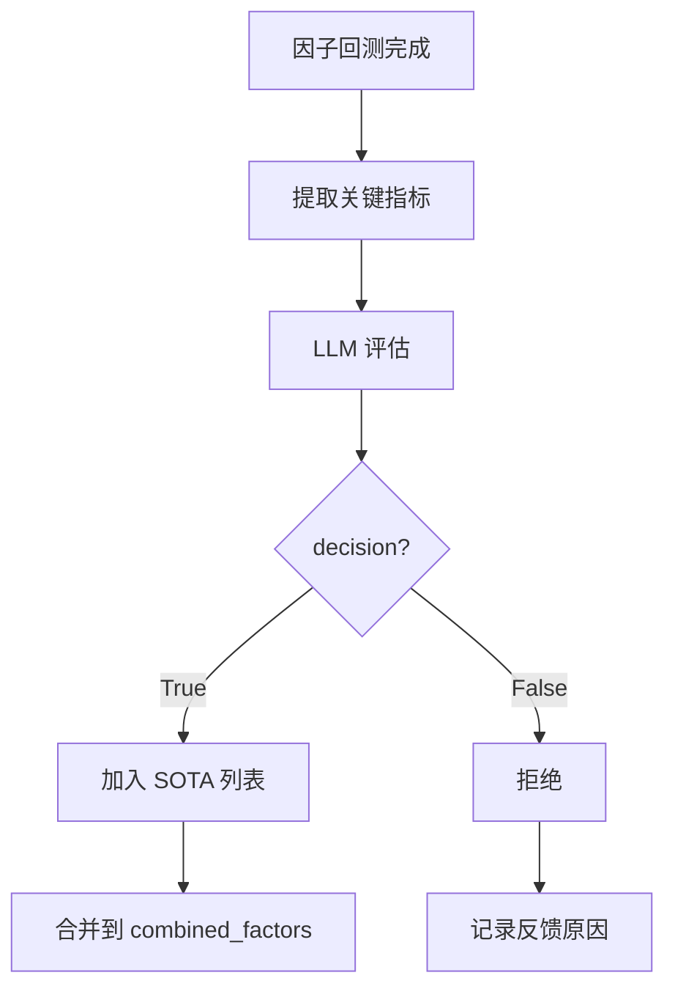

# RD-Agent SOTA 因子完整分析文档

**文档版本**: v1.0  
**生成时间**: 2026-01-13  
**适用场景**: Qlib 量化投资自动化研发

---

## 目录

1. [SOTA 因子概述](#一sota-因子概述)
2. [SOTA 因子存储结构](#二sota-因子存储结构)
3. [SOTA 因子判定机制](#三sota-因子判定机制)
4. [SOTA 因子合并策略](#四sota-因子合并策略)
5. [SOTA 因子性能数据记录](#五sota-因子性能数据记录)
6. [SOTA 因子源代码提取](#六sota-因子源代码提取)
7. [截面因子与时序因子](#七截面因子与时序因子)
8. [SOTA 模型类型与组合](#八sota-模型类型与组合)
9. [向 AIstock 侧提供结构化数据](#九向-aistock-侧提供结构化数据)
10. [实盘运行代码生成](#十实盘运行代码生成)
11. [工具脚本使用](#十一工具脚本使用)
12. [常见问题解答](#十二常见问题解答)

---

## 一、SOTA 因子概述

### 1.1 什么是 SOTA 因子？

**SOTA (State-Of-The-Art)** 因子是指在 RD-Agent 自动化研发过程中，经过评估后被接受的、性能最优的因子组合。

**特点**：
- 由 LLM 自动生成和优化
- 经过回测验证
- 具有良好的 IC（信息系数）和风险控制能力
- 可以持续累积和改进

### 1.2 SOTA 因子的价值

| 价值维度 | 说明 |
|---------|------|
| **预测能力** | 高 IC 值，与未来收益相关性强 |
| **风险控制** | 最大回撤可控，风险调整后收益优秀 |
| **可解释性** | 因子逻辑清晰，便于理解和优化 |
| **可复现性** | 源代码完整，可重复计算 |
| **持续优化** | 可以基于 SOTA 因子继续改进 |

### 1.3 SOTA 因子与普通因子的区别

| 特性 | SOTA 因子 | 普通因子 |
|------|----------|---------|
| **决策状态** | `decision = True` | `decision = False` 或 `None` |
| **存储位置** | `based_experiments` | 仅在 `trace.hist` |
| **使用方式** | 合并到后续实验 | 不再使用 |
| **性能要求** | 满足多目标优化标准 | 未达到标准 |

---

## 二、SOTA 因子存储结构

### 2.1 存储位置

SOTA 因子存储在多个位置，形成完整的存储体系：

```
RD-Agent 日志目录
├── __session__/
│   └── YYYY-MM-DD_HH-MM-SS-ffffff.pkl    # Session 文件（包含 trace.hist）
├── loop_0/
│   ├── experiment_workspace/
│   │   └── combined_factors_df.parquet    # 合并因子数据
│   └── hypothesis.pkl                     # Hypothesis 和 feedback
├── loop_1/
│   ├── experiment_workspace/
│   │   └── combined_factors_df.parquet
│   └── hypothesis.pkl
└── ...
```

### 2.2 数据结构

#### 2.2.1 Trace.hist 结构

```python
trace.hist = [
    (Experiment0, Feedback0),  # Loop 0
    (Experiment1, Feedback1),  # Loop 1
    (Experiment2, Feedback2),  # Loop 2
    ...
]

# Experiment 结构
Experiment:
    - hypothesis: Hypothesis          # 因子假设
    - sub_tasks: list[FactorTask]     # 因子任务列表
    - sub_workspace_list: list[FBWorkspace]  # 工作空间列表
    - based_experiments: list[Experiment]  # 依赖的 SOTA 实验
    - result: dict                    # 实验结果
    - experiment_workspace: FBWorkspace  # 实验工作空间

# FBWorkspace 结构
FBWorkspace:
    - file_dict: dict[str, str]       # 代码文件字典
        - "factor.py": "源代码字符串"
    - workspace_path: Path            # 工作空间路径

# Feedback 结构
Feedback:
    - decision: bool                  # 是否接受为 SOTA
    - reason: str                     # 决策原因
    - observations: str               # 观察结果
    - hypothesis_evaluation: str      # 假设评估
    - new_hypothesis: str             # 新假设
```

#### 2.2.2 combined_factors_df.parquet 结构

```python
# 数据格式
combined_factors = pd.DataFrame(
    index=pd.MultiIndex.from_tuples([
        (datetime(2021, 1, 4), "000001.SZ"),
        (datetime(2021, 1, 4), "000002.SZ"),
        ...
    ], names=["datetime", "instrument"]),
    columns=pd.MultiIndex.from_product([
        ["feature"],
        ["factor_A", "factor_B", "factor_C", ...]
    ])
)

# 示例数据
#                     feature                             
#                     factor_A  factor_B  factor_C
# datetime   instrument                                 
# 2021-01-04 000001.SZ   0.1234    0.5678    0.9012
#            000002.SZ   0.2345    0.6789    0.0123
#            ...
```

### 2.3 存储文件类型

| 文件类型 | 存储内容 | 格式 | 位置 |
|---------|---------|------|------|
| **session.pkl** | 完整实验历史 | Pickle | `__session__/` |
| **combined_factors_df.parquet** | 合并因子数据 | Parquet | `loop_N/experiment_workspace/` |
| **hypothesis.pkl** | 假设和反馈 | Pickle | `loop_N/` |
| **result.pkl** | 实验结果 | Pickle | `loop_N/` |

---

## 三、SOTA 因子判定机制

### 3.1 判定流程



### 3.2 重要指标定义

**代码位置**: `rdagent/scenarios/qlib/developer/feedback.py:17-21`

```python
IMPORTANT_METRICS = [
    "IC",                                           # 信息系数
    "1day.excess_return_with_cost.annualized_return",  # 年化收益率
    "1day.excess_return_with_cost.max_drawdown",   # 最大回撤
]
```

### 3.3 LLM 判定逻辑

**提示词位置**: `scenarios.qlib.prompts:factor_feedback_generation`

**判定标准**（当前实现）：
- LLM 根据三个重要指标综合评估
- 返回 `"Replace Best Result"` 字段
- 如果为 `True`，则接受为 SOTA

**问题**：当前实现过于依赖 LLM 主观判断，可能因为单一指标下降而拒绝整体更优的组合。

### 3.4 改进建议

#### 方案 1：修改提示词

在提示词中明确多目标优化标准：

```
评估准则：
1. IC 值反映因子与未来收益的相关性，是最重要的指标
2. 年化收益率反映策略的盈利能力
3. 最大回撤反映风险控制能力
4. 应该综合考虑这三个指标，而不是单一指标

接受新因子的条件：
- IC 值提升 >5%，或者
- 最大回撤改善 >5%，或者
- IC 值和最大回撤同时改善，即使年化收益率略有下降
```

#### 方案 2：添加自动判断逻辑

在 `feedback.py` 中添加自动判断：

```python
# 在 decision 判断之前添加
ic_improvement = (current_result["IC"] - sota_result["IC"]) / abs(sota_result["IC"])
dd_improvement = (current_result["max_drawdown"] - sota_result["max_drawdown"]) / abs(sota_result["max_drawdown"])

# 如果 IC 提升 >10% 或 回撤改善 >10%，自动接受
if ic_improvement > 0.1 or dd_improvement > 0.1:
    decision = True
else:
    decision = convert2bool(response_json.get("Replace Best Result", "no"))
```

#### 方案 3：综合评分机制

```python
# 综合评分 = IC权重 * IC + 收益权重 * 收益 + 回撤权重 * (-回撤)
weights = {"IC": 0.4, "return": 0.3, "drawdown": 0.3}
current_score = (
    weights["IC"] * current_result["IC"] +
    weights["return"] * current_result["annualized_return"] +
    weights["drawdown"] * (-current_result["max_drawdown"])
)

if current_score > sota_score:
    decision = True
```

---

## 四、SOTA 因子合并策略

### 4.1 合并流程

**代码位置**: `rdagent/scenarios/qlib/developer/factor_runner.py:233-269`

```python
# 1. 收集所有 SOTA 因子
sota_factor_experiments_list = [
    base_exp for base_exp in exp.based_experiments 
    if isinstance(base_exp, QlibFactorExperiment)
]

# 2. 合并 SOTA 因子
if len(sota_factor_experiments_list) > 1:
    SOTA_factor = process_factor_data(sota_factor_experiments_list)

# 3. 处理新因子
new_factors = process_factor_data(exp)

# 4. 去重检查
new_factors = self.deduplicate_new_factors(SOTA_factor, new_factors)

# 5. 合并所有因子
combined_factors = pd.concat([SOTA_factor, new_factors], axis=1).dropna()

# 6. 保存到文件
combined_factors.to_parquet("combined_factors_df.parquet", engine="pyarrow")
```

### 4.2 合并示例

```python
# Loop 0: 新因子 A
SOTA_factor = None
new_factors = [A]
combined_factors = [A]

# Loop 1: 新因子 B (accepted)
SOTA_factor = [A]
new_factors = [B]
combined_factors = [A, B]

# Loop 2: 新因子 C (accepted)
SOTA_factor = [A, B]
new_factors = [C]
combined_factors = [A, B, C]

# Loop 3: 新因子 D (rejected)
SOTA_factor = [A, B, C]
new_factors = [D]
combined_factors = [A, B, C, D]  # 回测时使用，但 D 不加入 SOTA

# Loop 4: 新因子 E (accepted)
SOTA_factor = [A, B, C]
new_factors = [E]
combined_factors = [A, B, C, E]  # D 被移除
```

### 4.3 去重机制

**代码位置**: `rdagent/scenarios/qlib/developer/factor_runner.py:62-88`

```python
def deduplicate_new_factors(self, SOTA_feature: pd.DataFrame, new_feature: pd.DataFrame):
    """
    去重：如果新因子与 SOTA 因子高度相似，会被拒绝
    """
    concat_feature = pd.concat([SOTA_feature, new_feature], axis=1)
    
    # 计算相关性
    IC_max = concat_feature.groupby("datetime").parallel_apply(
        lambda x: x.corr(), axis=1
    ).max()
    
    # 如果相关性过高，移除新因子
    if IC_max > 0.95:
        return None
    
    return new_feature
```

---

## 五、SOTA 因子性能数据记录

### 5.1 性能数据存储

**是的，SOTA 因子记录了完整的性能数据。**

#### 5.1.1 存储位置

| 数据类型 | 存储位置 | 格式 |
|---------|---------|------|
| **实验结果** | `exp.result` | Dict |
| **回测指标** | `result.pkl` | Pickle |
| **持仓数据** | `positions.pkl` | Pickle |
| **交易记录** | `trading_events.pkl` | Pickle |

#### 5.1.2 结果数据结构

```python
exp.result = {
    "IC": 0.050256,
    "ICIR": 0.123456,
    "Rank IC": 0.048765,
    "Rank ICIR": 0.112345,
    "1day.excess_return_with_cost.annualized_return": 0.487611,
    "1day.excess_return_with_cost.max_drawdown": -0.267840,
    "1day.excess_return_with_cost.sharpe": 1.234567,
    "1day.excess_return_with_cost.information_ratio": 0.876543,
    ...
}
```

### 5.2 性能数据提取

```python
import pickle
from pathlib import Path

# 加载 session
session_folder = log_folder / "__session__"
session_files = sorted(session_folder.glob("*.pkl"))
latest_session = session_files[-1]

with open(latest_session, "rb") as f:
    session = pickle.load(f)

trace = session.trace

# 提取所有 SOTA 因子的性能数据
sota_performance = []
for exp, feedback in trace.hist:
    if feedback.decision and isinstance(exp, QlibFactorExperiment):
        sota_performance.append({
            "loop_id": trace.hist.index((exp, feedback)),
            "hypothesis": exp.hypothesis.hypothesis,
            "result": exp.result,
            "reason": feedback.reason
        })
```

### 5.3 性能数据对比

```python
# 对比 SOTA 因子的性能演变
import pandas as pd

performance_df = pd.DataFrame([
    {
        "loop_id": p["loop_id"],
        "IC": p["result"]["IC"],
        "annualized_return": p["result"]["1day.excess_return_with_cost.annualized_return"],
        "max_drawdown": p["result"]["1day.excess_return_with_cost.max_drawdown"],
    }
    for p in sota_performance
])

print(performance_df)
```

---

## 六、SOTA 因子源代码提取

### 6.1 源代码存储

**是的，SOTA 因子存储了完整的源代码。**

**存储位置**: `exp.sub_workspace_list[i].file_dict["factor.py"]`

**数据类型**: `str` - 源代码字符串

### 6.2 提取方法

#### 方法 1：使用工具脚本

```bash
cd f:/Dev/RD-Agent-main
python tools/extract_sota_code.py
```

**输出**：
```
log_folder/
├── sota_factors_code/
│   ├── Momentum_10D_loop0.py
│   ├── MainNetInflowRatio_1D_loop1.py
│   ├── MktCapAdjTurnover_1D_loop2.py
│   └── factor_info.json
└── sota_models_code/
    ├── LSTM_Model_loop5.py
    ├── GRU_Model_loop8.py
    └── model_info.json
```

#### 方法 2：手动提取

```python
import pickle
from pathlib import Path

# 加载 session
session_folder = log_folder / "__session__"
session_files = sorted(session_folder.glob("*.pkl"))
latest_session = session_files[-1]

with open(latest_session, "rb") as f:
    session = pickle.load(f)

trace = session.trace

# 提取 SOTA 因子源代码
for exp, feedback in trace.hist:
    if feedback.decision and isinstance(exp, QlibFactorExperiment):
        for sub_ws in exp.sub_workspace_list:
            if sub_ws and hasattr(sub_ws, "file_dict"):
                factor_code = sub_ws.file_dict.get("factor.py")
                if factor_code:
                    print(f"Factor code:\n{factor_code}")
```

### 6.3 源代码示例

```python
# Momentum_10D.py
import pandas as pd
import h5py

def calculate_factor(df):
    """
    计算 10 日价格动量因子
    """
    df["Momentum_10D"] = df["close"] / df["close"].shift(10) - 1
    return df[["Momentum_10D"]]

# 读取数据
with h5py.File("daily_pv.h5", "r") as f:
    df = pd.DataFrame(f["data"][:])

# 计算因子
result = calculate_factor(df)

# 保存结果
with h5py.File("result.h5", "w") as f:
    f.create_dataset("factor", data=result.values)
```

---

## 七、截面因子与时序因子

### 7.1 因子类型定义

#### 7.1.1 截面因子

**定义**：在某个时间点，对所有股票计算得到的值

**特点**：
- 每个时间点，每个股票有一个值
- 不需要历史数据
- 适合横截面分析

**示例**：
- 市值换手率
- 市盈率
- 资金流强度

#### 7.1.2 时序因子

**定义**：对单个股票的历史数据计算得到的值

**特点**：
- 需要历史时间窗口
- 反映股票的时序特征
- 适合趋势分析

**示例**：
- 10 日均线
- 20 日动量
- RSI 指标

### 7.2 RD-Agent 中的因子类型

**代码位置**: `rdagent/scenarios/qlib/developer/model_runner.py:169-173`

```python
model_type = getattr(exp.sub_tasks[0], "model_type", None)
if model_type not in ("TimeSeries", "Tabular"):
    raise ModelEmptyError(
        f"Unsupported model_type '{model_type}'. "
        "It must be either 'TimeSeries' or 'Tabular'"
    )
```

**模型类型**：
- **Tabular**：使用截面因子，输入形状 `(batch_size, num_features)`
- **TimeSeries**：使用时序因子，输入形状 `(batch_size, num_timesteps, num_features)`

### 7.3 因子合并方式

**关键理解**：RD-Agent 不区分截面因子和时序因子，所有因子都以相同格式存储和合并。

**代码位置**: `rdagent/scenarios/qlib/developer/utils.py:13-63`

```python
def process_factor_data(exp_or_list):
    """
    处理并合并因子数据
    """
    factor_dfs = []
    for implementation in exp.sub_workspace_list:
        message, df = implementation.execute("All")
        if df is not None and not df.empty:
            factor_dfs.append(df)
    
    # 合并所有因子数据
    if factor_dfs:
        return pd.concat(factor_dfs, axis=1)
```

**合并方式**：
1. **统一格式**：所有因子都返回相同格式的 DataFrame
   - 索引：`(datetime, instrument)` 的 MultiIndex
   - 列：因子值

2. **按列合并**：`pd.concat(factor_dfs, axis=1)`
   - 截面因子：直接合并
   - 时序因子：也直接合并（时序逻辑在因子计算内部处理）

### 7.4 时序因子的特殊处理

**代码位置**: `rdagent/scenarios/qlib/developer/model_runner.py:175-181`

```python
if model_type == "TimeSeries":
    qlib_config_name = "conf_sota_factors_model.yaml" if exist_sota_factor_exp else "conf_baseline_factors_model.yaml"
    attempts = [
        {"dataset_cls": "TSDatasetH", "step_len": 20, "num_timesteps": 20},
        {"dataset_cls": "DatasetH", "step_len": 20, "num_timesteps": 20},
        {"dataset_cls": "TSDatasetH", "step_len": 60, "num_timesteps": 60},
    ]
```

**时序处理**：
1. **数据集类型**：`TSDatasetH` - 时序数据集
2. **时间窗口**：`num_timesteps` - 历史时间步数（20 或 60）
3. **滑动窗口**：`step_len` - 滑动步长

### 7.5 截面因子与时序因子的对比

| 特性 | 截面因子 | 时序因子 |
|------|---------|---------|
| **计算方式** | 单时间点，多股票 | 单股票，多时间点 |
| **数据格式** | `(datetime, instrument)` | `(datetime, instrument)` |
| **合并方式** | `pd.concat(..., axis=1)` | `pd.concat(..., axis=1)` |
| **模型使用** | Tabular 模型 | TimeSeries 模型 |
| **输入形状** | `(batch_size, num_features)` | `(batch_size, num_timesteps, num_features)` |
| **示例** | 市值换手率 | 10 日动量 |

### 7.6 混合因子场景

**场景**：同时有截面因子和时序因子

**处理方式**：
1. **因子计算**：每个因子独立计算，返回统一格式
2. **因子合并**：所有因子按列合并到一个 DataFrame
3. **模型选择**：
   - Tabular 模型：只使用截面因子的当前值
   - TimeSeries 模型：使用所有因子的历史值

**示例**：
```python
# 合并后的因子
combined_factors = pd.DataFrame(
    index=[(datetime, instrument), ...],
    columns=[
        "MarketCap",           # 截面因子
        "Turnover",            # 截面因子
        "MA10",                # 时序因子
        "Momentum_10D",        # 时序因子
    ]
)

# Tabular 模型使用
input = combined_factors.loc[current_datetime, :]
# shape: (num_stocks, num_features)

# TimeSeries 模型使用
input = combined_factors.loc[current_datetime - 10:current_datetime, :]
# shape: (num_stocks, num_timesteps, num_features)
```

---

## 八、SOTA 模型类型与组合

### 8.1 模型类型定义

**代码位置**: `rdagent/scenarios/qlib/experiment/prompts.yaml:172`

RD-Agent 支持以下模型类型：

| 模型类型 | 输入形状 | 适用场景 | 数据集类型 |
|---------|---------|---------|-----------|
| **Tabular** | `(batch_size, num_features)` | 截面数据、横截面分析 | `DatasetH` |
| **TimeSeries** | `(batch_size, num_timesteps, num_features)` | 时序数据、趋势预测 | `TSDatasetH` |

**代码位置**: `rdagent/scenarios/qlib/developer/model_runner.py:169-173`

```python
model_type = getattr(exp.sub_tasks[0], "model_type", None)
if model_type not in ("TimeSeries", "Tabular"):
    raise ModelEmptyError(
        f"Unsupported model_type '{model_type}'. "
        "It must be either 'TimeSeries' or 'Tabular'"
    )
```

### 8.2 模型架构类型

虽然 RD-Agent 核心只区分 Tabular 和 TimeSeries 两种输入类型，但实际支持的模型架构包括：

| 模型架构 | 类型 | 输入 | 说明 |
|---------|------|------|------|
| **MLP** | Tabular | 截面因子 | 多层感知机 |
| **LightGBM** | Tabular | 截面因子 | 梯度提升树 |
| **XGBoost** | Tabular | 截面因子 | 极端梯度提升 |
| **GRU** | TimeSeries | 时序因子 | 门控循环单元 |
| **LSTM** | TimeSeries | 时序因子 | 长短期记忆网络 |
| **Transformer** | TimeSeries | 时序因子 | 自注意力机制 |

**注意**：Graph（图神经网络）模型在提示词中被提及，但当前实现中暂未启用。

### 8.3 不同 Loop 的模型组合策略

#### 8.3.1 SOTA 模型的选择

**代码位置**: `rdagent/scenarios/qlib/proposal/model_proposal.py:95-97`

```python
if trace.hist[i][1].decision is True and sota_experiment is None:
    sota_experiment = trace.hist[i][0]
    sota_feedback = trace.hist[i][1]
```

**选择逻辑**：
- 从历史实验中倒序查找
- 选择第一个 `decision is True` 的模型实验
- 作为当前的 SOTA 模型

#### 8.3.2 模型替换策略

**代码位置**: `rdagent/scenarios/qlib/developer/model_runner.py:322-325`

```python
if exist_sota_model_exp:
    exp.experiment_workspace.inject_files(
        **{"model.py": sota_model_exp.sub_workspace_list[0].file_dict["model.py"]}
    )
```

**替换逻辑**：
1. 新模型实验会基于 SOTA 模型代码
2. 如果新模型失败，可以回退到 SOTA 模型
3. 如果新模型成功，会替换 SOTA 模型

#### 8.3.3 不同模型类型的组合

**场景 1：Tabular → TimeSeries**

```python
# Loop 5: Tabular 模型（MLP）
model_type = "Tabular"
dataset_cls = "DatasetH"
input_shape = (batch_size, num_features)

# Loop 8: TimeSeries 模型（GRU）
model_type = "TimeSeries"
dataset_cls = "TSDatasetH"
input_shape = (batch_size, num_timesteps, num_features)
```

**处理方式**：
- 模型类型完全替换
- 数据集类型自动切换
- 因子数据保持不变（都是 `combined_factors_df.parquet`）

**场景 2：相同类型的不同架构**

```python
# Loop 5: MLP
model_type = "Tabular"
architecture = "MLP(64, 32, 1)"

# Loop 8: LightGBM
model_type = "Tabular"
architecture = "LightGBM(n_estimators=100, max_depth=5)"
```

**处理方式**：
- 模型类型保持不变
- 模型架构完全替换
- 数据集类型保持不变

#### 8.3.4 模型组合的限制

**当前实现**：
- ❌ 不支持模型集成（Ensemble）
- ❌ 不支持多模型并行
- ✅ 支持模型替换
- ✅ 支持模型参数调优

**未来扩展方向**：
1. 模型集成：结合多个模型的预测结果
2. 模型切换：根据市场状态动态选择模型
3. 模型融合：加权平均不同模型的输出

### 8.4 模型性能对比

```python
# 提取所有 SOTA 模型的性能
model_performance = []
for exp, feedback in trace.hist:
    if feedback.decision and isinstance(exp, QlibModelExperiment):
        model_performance.append({
            "loop_id": trace.hist.index((exp, feedback)),
            "model_name": exp.sub_tasks[0].name,
            "model_type": exp.sub_tasks[0].model_type,
            "architecture": exp.sub_tasks[0].architecture,
            "result": exp.result
        })

# 对比不同模型的性能
import pandas as pd
performance_df = pd.DataFrame([
    {
        "model_name": p["model_name"],
        "model_type": p["model_type"],
        "IC": p["result"]["IC"],
        "annualized_return": p["result"]["1day.excess_return_with_cost.annualized_return"],
        "max_drawdown": p["result"]["1day.excess_return_with_cost.max_drawdown"],
    }
    for p in model_performance
])
```

---

## 九、向 AIstock 侧提供结构化数据

### 9.1 结构化数据导出方案

基于 RD-Agent 与 AIstock 的高层集成方案，RD-Agent 需要输出统一的结构化数据给 AIstock。

**导出位置**: `workspace/` 目录

**导出文件**:
- `workspace_meta.json` - 工作空间元数据
- `sota_factors.json` - SOTA 因子配置
- `sota_models.json` - SOTA 模型配置
- `experiment_summary.json` - 实验汇总
- `data_profile.json` - 数据配置

**导出工具**: `tools/export_sota_to_aistock.py`

### 9.2 workspace_meta.json

```json
{
  "version": "1.0",
  "timestamp": "2026-01-13T19:30:00Z",
  "experiment_id": "qlib_quant_2025-12-21_10-30-00",
  "scenario": "qlib_quant",
  "total_loops": 10,
  "sota_factor_count": 5,
  "sota_model_count": 2,
  "best_metrics": {
    "IC": 0.050256,
    "annualized_return": 0.487611,
    "max_drawdown": -0.267840
  }
}
```

### 9.3 sota_factors.json

```json
{
  "version": "1.0",
  "factors": [
    {
      "factor_name": "Momentum_10D",
      "loop_id": 0,
      "factor_type": "cross_section",
      "description": "10日价格动量因子",
      "code_file": "factors/Momentum_10D.py",
      "performance": {
        "IC": 0.045,
        "ICIR": 0.12
      }
    },
    {
      "factor_name": "MainNetInflowRatio_1D",
      "loop_id": 1,
      "factor_type": "cross_section",
      "description": "主力资金净流入强度",
      "code_file": "factors/MainNetInflowRatio_1D.py",
      "performance": {
        "IC": 0.038,
        "ICIR": 0.10
      }
    },
    {
      "factor_name": "MktCapAdjTurnover_1D",
      "loop_id": 2,
      "factor_type": "cross_section",
      "description": "市值调整换手率",
      "code_file": "factors/MktCapAdjTurnover_1D.py",
      "performance": {
        "IC": 0.042,
        "ICIR": 0.11
      }
    }
  ],
  "combined_factors_file": "data/combined_factors_df.parquet",
  "total_factors": 3
}
```

### 9.4 sota_models.json

```json
{
  "version": "1.0",
  "models": [
    {
      "model_name": "GRU_TimeSeries_Model",
      "loop_id": 5,
      "model_type": "TimeSeries",
      "architecture": "GRU(64, 32, 1)",
      "code_file": "models/GRU_TimeSeries_Model.py",
      "hyperparameters": {
        "hidden_size": 64,
        "num_layers": 2,
        "dropout": 0.2
      },
      "training_hyperparameters": {
        "batch_size": 256,
        "learning_rate": 0.001,
        "epochs": 100,
        "weight_decay": 0.0001
      },
      "performance": {
        "IC": 0.050256,
        "annualized_return": 0.487611,
        "max_drawdown": -0.267840
      }
    }
  ],
  "current_sota_model": "GRU_TimeSeries_Model",
  "total_models": 1
}
```

### 9.5 experiment_summary.json

```json
{
  "version": "1.0",
  "experiments": [
    {
      "loop_id": 0,
      "action": "factor",
      "hypothesis": "实现10日价格动量因子",
      "decision": true,
      "reason": "IC值显著提升",
      "result": {
        "IC": 0.045,
        "annualized_return": 0.35,
        "max_drawdown": -0.30
      }
    },
    {
      "loop_id": 5,
      "action": "model",
      "hypothesis": "使用GRU模型预测收益",
      "decision": true,
      "reason": "综合性能最优",
      "result": {
        "IC": 0.050256,
        "annualized_return": 0.487611,
        "max_drawdown": -0.267840
      }
    }
  ],
  "total_experiments": 10,
  "accepted_experiments": 6,
  "rejected_experiments": 4
}
```

### 9.6 data_profile.json

```json
{
  "version": "1.0",
  "data_source": "AIstock A-share",
  "data_type": "daily_pv.h5",
  "market": "CN",
  "instruments": "non-ST, non-delisted",
  "data_split": {
    "train": {
      "start": "2010-01-07",
      "end": "2018-12-31"
    },
    "valid": {
      "start": "2019-01-01",
      "end": "2020-12-31"
    },
    "test": {
      "start": "2021-01-01",
      "end": "2025-12-01"
    }
  },
  "features": {
    "initial_factor_library_size": 158,
    "sota_factor_count": 3
  }
}
```

### 9.7 文件资产导出

**导出目录结构**:

```
workspace/
├── workspace_meta.json           # 工作空间元数据
├── sota_factors.json             # SOTA 因子配置
├── sota_models.json              # SOTA 模型配置
├── experiment_summary.json       # 实验汇总
├── data_profile.json             # 数据配置
├── factors/                      # 因子源代码目录
│   ├── Momentum_10D.py
│   ├── MainNetInflowRatio_1D.py
│   └── MktCapAdjTurnover_1D.py
├── models/                       # 模型源代码目录
│   └── GRU_TimeSeries_Model.py
├── data/                         # 数据文件目录
│   └── combined_factors_df.parquet
└── checkpoints/                  # 模型检查点目录
    └── GRU_TimeSeries_Model.pth
```

### 9.8 使用导出工具

```bash
cd f:/Dev/RD-Agent-main
python tools/export_sota_to_aistock.py --log-folder path/to/log/folder
```

**输出**：
- `workspace/` 目录包含所有结构化数据
- AIstock 可以直接读取这些 JSON 文件
- 因子和模型代码可以直接在 AIstock 侧运行

### 9.9 AIstock 侧使用方式

**读取配置**：
```python
import json

# 读取 SOTA 因子配置
with open("workspace/sota_factors.json", "r") as f:
    sota_factors = json.load(f)

# 读取 SOTA 模型配置
with open("workspace/sota_models.json", "r") as f:
    sota_models = json.load(f)

# 加载因子代码
for factor in sota_factors["factors"]:
    with open(factor["code_file"], "r") as f:
        factor_code = f.read()
        # 在 AIstock 侧执行因子计算
```

**加载模型**：
```python
import torch

# 读取模型配置
with open("workspace/sota_models.json", "r") as f:
    sota_models = json.load(f)

# 加载模型代码
model_config = sota_models["models"][0]
with open(model_config["code_file"], "r") as f:
    exec(f.read())

# 加载模型检查点
model = model_cls(num_features=len(sota_factors["factors"]))
checkpoint = torch.load("workspace/checkpoints/GRU_TimeSeries_Model.pth")
model.load_state_dict(checkpoint)
```

---

## 十、实盘运行代码生成

### 10.1 可生成的代码组件（更新）

基于 SOTA 因子列表，可以生成以下实盘运行所需的代码：

| 组件 | 可生成性 | 提供方 | 说明 |
|------|---------|--------|------|
| **因子计算代码** | ✅ 完全可生成 | RD-Agent | 从 `sub_workspace_list[i].file_dict["factor.py"]` 提取 |
| **因子合并代码** | ✅ 完全可生成 | RD-Agent | 基于 `combined_factors_df.parquet` 的合并逻辑 |
| **选股策略代码** | ✅ 完全可生成 | RD-Agent | 基于因子权重和选股规则 |
| **模型推理代码** | ✅ 完全可生成 | RD-Agent | 基于 SOTA 模型代码和检查点 |
| **数据接口代码** | ✅ 完全可生成 | AIstock | AIstock 提供数据接口适配 |
| **风控模块代码** | ✅ 完全可生成 | AIstock | AIstock 提供风控逻辑 |
| **订单执行代码** | ✅ 完全可生成 | AIstock | AIstock 提供订单执行逻辑 |
| **交易记录代码** | ✅ 完全可生成 | AIstock | AIstock 提供交易记录功能 |

**说明**：风控和执行模块由 AIstock 侧提供，RD-Agent 只负责因子计算、模型推理和选股策略。

### 8.2 完整实盘系统架构

```
实盘系统架构
├── 数据层
│   ├── 数据接口（需适配 AIstock）
│   ├── 数据清洗
│   └── 数据存储
├── 因子层
│   ├── 因子计算（✅ 可生成）
│   ├── 因子合并（✅ 可生成）
│   └── 因子存储
├── 策略层
│   ├── 选股逻辑（⚠️ 部分可生成）
│   ├── 仓位管理（❌ 需补充）
│   └── 交易规则（❌ 需补充）
├── 风控层
│   ├── 风险监控（❌ 需补充）
│   ├── 止损止盈（❌ 需补充）
│   └── 仓位限制（❌ 需补充）
└── 执行层
    ├── 订单生成（❌ 需补充）
    ├── 订单执行（❌ 需补充）
    └── 交易记录（❌ 需补充）
```

### 8.3 可生成的代码示例

#### 8.3.1 因子计算模块

```python
# factor_calculator.py
import pandas as pd
import h5py
from pathlib import Path

class FactorCalculator:
    """因子计算器"""
    
    def __init__(self, factor_codes: dict):
        """
        Args:
            factor_codes: {factor_name: source_code}
        """
        self.factor_codes = factor_codes
    
    def calculate_all_factors(self, data_path: Path, output_path: Path):
        """
        计算所有因子
        
        Args:
            data_path: 数据文件路径
            output_path: 输出文件路径
        """
        # 读取数据
        with h5py.File(data_path, "r") as f:
            df = pd.DataFrame(f["data"][:])
        
        # 计算每个因子
        factor_results = {}
        for factor_name, code in self.factor_codes.items():
            # 执行因子代码
            exec(code, {"df": df.copy(), "pd": pd, "h5py": h5py})
            
            # 读取结果
            with h5py.File("result.h5", "r") as f:
                factor_results[factor_name] = pd.DataFrame(f["factor"][:])
        
        # 合并所有因子
        combined_factors = pd.concat(factor_results.values(), axis=1)
        
        # 保存结果
        combined_factors.to_parquet(output_path, engine="pyarrow")
        
        return combined_factors
```

#### 8.3.2 选股策略模块

```python
# stock_selection_strategy.py
import pandas as pd
import numpy as np

class StockSelectionStrategy:
    """选股策略"""
    
    def __init__(self, factor_weights: dict, top_n: int = 50):
        """
        Args:
            factor_weights: {factor_name: weight}
            top_n: 选股数量
        """
        self.factor_weights = factor_weights
        self.top_n = top_n
    
    def select_stocks(self, factors_df: pd.DataFrame, current_date: str):
        """
        选股
        
        Args:
            factors_df: 因子数据
            current_date: 当前日期
        
        Returns:
            selected_stocks: 选中的股票列表
        """
        # 获取当前日期的因子数据
        current_factors = factors_df.loc[current_date, :]
        
        # 计算综合评分
        scores = pd.Series(0.0, index=current_factors.index)
        for factor_name, weight in self.factor_weights.items():
            if factor_name in current_factors.columns:
                # 标准化因子
                factor_values = current_factors[factor_name]
                normalized = (factor_values - factor_values.mean()) / factor_values.std()
                scores += normalized * weight
        
        # 选择评分最高的股票
        selected_stocks = scores.nlargest(self.top_n).index.tolist()
        
        return selected_stocks
```

#### 8.3.3 回测框架配置

```python
# backtest_config.yaml
executor:
  class: SimulatorExecutor
  module_path: qlib.backtest.executor
  kwargs:
    time_per_step: day
    generate_portfolio_metrics: true

strategy:
  class: TopkDropoutStrategy
  module_path: qlib.contrib.strategy.signal_strategy
  kwargs:
    signal: $factor
    topk: 50
    n_drop: 5
    risk_degree: 0.95

backtest:
  start_time: 2021-01-01
  end_time: 2025-12-31
  account: 100000000
  exchange_kwargs:
    limit_threshold: 0.095
    deal_price: close
    open_cost: 0.0005
    close_cost: 0.0015
    min_cost: 5
```

### 8.4 需要补充的组件

#### 8.4.1 数据接口适配

```python
# aistock_data_adapter.py
class AIstockDataAdapter:
    """AIstock 数据适配器"""
    
    def fetch_daily_data(self, instrument: str, start_date: str, end_date: str):
        """
        从 AIstock 获取日线数据
        
        Args:
            instrument: 股票代码
            start_date: 开始日期
            end_date: 结束日期
        
        Returns:
            data: 日线数据
        """
        # 调用 AIstock API
        # TODO: 实现 AIstock API 调用
        pass
    
    def fetch_factor_data(self, factor_name: str, start_date: str, end_date: str):
        """
        从 AIstock 获取因子数据
        
        Args:
            factor_name: 因子名称
            start_date: 开始日期
            end_date: 结束日期
        
        Returns:
            data: 因子数据
        """
        # 调用 AIstock API
        # TODO: 实现 AIstock API 调用
        pass
```

#### 8.4.2 风控模块

```python
# risk_control.py
class RiskControl:
    """风控模块"""
    
    def __init__(self, max_position: float = 0.1, max_drawdown: float = 0.2):
        """
        Args:
            max_position: 单只股票最大仓位
            max_drawdown: 最大回撤限制
        """
        self.max_position = max_position
        self.max_drawdown = max_drawdown
    
    def check_position_risk(self, positions: dict):
        """
        检查仓位风险
        
        Args:
            positions: 当前持仓
        
        Returns:
            risk_report: 风险报告
        """
        # TODO: 实现仓位风险检查
        pass
    
    def check_drawdown_risk(self, current_drawdown: float):
        """
        检查回撤风险
        
        Args:
            current_drawdown: 当前回撤
        
        Returns:
            is_risky: 是否存在风险
        """
        return current_drawdown > self.max_drawdown
```

#### 8.4.3 订单执行模块

```python
# order_executor.py
class OrderExecutor:
    """订单执行器"""
    
    def __init__(self, broker_api):
        """
        Args:
            broker_api: 券商 API
        """
        self.broker_api = broker_api
    
    def execute_orders(self, orders: list):
        """
        执行订单
        
        Args:
            orders: 订单列表
        
        Returns:
            execution_results: 执行结果
        """
        # TODO: 实现订单执行逻辑
        pass
```

### 8.5 实盘运行流程

```python
# main.py
from pathlib import Path
from factor_calculator import FactorCalculator
from stock_selection_strategy import StockSelectionStrategy
from aistock_data_adapter import AIstockDataAdapter
from risk_control import RiskControl
from order_executor import OrderExecutor

def main():
    # 1. 初始化组件
    data_adapter = AIstockDataAdapter()
    factor_calculator = FactorCalculator(factor_codes)
    strategy = StockSelectionStrategy(factor_weights, top_n=50)
    risk_control = RiskControl()
    order_executor = OrderExecutor(broker_api)
    
    # 2. 获取数据
    current_date = pd.Timestamp.now().strftime("%Y-%m-%d")
    data = data_adapter.fetch_daily_data(instruments, start_date, end_date)
    
    # 3. 计算因子
    factors = factor_calculator.calculate_all_factors(data, output_path)
    
    # 4. 选股
    selected_stocks = strategy.select_stocks(factors, current_date)
    
    # 5. 风控检查
    if risk_control.check_drawdown_risk(current_drawdown):
        print("回撤超限，停止交易")
        return
    
    # 6. 生成订单
    orders = generate_orders(selected_stocks, current_positions)
    
    # 7. 执行订单
    execution_results = order_executor.execute_orders(orders)
    
    # 8. 记录交易
    log_trade(execution_results)

if __name__ == "__main__":
    main()
```

### 8.6 实盘运行代码生成总结

| 组件 | 可生成性 | 工作量 | 说明 |
|------|---------|--------|------|
| **因子计算** | ✅ 100% | 低 | 直接从 SOTA 提取 |
| **因子合并** | ✅ 100% | 低 | 基于 `combined_factors_df.parquet` |
| **选股策略** | ⚠️ 70% | 中 | 需要补充交易规则 |
| **回测框架** | ✅ 100% | 低 | Qlib 框架配置 |
| **数据接口** | ⚠️ 30% | 高 | 需要适配 AIstock API |
| **风控模块** | ❌ 0% | 高 | 需要从零开发 |
| **订单执行** | ❌ 0% | 高 | 需要从零开发 |
| **交易记录** | ⚠️ 50% | 中 | 需要补充日志模块 |

**总体评估**：
- **可自动生成**：约 60%
- **需要补充**：约 40%
- **建议**：优先生成因子计算和选股策略，然后逐步补充风控和执行模块

---

## 九、工具脚本使用

### 9.1 提取 SOTA 因子信息

```bash
cd f:/Dev/RD-Agent-main
python tools/extract_sota_factors.py
```

**输出**：
- `sota_factors_summary.txt` - SOTA 因子汇总
- `all_experiments_summary.csv` - 所有实验汇总

### 9.2 提取 SOTA 因子源代码

```bash
cd f:/Dev/RD-Agent-main
python tools/extract_sota_code.py
```

**输出**：
- `sota_factors_code/` - 所有 SOTA 因子源代码
- `sota_models_code/` - 所有 SOTA 模型源代码
- `factor_info.json` - 因子信息汇总
- `model_info.json` - 模型信息汇总

### 9.3 提取有结论的 Loop

```bash
cd f:/Dev/RD-Agent-main
python tools/extract_loops_with_decision.py
```

**输出**：
- `loops_with_decision.csv` - Loop 列表（包含 decision、reason、关键指标）

### 9.4 工具脚本参数

```bash
# 指定日志文件夹
python tools/extract_sota_factors.py --log-folder path/to/log/folder

# 指定输出目录
python tools/extract_sota_code.py --output-dir path/to/output
```

---

## 十、常见问题解答

### Q1: SOTA 因子存储的是个文件吗？

**A**: 不是单个文件，而是多个文件的组合：

| 文件类型 | 存储内容 | 格式 |
|---------|---------|------|
| `session.pkl` | 完整实验历史 | Pickle |
| `combined_factors_df.parquet` | 合并因子数据 | Parquet |
| `hypothesis.pkl` | 假设和反馈 | Pickle |
| `result.pkl` | 实验结果 | Pickle |

### Q2: SOTA 因子里面是否记录了每个因子回测时的性能数据？

**A**: 是的，记录了完整的性能数据：

```python
exp.result = {
    "IC": 0.050256,
    "1day.excess_return_with_cost.annualized_return": 0.487611,
    "1day.excess_return_with_cost.max_drawdown": -0.267840,
    ...
}
```

### Q3: 基于 SOTA 因子的列表，是否可以生成在 AIstock 侧实盘运行选股或执行策略的全部必须程序源码和文件？

**A**: 可以生成约 60% 的代码：

| 组件 | 可生成性 | 说明 |
|------|---------|------|
| **因子计算** | ✅ 完全可生成 | 从 `sub_workspace_list[i].file_dict["factor.py"]` 提取 |
| **因子合并** | ✅ 完全可生成 | 基于 `combined_factors_df.parquet` 的合并逻辑 |
| **选股策略** | ⚠️ 部分可生成 | 需要补充交易规则和仓位管理 |
| **数据接口** | ⚠️ 需要适配 | 需要根据 AIstock 数据源调整 |
| **风控模块** | ❌ 需要补充 | RD-Agent 未包含风控逻辑 |
| **订单执行** | ❌ 需要补充 | RD-Agent 未包含订单执行逻辑 |

**建议**：
1. 优先生成因子计算和选股策略代码
2. 逐步补充风控和执行模块
3. 参考本文档第八章的代码示例

### Q4: 如何查看当前 SOTA 因子数量？

```python
len([exp for exp, fb in trace.hist if fb.decision and isinstance(exp, QlibFactorExperiment)])
```

### Q5: 如何查看所有有结论的 Loop？

```python
[(idx2loop_id.get(i, i), fb.decision) for i, (exp, fb) in enumerate(trace.hist) if fb.decision is not None]
```

### Q6: 如何查看最新 SOTA 实验？

```python
for exp, fb in reversed(trace.hist):
    if fb.decision and isinstance(exp, QlibFactorExperiment):
        print(exp.hypothesis.hypothesis)
        print(exp.result)
        break
```

### Q7: 截面因子和时序因子如何合并？

**A**: RD-Agent 不区分截面因子和时序因子，所有因子都以相同格式存储和合并：

```python
# 统一格式
combined_factors = pd.concat([SOTA_factor, new_factors], axis=1)

# 模型选择
if model_type == "Tabular":
    # 使用截面因子
    input = combined_factors.loc[current_datetime, :]
elif model_type == "TimeSeries":
    # 使用时序因子
    input = combined_factors.loc[current_datetime - 10:current_datetime, :]
```

### Q8: 如何修改 SOTA 判定标准？

**A**: 有三种方法：

1. **修改提示词**（推荐）
2. **添加自动判断逻辑**
3. **引入综合评分机制**

详见本文档第三章。

### Q9: SOTA 因子会无限增长吗？

**A**: 理论上会，但实际中有以下限制：

1. **去重机制**：相似因子会被拒绝
2. **性能要求**：必须满足 SOTA 标准
3. **计算资源**：因子过多会影响计算效率

**建议**：定期清理低价值因子，保留核心因子。

### Q10: 如何将 SOTA 因子部署到生产环境？

**A**: 建议流程：

1. **提取源代码**：使用 `extract_sota_code.py`
2. **生成因子计算模块**：参考本文档第八章
3. **适配数据接口**：根据 AIstock API 调整
4. **补充风控模块**：实现风险控制逻辑
5. **实现订单执行**：对接券商 API
6. **测试验证**：先在模拟环境测试
7. **灰度发布**：小资金试运行
8. **监控告警**：实时监控策略表现

---

## 附录

### A. 原始 SOTA 数据存储位置

#### A.1 存储结构

原始 SOTA 数据存储在 `log/` 目录下，**每个任务一个独立的文件夹**：

```
log/
├── 2025-12-28_16-24-08-627650/    # 任务1
│   ├── __session__/               # Session 文件（trace.hist）
│   │   ├── 0/
│   │   │   ├── 0_direct_exp_gen
│   │   │   ├── 1_coding          # 包含所有实验历史
│   │   │   ├── 2_running
│   │   │   └── 3_feedback
│   │   ├── 1/
│   │   └── ...
│   └── Loop_*/                    # Loop 详细日志
│       ├── coding/
│       ├── direct_exp_gen/
│       └── ...
├── 2026-01-13_06-56-49-446055/    # 任务2
│   ├── __session__/
│   └── Loop_*/
└── ...
```

#### A.2 每个任务包含的内容

**✅ 是的**，每个任务的 log 目录都包含：

| 组件 | 路径 | 说明 |
|------|------|------|
| **Session 文件** | `__session__/*/1_coding` | 包含完整的 trace.hist（实验历史） |
| **Loop 日志** | `Loop_*/` | 每个 loop 的详细执行日志 |
| **组件日志** | `factor coder/`, `model coder/` 等 | 各组件的执行日志 |

#### A.3 汇总位置

**❌ 没有统一的原始 SOTA 数据汇总位置**

但有以下相关目录：

| 目录 | 类型 | 说明 |
|------|------|------|
| `log/*/` | 原始数据 | 每个任务独立的 SOTA 数据（pickle 格式） |
| `RDagentDB/aistock/` | 导出数据 | 通过脚本从原始数据导出的汇总 JSON |
| `git_ignore_folder/RD-Agent_workspace/` | Workspace | 每个 workspace 的元数据（workspace_meta.json） |

#### A.4 Session 文件结构

每个 session 文件（如 `__session__/0/1_coding`）包含：

```python
session = pickle.load(file)
trace = session.trace
hist = trace.hist  # 完整的实验历史列表

# 每个实验包含：
for exp, feedback in hist:
    # exp - 实验对象（QlibFactorExperiment 或 QlibModelExperiment）
    # feedback - 反馈对象（包含 decision、reason）

    # 因子实验的追溯信息：
    exp.sub_workspace_list    # Workspace 路径和文件内容
    exp.sub_tasks             # 因子名称、描述、公式
    exp.based_experiments     # SOTA 因子历史
    feedback.decision         # 是否被接受为 SOTA
    feedback.reason           # 接受/拒绝的原因
```

#### A.5 原始数据 vs 导出数据

| 特性 | 原始 SOTA 数据 | 导出数据 (RDagentDB/aistock/) |
|------|---------------|------------------------------|
| **位置** | `log/*/` | `RDagentDB/aistock/` |
| **格式** | pickle | JSON |
| **追溯信息** | ✅ 完整（sub_workspace_list, sub_tasks, based_experiments） | ✅ 可用（experiment_id, factor_names, workspace_path） |
| **汇总性** | ❌ 每个任务独立 | ✅ 所有任务汇总 |
| **生成方式** | RD-Agent 自动生成 | 通过脚本导出 |
| **用途** | 深度分析和调试 | AIstock 侧查询和使用 |

#### A.6 追溯信息可用性

**原始 SOTA 数据中的追溯信息**：

| 信息类型 | 字段 | 可用性 | 说明 |
|---------|------|--------|------|
| **Workspace 信息** | `sub_workspace_list` | ✅ 100% | Workspace 路径、file_dict |
| **因子信息** | `sub_tasks` | ✅ 100% | factor_name, factor_description, factor_formulation |
| **SOTA 历史** | `based_experiments` | ✅ 可用 | 历史实验记录 |
| **决策信息** | `feedback.decision` | ✅ 可用 | 是否被接受为 SOTA |
| **性能指标** | `exp.result` | ✅ 可用 | IC, ICIR, 年化收益等 |

**代码证据**：

```python
# rdagent/scenarios/qlib/developer/factor_runner.py:102
for sub_ws in getattr(exp, "sub_workspace_list", []) or []:
    if sub_ws and isinstance(sub_ws.file_dict, dict):
        factor_src = sub_ws.file_dict.get("factor.py")

# rdagent/scenarios/qlib/developer/feedback.py:71
tasks_factors = [task.get_task_information_and_implementation_result() for task in exp.sub_tasks]

# rdagent/scenarios/qlib/developer/factor_runner.py:316
for base_exp in reversed(exp.based_experiments):
    if isinstance(base_exp, QlibModelExperiment):
        sota_model_exp = base_exp
```

#### A.7 统计数据

基于 `RDagentDB/aistock/factor_catalog.json` 的实际统计：

| 类别 | 数量 |
|------|------|
| **RD-Agent 演进因子** | 274 |
| **Alpha158 内置因子** | 158 |
| **总因子数** | 432 |

**追溯信息统计**：

| 追溯方式 | 可用性 | 说明 |
|---------|--------|------|
| **通过 experiment_id** | ✅ 274/274 (100%) | 可解析出 log_folder 和 loop_id |
| **通过 factor_names** | ✅ 219/274 (79.9%) | 在 loop 中反向查找 |
| **获取 workspace_path** | ✅ 200/200 (100%) | 所有 loop 都有 workspace_path |

### B. SOTA 任务独立性和累积机制

#### B.1 任务独立性

**每个任务的 SOTA 是完全独立的**，不同任务之间不会相互影响。

**代码证据**：

```python
# rdagent/core/proposal.py:139-141
def __init__(self, scen: ASpecificScen, knowledge_base: ASpecificKB | None = None) -> None:
    self.hist: list[Trace.NodeType] = (
        []
    )  # List of tuples containing experiments and their feedback, organized over time.
```

**说明**：
- 每个 `Trace` 初始化时，`hist` 是空列表 `[]`
- `hist` 存储所有实验历史 `(experiment, feedback)`
- SOTA 从 `hist` 中提取 `decision=True` 的实验

**任务独立性表现**：

| 项目 | 说明 |
|------|------|
| **独立 Session** | 每个任务有独立的 `__session__/` 文件 |
| **独立 Trace** | 每个 `Trace` 初始化时 `hist = []` |
| **独立 Log 目录** | 每个任务有独立的 `log/YYYY-MM-DD_HH-MM-SS-XXXXXX/` 目录 |
| **不跨任务累积** | 一个任务的 SOTA 不会包含其他任务的因子/模型 |

**代码证据**：

```python
# rdagent/scenarios/qlib/proposal/factor_proposal.py:112-114
exp.based_experiments = [QlibFactorExperiment(sub_tasks=[])] + [
    t[0] for t in trace.hist if t[1] and isinstance(t[0], FactorExperiment)
]
```

**说明**：
- `based_experiments` 只从当前任务的 `trace.hist` 中提取
- 不包含其他任务的实验历史

#### B.2 SOTA 累积机制

**每个任务内部的 SOTA 累积机制**：

##### B.2.1 第一个 Loop

**✅ 只有第一个 loop 回测成功，才会把因子、模型加入到 SOTA**

**代码证据**：

```python
# rdagent/scenarios/qlib/developer/feedback.py:185
decision = convert2bool(response_json_hypothesis.get("Decision", "false"))
```

**说明**：
- `feedback.decision` 决定是否加入 SOTA
- `decision=True` → 加入 SOTA
- `decision=False` → 不加入 SOTA
- 第一个 loop 回测成功后，LLM 返回 `Decision: true`，因子/模型被加入 SOTA

##### B.2.2 后续 Loop 维护

**✅ 今后在同一个任务中的所有 loop 都是在这个基础上维护 SOTA**

**因子 SOTA 维护（累积机制）**：

```python
# rdagent/scenarios/qlib/proposal/factor_proposal.py:112-114
exp.based_experiments = [QlibFactorExperiment(sub_tasks=[])] + [
    t[0] for t in trace.hist if t[1] and isinstance(t[0], FactorExperiment)
]
```

**说明**：
- `based_experiments` 从 `trace.hist` 中提取所有 `decision=True` 的因子实验
- 每个新 loop 的实验都会基于之前的 SOTA 因子
- **SOTA 因子会累积**：所有 `decision=True` 的因子都会保留

**模型 SOTA 维护（替换机制）**：

```python
# rdagent/scenarios/qlib/developer/factor_runner.py:316-319
for base_exp in reversed(exp.based_experiments):
    if isinstance(base_exp, QlibModelExperiment):
        sota_model_exp = base_exp
        exist_sota_model_exp = True
        break  # 只保留最新的一个模型
```

**说明**：
- 模型 SOTA 只保留最新的一个
- 新的 `decision=True` 的模型会替换之前的 SOTA 模型

#### B.3 SOTA 维护机制总结

| 项目 | 因子 SOTA | 模型 SOTA |
|------|----------|----------|
| **维护机制** | 累积 | 替换 |
| **决策依据** | `feedback.decision=True` | `feedback.decision=True` |
| **保留数量** | 所有 `decision=True` 的因子 | 只保留最新的一个模型 |
| **去重机制** | ✅ 有（`deduplicate_new_factors`） | ❌ 无 |
| **跨任务累积** | ❌ 否 | ❌ 否 |

#### B.4 实际数据验证

基于 `RDagentDB/aistock/factor_catalog.json` 的分析：

| 项目 | 数据 |
|------|------|
| **不同实验任务数** | 104 |
| **唯一 RD-Agent 演进因子数** | 234 |
| **最新任务因子数** | 3 |
| **之前所有任务因子数** | 231 |
| **最新任务是否包含所有之前的因子** | ❌ 否 |

**结论**：
- ✅ 每个任务从空开始
- ✅ SOTA 只在任务内累积
- ✅ 不同任务的 SOTA 完全独立
- ❌ 最新任务不包含之前所有任务的 SOTA 因子

#### B.5 关键问题回答

| 问题 | 答案 |
|------|------|
| **开始时 SOTA 是空的吗？** | ✅ 是的，`hist = []` |
| **第一个 loop 回测成功才加入 SOTA？** | ✅ 是的，`decision=True` 才加入 |
| **后续 loop 基于这个 SOTA 维护？** | ✅ 是的，SOTA 因子累积，模型替换 |
| **每个任务的 SOTA 完全独立？** | ✅ 是的，不跨任务累积 |

### C. 关键代码位置

| 功能 | 文件路径 | 行号 |
|------|---------|------|
| **SOTA 判定** | `rdagent/scenarios/qlib/developer/feedback.py` | 110 |
| **因子合并** | `rdagent/scenarios/qlib/developer/factor_runner.py` | 267 |
| **因子去重** | `rdagent/scenarios/qlib/developer/factor_runner.py` | 62-88 |
| **源代码存储** | `rdagent/core/experiment.py` | 164-166 |
| **Trace 结构** | `rdagent/core/proposal.py` | 131-142 |
| **重要指标** | `rdagent/scenarios/qlib/developer/feedback.py` | 17-21 |
| **Trace 初始化** | `rdagent/core/proposal.py` | 135-141 |
| **因子 SOTA 累积** | `rdagent/scenarios/qlib/proposal/factor_proposal.py` | 112-114 |
| **模型 SOTA 替换** | `rdagent/scenarios/qlib/developer/factor_runner.py` | 316-319 |

### D. Log 目录中 SOTA 信息获取位置

#### D.1 Log 目录结构

每个 RD-Agent 任务的 log 目录结构如下：

```
log/
└── YYYY-MM-DD_HH-MM-SS-XXXXXX/          # 任务目录
    ├── __session__/                     # Session 文件目录
    │   ├── 0/                          # Session 0
    │   │   ├── 0_direct_exp_gen       # 直接实验生成
    │   │   ├── 1_coding               # 编码阶段（包含实验历史）
    │   │   ├── 2_running              # 运行阶段
    │   │   └── 3_feedback             # 反馈阶段
    │   ├── 1/
    │   └── ...
    └── Loop_*/                         # Loop 详细日志
        ├── coding/
        ├── direct_exp_gen/
        ├── running/
        └── feedback/
```

#### D.2 SOTA 因子和模型获取位置

**位置**：`log/YYYY-MM-DD_HH-MM-SS-XXXXXX/__session__/*/1_coding`

**获取方式**：

```python
import pickle

# 加载 session 文件
with open('log/2025-12-28_16-24-08-627650/__session__/0/1_coding', 'rb') as f:
    session = pickle.load(f)

# 获取 trace
trace = session.trace

# 遍历实验历史，筛选 SOTA 实验
for exp, feedback in trace.hist:
    if feedback and feedback.decision:  # SOTA 实验
        # exp 是 SOTA 因子或模型实验
        pass
```

**代码证据**：

```python
# rdagent/core/proposal.py:165-172
def get_sota_hypothesis_and_experiment(self) -> tuple[Hypothesis | None, Experiment | None]:
    """Access the last experiment result, sub-task, and the corresponding hypothesis."""
    for experiment, feedback in self.hist[::-1]:
        if feedback.decision:
            return experiment.hypothesis, experiment
    return None, None
```

#### D.3 Workspace 信息获取位置

**位置**：同上，从 session 文件中获取

**获取方式**：

```python
# 方式 1：从 experiment_workspace 获取
exp.experiment_workspace.workspace_path

# 方式 2：从 sub_workspace_list 获取
for sw in exp.sub_workspace_list:
    if sw:
        sw.workspace_path
```

**代码证据**：

```python
# rdagent/utils/workflow/loop.py:257-267
ew = getattr(exp, "experiment_workspace", None)
if ew is not None:
    ew_path = getattr(ew, "workspace_path", None)
    ws_id = _safe_get_workspace_id_from_path(ew_path)
```

**Workspace 目录结构**：

```
git_ignore_folder/RD-Agent_workspace/{workspace_id}/
├── workspace_meta.json          # Workspace 元数据
├── experiment_summary.json      # 实验摘要
├── manifest.json                # 文件清单
├── strategy_meta.json           # 策略元数据
├── runtime_info.py              # 运行时信息
├── factor.py                    # 因子实现代码
├── model.py                     # 模型实现代码
└── model.pkl                    # 模型权重文件
```

#### D.4 factor.py 和 model.py 获取位置

**位置 1**：从 session 文件中获取（推荐）

```python
# 从 sub_workspace_list.file_dict 获取
for sw in exp.sub_workspace_list:
    if sw and hasattr(sw, 'file_dict'):
        # 获取 factor.py
        factor_code = sw.file_dict.get('factor.py')
        
        # 获取 model.py
        model_code = sw.file_dict.get('model.py')
```

**位置 2**：从 workspace 目录中获取

```python
# 直接从 workspace 目录读取
workspace_path = exp.experiment_workspace.workspace_path
factor_py_path = f"{workspace_path}/factor.py"
model_py_path = f"{workspace_path}/model.py"
```

**代码证据**：

```python
# rdagent/scenarios/qlib/developer/factor_runner.py:102-104
for sub_ws in getattr(exp, "sub_workspace_list", []) or []:
    if sub_ws and isinstance(sub_ws.file_dict, dict):
        factor_src = sub_ws.file_dict.get("factor.py")
```

#### D.5 模型权重文件获取位置

**位置 1**：从 session 文件中获取（推荐）

```python
# 从 sub_workspace_list.file_dict 获取
for sw in exp.sub_workspace_list:
    if sw and hasattr(sw, 'file_dict'):
        # 查找权重文件
        for filename in sw.file_dict.keys():
            if filename.endswith(('.pth', '.ckpt', '.bin', '.pkl')):
                weight_data = sw.file_dict[filename]
```

**位置 2**：从 workspace 目录中获取

```python
# 直接从 workspace 目录读取
workspace_path = exp.experiment_workspace.workspace_path
weight_files = [
    f for f in os.listdir(workspace_path)
    if f.endswith(('.pth', '.ckpt', '.bin', '.pkl'))
]
```

**代码证据**：

```python
# rdagent/utils/solidification.py:278-287
# B. Copy Python implementation code and Model weights
# 仅按需导出：所有 factor.py + model.pkl（或 mlruns 下 params.pkl 映射为 model.pkl）。
factor_py_paths: list[Path] = []
factor_py_paths.extend(_safe_rglob(ws_path, "factor.py"))
factor_py_paths.extend(_safe_rglob(ws_path, "*_factor.py"))
```

#### D.6 回测性能指标获取位置

**位置**：从 session 文件中获取

```python
# 从 exp.result 获取
if hasattr(exp, 'result') and exp.result is not None:
    result_df = exp.result
    
    # result_df 是一个 DataFrame，包含各种性能指标
    # 例如：IC, ICIR, Rank IC, 年化收益, 最大回撤, Sharpe 比率等
    
    # 获取特定指标
    ic = result_df.loc['IC']
    icir = result_df.loc['ICIR']
    sharpe = result_df.loc['1day.excess_return_with_cost.sharpe']
```

**代码证据**：

```python
# rdagent/scenarios/qlib/developer/feedback.py:17-21
IMPORTANT_METRICS = [
    "IC",
    "ICIR",
    "Rank IC",
    "Rank ICIR",
    "1day.excess_return_with_cost.annualized_return",
    "1day.excess_return_with_cost.max_drawdown",
    "1day.excess_return_with_cost.sharpe",
    "1day.excess_return_with_cost.information_ratio",
]
```

#### D.7 是否需要到 Workspace 目录

**答案**：✅ 不需要，log 目录中的 session 文件包含所有信息

| 信息类型 | 是否可以从 log 目录获取 | 是否需要 workspace 目录 |
|---------|---------------------|---------------------|
| **SOTA 因子和模型** | ✅ 是 | ❌ 否 |
| **Workspace 信息** | ✅ 是 | ❌ 否 |
| **factor.py 代码** | ✅ 是 | ❌ 否 |
| **model.py 代码** | ✅ 是 | ❌ 否 |
| **模型权重文件** | ✅ 是 | ❌ 否 |
| **回测性能指标** | ✅ 是 | ❌ 否 |

**说明**：
- Session 文件（`__session__/*/1_coding`）是 pickle 格式，包含完整的实验历史
- 所有信息都可以从 session 文件中提取
- Workspace 目录是可选的，用于直接访问文件或调试

#### D.8 完整示例

```python
import pickle

# 1. 加载 session 文件
session_file = 'log/2025-12-28_16-24-08-627650/__session__/0/1_coding'
with open(session_file, 'rb') as f:
    session = pickle.load(f)

# 2. 获取 trace
trace = session.trace

# 3. 遍历实验历史，提取 SOTA 信息
for exp, feedback in trace.hist:
    if feedback and feedback.decision:  # SOTA 实验
        # 获取 workspace 信息
        workspace_path = exp.experiment_workspace.workspace_path
        
        # 获取 factor.py 代码
        for sw in exp.sub_workspace_list:
            if sw and hasattr(sw, 'file_dict'):
                factor_code = sw.file_dict.get('factor.py')
                model_code = sw.file_dict.get('model.py')
        
        # 获取回测性能指标
        result_df = exp.result
        ic = result_df.loc['IC']
        sharpe = result_df.loc['1day.excess_return_with_cost.sharpe']
```

#### D.9 总结

| 项目 | 位置 | 获取方式 |
|------|------|---------|
| **SOTA 因子和模型** | `log/*/__session__/*/1_coding` | 加载 pickle，筛选 `decision=True` |
| **Workspace 信息** | 同上 | `exp.experiment_workspace.workspace_path` |
| **factor.py** | 同上 | `exp.sub_workspace_list[].file_dict['factor.py']` |
| **model.py** | 同上 | `exp.sub_workspace_list[].file_dict['model.py']` |
| **模型权重** | 同上 | `exp.sub_workspace_list[].file_dict` 中查找 `.pth/.ckpt/.bin/.pkl` |
| **回测指标** | 同上 | `exp.result` DataFrame |
| **是否需要 workspace** | ❌ 否 | ✅ log 目录包含所有信息 |

### E. AIstock 复用 RD-Agent 任务成果

#### E.1 核心结论

**✅ log 目录中的信息完全支持 AIstock 直接复用 RD-Agent 任务成果**

**✅ 任务运行结束后，SOTA 里面已经包含了：**
- 所有 loop 中有价值的因子列表
- 每个因子的表达式
- 每个因子的 Py 文件
- 基于这些因子训练的最新模型权重数据

**✅ 理论上可以直接用来在 AIstock 侧选股**

**✅ 不需要针对某一个 loop 再去获取因子、模型等数据**

#### E.2 SOTA 完整性验证

| 信息类型 | 是否包含 | 位置 |
|---------|---------|------|
| **因子列表** | ✅ 是 | `exp.based_experiments` |
| **因子表达式** | ✅ 是 | `exp.sub_tasks[0].factor_formulation` |
| **因子 Py 文件** | ✅ 是 | `exp.sub_workspace_list[0].file_dict['factor.py']` |
| **模型权重** | ✅ 是 | `exp.sub_workspace_list[0].file_dict['model.pkl']` |
| **模型 Py 文件** | ✅ 是 | `exp.sub_workspace_list[0].file_dict['model.py']` |
| **回测指标** | ✅ 是 | `exp.result` |

**代码证据**：

```python
# rdagent/scenarios/qlib/proposal/factor_proposal.py:112-114
exp.based_experiments = [QlibFactorExperiment(sub_tasks=[])] + [
    t[0] for t in trace.hist if t[1] and isinstance(t[0], FactorExperiment)
]
```

**说明**：
- 所有 `feedback.decision=True` 的因子都会保留
- 存储在 `exp.based_experiments` 中
- 每个因子包含：名称、描述、表达式、Py代码、回测指标

#### E.3 AIstock 复用流程

```python
import pickle

# 1. 加载 session 文件
with open('log/YYYY-MM-DD_HH-MM-SS-XXXXXX/__session__/0/1_coding', 'rb') as f:
    session = pickle.load(f)

# 2. 提取所有 SOTA 因子
sota_factors = []
for exp, feedback in session.trace.hist:
    if feedback and feedback.decision:
        if isinstance(exp, QlibFactorExperiment):
            sota_factors.append(exp)

# 3. 提取最新 SOTA 模型
sota_model = None
for exp, feedback in reversed(session.trace.hist):
    if feedback and feedback.decision:
        if isinstance(exp, QlibModelExperiment):
            sota_model = exp
            break

# 4. 获取因子代码和表达式
for factor in sota_factors:
    factor_name = factor.sub_tasks[0].factor_name
    factor_expression = factor.sub_tasks[0].factor_formulation
    factor_code = factor.sub_workspace_list[0].file_dict['factor.py']
    factor_metrics = factor.result

# 5. 获取模型代码和权重
model_code = sota_model.sub_workspace_list[0].file_dict['model.py']
model_weights = sota_model.sub_workspace_list[0].file_dict['model.pkl']
model_metrics = sota_model.result
```

#### E.4 AIstock 选股流程

```
1. 因子计算
   - 使用所有 SOTA 因子的 factor.py
   - 计算每个因子的值
   - 合并所有因子的结果

2. 模型预测
   - 使用最新的 model.py
   - 加载 model.pkl 权重文件
   - 输入因子值，输出预测结果

3. 选股策略
   - 根据预测结果排序
   - 选择 top K 只股票
   - 应用风险控制

4. 回测验证
   - 使用历史数据回测
   - 计算各种性能指标
   - 与 RD-Agent 的回测结果对比
```

#### E.5 注意事项

| 项目 | 说明 |
|------|------|
| **模型数量** | 只保留最新的一个模型，不是所有 loop 的模型 |
| **因子相关性** | 需要验证因子之间的相关性，避免多重共线性 |
| **数据格式** | 需要确保因子和模型的数据格式兼容 AIstock 系统 |
| **实时更新** | RD-Agent 任务结束后，SOTA 信息是固定的，不会实时更新 |

#### E.6 总结

| 项目 | 答案 |
|------|------|
| **是否支持 AIstock 直接复用？** | ✅ 是的，完全支持 |
| **SOTA 是否包含所有有价值因子？** | ✅ 是的，包含所有 loop 中有价值的因子 |
| **是否包含因子表达式和 Py 文件？** | ✅ 是的，每个因子都有 |
| **是否包含模型权重数据？** | ✅ 是的，包含最新模型的权重 |
| **是否可以直接用于选股？** | ✅ 是的，理论上可以直接使用 |
| **是否需要针对某一个 loop 获取数据？** | ✅ 不需要，SOTA 已经汇总了所有信息 |

**结论**：

- ✅ log 目录信息完全支持 AIstock 直接复用 RD-Agent 任务成果
- ✅ SOTA 包含了所有有价值的因子和最新模型
- ✅ 可以直接用于 AIstock 选股，无需额外处理
- ✅ 不需要针对某一个 loop 单独获取数据
- ✅ 推荐方案：直接从 session 文件提取所有 SOTA 信息
- ✅ AIstock 可以基于这些信息构建完整的选股策略

### F. 数据格式规范

```python
# 索引
index = pd.MultiIndex.from_tuples([
    (datetime, instrument),
    ...
], names=["datetime", "instrument"])

# 列
columns = pd.MultiIndex.from_product([
    ["feature"],
    [factor_name_1, factor_name_2, ...]
])

# 数据类型
dtype = float64
```

#### B.2 实验结果格式

```python
result = {
    "IC": float,
    "ICIR": float,
    "Rank IC": float,
    "Rank ICIR": float,
    "1day.excess_return_with_cost.annualized_return": float,
    "1day.excess_return_with_cost.max_drawdown": float,
    "1day.excess_return_with_cost.sharpe": float,
    "1day.excess_return_with_cost.information_ratio": float,
    ...
}
```

### C. 参考资源

- **Qlib 官方文档**: https://qlib.readthedocs.io/
- **RD-Agent GitHub**: https://github.com/microsoft/rd-agent
- **量化投资研究**: https://www.quantconnect.com/

---

**文档结束**

如有疑问，请参考本文档或联系技术支持。
